# Freeman Architecture

> Actual note: this document describes the current operational architecture in `main`. Legacy benchmark and earlier evaluation artifacts are documented separately in `docs/FAAB.md`, `docs/REAL_LLM_E2E.md`, and `PROGRESS.md`.

This document describes the implemented USIM-AGENT architecture in the current repository, with emphasis on data flow, execution stages, verification, memory, and human override paths.

## System Overview

Freeman is organized into seven layers:

1. `freeman.core`: deterministic world model, transition operators, scoring, uncertainty, compile validation.
2. `freeman.verifier`: invariant checks, structural stability checks, sign consistency, fixed-point correction.
3. `freeman.memory`: long-term knowledge graph, semantic vector store, session log, confidence reconciliation, self-model feedback, `SelfModelGraph`.
4. `freeman.agent`: signal ingestion, signal memory, obligation-driven attention scheduling, end-to-end analysis pipeline, forecast tracking, proactive emission, cost governance.
5. `freeman.agent.consciousness`: `ConsciousState`, deterministic metacognitive operators, idle deliberation scheduling, trace generation.
6. `freeman.runtime`: local foreground runtime, checkpointing, stream cursor persistence, and generic daemon-like stream execution.
7. `freeman.interface`: CLI, REST endpoints, identity/explanation views, export, override and diff utilities.

## High-Level Flow

```mermaid
flowchart LR
    A["Incoming signals or schema"] --> B["SignalIngestionEngine + SignalMemory"]
    B --> C["AttentionScheduler + ObligationQueue"]
    C --> D["DomainCompiler / CompileValidator"]
    D --> E["WorldGraph / WorldState"]
    E --> F["Verifier Level 1 + Level 2 precheck"]
    F --> G["GameRunner"]
    G --> H["Outcome scoring + confidence"]
    H --> I["ForecastRegistry + ProactiveEmitter"]
    H --> J["KnowledgeGraph update"]
    J --> K["SessionLog + Reconciler"]
    K --> L["ConsciousnessEngine"]
    L --> M["SelfModelGraph + TraceEvent log"]
    M --> N["CLI / REST / Identity / Explain / Export"]
    M --> O["CheckpointManager + StreamCursorStore"]
    I --> N
```

## Core Simulation Layer

### World Model

- `WorldGraph` is the spec-facing state container.
- `WorldState` is a backward-compatible alias used by the rest of the repo.
- The state contains:
  - actors
  - resources
  - relations
  - outcome registry
  - causal DAG
  - actor update rules
  - metadata
  - `parameter_vector`

### Transition Operator

The simulator implements:

```text
S_t+1 = S_t + F_theta_D(S_t, pi_t)
```

Operationally, each resource uses one evolution operator:

- `linear`
- `stock_flow`
- `logistic`
- `threshold`
- `coupled`

`EvolutionRegistry` provides the spec-facing factory over these operators.

## Operator Selection Criteria

By default the schema still chooses an operator explicitly, but `CompileValidator.compare_operators()` can now compare that choice against alternatives on a historical resource series. The validator runs each candidate operator on the observed trajectory, computes RMSE, and warns when the chosen operator is materially worse than the best alternative.

| Operator | When to use it | Typical signal in data |
| --- | --- | --- |
| `linear` | smooth trend-like dynamics | approximately affine step-to-step update |
| `stock_flow` | accumulation with inflow/outflow | drift toward or away from a stock level |
| `logistic` | bounded S-curve growth | inflection plus saturation near a ceiling |
| `threshold` | regime change around a level | different dynamics below vs above a cutoff |
| `coupled` | blended operator behavior | no single family dominates cleanly |

If historical data are available, the validator reports:

- per-operator RMSE for each resource
- the best operator under that metric
- a relative RMSE gap for the schema-chosen operator
- `warn=True` when the chosen operator exceeds the configured gap threshold

### Stateful Shock Update

Longitudinal updates now keep an explicit baseline-relative shock state:

```text
d_t+1 = lambda * d_t + Delta_t+1
S_t+1 = S_base + d_t+1
```

where:

- `d_t` is the accumulated decayed deviation stored in `metadata["_shock_state"]`
- `lambda` is `time_decay`
- `Delta_t+1` is the newly inferred shock vector

`WorldGraph.apply_shocks()` implements this in a deterministic way:

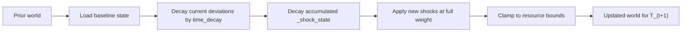

### Parameter Vector

The simulator now supports a universal dynamic calibration layer:

```text
Theta_t = {alpha_t, lambda_t, DeltaW_t}
```

`ParameterVector` is stored directly on the world state and is preserved by snapshot/clone operations. It lets the system recalibrate a world at `T_1` without rewriting the base ontology generated at `T_0`.

Its three active channels are:

- `alpha_t`: outcome-level multiplicative scaling, implemented as `outcome_modifiers`
- `lambda_t`: global decay of previously accumulated shock state, implemented as `shock_decay`
- `DeltaW_t`: additive adjustment of causal edge weights in resource and actor-state updates, implemented as `edge_weight_deltas`

### Outcome Scoring

For outcomes `o`, the raw score is:

```text
z_o = W_o * S_t
```

and the probability is:

```text
p(o_t) = exp(z_o) / sum_j exp(z_j)
```

implemented in `freeman.core.scorer`.

### Regime Shifts

Each `Outcome` may now define conditional multipliers:

```text
if C_o(d_t) is true:
  z_o = m_o * z_o
```

where `C_o` is a safe boolean expression over the accumulated shock context. Plain identifiers in regime-shift conditions are interpreted as decayed deviations, while `level_<name>` and `abs_<name>` expose absolute levels.

Examples:

- macro: `business_demand <= -5 AND policyrate >= 5`
- film: `criticsentiment <= -5 AND boxofficelegs <= -5`

Dynamic `ParameterVector.outcome_modifiers` are applied after static regime shifts:

```text
z_o = z_o * m_o
```

with `m_o = 1` by default.

### Dynamic Edge Calibration

Resource and actor-state transitions now read:

```text
w_ij_eff = w_ij + Delta_w_ij
```

where `Delta_w_ij` comes from `ParameterVector.edge_weight_deltas`. This is how a new signal can temporarily strengthen or weaken one causal relation without changing the original schema.

## Verification Layer

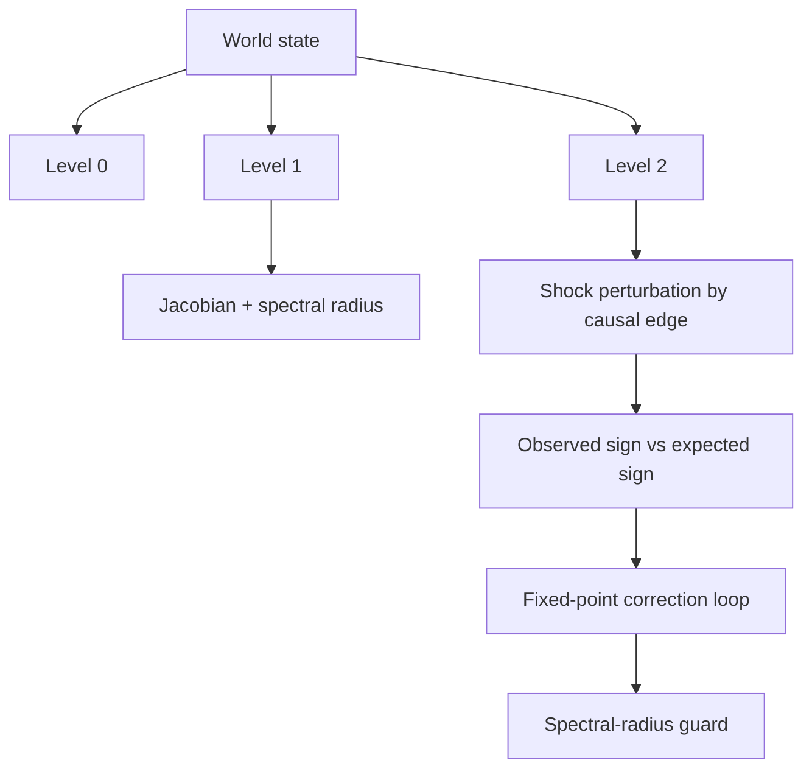

### Level 0

`freeman.verifier.level0` enforces:

- conservation
- non-negativity
- probability simplex
- bounds

Hard violations trigger `HardStopException`.

### Level 1

`freeman.verifier.level1` checks:

- null-action convergence
- shock decay
- spectral radius `rho(J_Phi) < 1`
- causal sign precheck through the current DAG

### Level 2

`freeman.verifier.level2` checks local sign consistency with DAG perturbations. `freeman.verifier.fixedpoint` adds bounded correction iterations and the guard:

```text
rho(J_Phi) < 1
```

The aggregate API lives in `freeman.verifier.verifier.Verifier`.

## Memory and Reconciliation

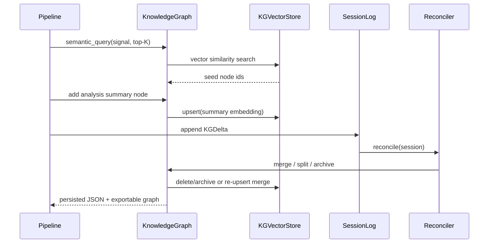

### Knowledge Graph

`freeman.memory.knowledgegraph` uses `networkx.MultiDiGraph` with JSON persistence. Supported operations:

- query
- semantic query with top-K retrieval plus 1-hop neighbors
- add node / edge
- split node
- archive node
- export HTML / JSON / DOT

When semantic memory is enabled, each `KGNode` also stores an embedding vector and the graph is synchronized with `freeman.memory.vectorstore.KGVectorStore` backed by ChromaDB.

### Causal Trajectory Export

Longitudinal updates now export part of the simulator trajectory into KG edges so later verification can reason over paths, not only scalar probabilities.

Current exported edge sequence:

- `causes`: signal or parameter-delta node initiates a causal change
- `propagates_to`: parameter change propagates into a state variable
- `threshold_exceeded`: state variable contributes to an outcome regime crossing

These edges are written during `AnalysisPipeline.update()` and referenced by `Forecast.causal_path`.

`Reconciler.verify_causal_path()` then verifies whether that stored path remains:

- confirmed
- refuted
- unknown

This causal verdict is written into `self_observation`, together with scalar forecast error, so the self-model learns from both calibration and failed trajectories.

### Semantic Retrieval

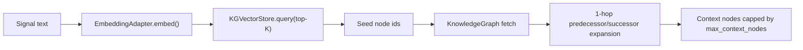

Retrieval policy:

- never send the full KG to downstream LLM-facing paths when semantic memory is enabled
- retrieve top-K semantically similar nodes from ChromaDB
- expand by one graph hop to preserve local structural context
- apply a hard cap with `memory.max_context_nodes`

Confidence status mapping:

- `active`: `c >= 0.60`
- `uncertain`: `0.30 <= c < 0.60`
- `review`: `0.15 <= c < 0.30`
- `archived`: `c < 0.15`

### Reconciler

The default reconciliation update is now a Bayesian log-odds rule with optional exponential forgetting. Let

```text
L_v(n) = log(c_v(n) / (1 - c_v(n)))
```

For `support = S_v` and `contradiction = S_v^-`, Freeman treats each unit observation as a repeated Bayes factor relative to a prior-strength pseudocount `S_v0`:

```text
L_v(n+1) =
  exp(-gamma) * L_v(n)
  + w_s * S_v * log((S_v0 + 1) / S_v0)
  - w_c * S_v^- * log((S_v0 + 1) / S_v0)
```

```text
c_v(n+1) = sigmoid(L_v(n+1))
sigmoid(x) = 1 / (1 + exp(-x))
```

So support multiplies posterior odds, conflict divides them, and `exp(-gamma)` decays stale evidence back toward neutral confidence `0.5`. A compatibility path remains available through `Reconciler(mode="legacy")`, which preserves the older multiplicative update.

Conflict handling:

- same `claim_key` + same content: merge
- same `claim_key` + high cosine similarity (`>= memory.reconciler.merge_threshold`): semantic merge instead of splitting
- same `claim_key` + genuinely conflicting content: split the node and archive the previous aggregate
- confidence below threshold: archive
- verified forecast errors: update rolling `self_observation` nodes keyed by `(domain_id, outcome_id)`

To control graph bloat, the reconciler now also performs periodic split compaction. Every `memory.reconciler.compaction_interval` runtime steps, redundant `__split_*` children with no unique downstream structure are merged back into their parent. The resulting health summary is persisted through `ConsciousState.runtime_metadata.kg_health`:

- `split_node_count`
- `avg_node_degree`
- `compaction_last_step`

## Agent Layer

### Analysis Pipeline

`freeman.agent.analysispipeline.AnalysisPipeline` executes:

1. compile schema to world
2. run verifier
3. simulate trajectory
4. score outcomes
5. write summary node to KG
6. append session deltas
7. reconcile memory

For longitudinal updates it now also exposes:

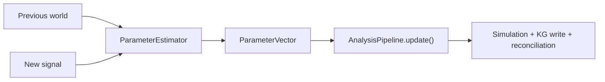

`AnalysisPipeline.update()`:

1. clones the previous world
2. replaces its `parameter_vector`
3. re-runs verify/simulate/score on the preserved ontology
4. exports the realized simulation trajectory into KG causal edges
5. stores a forecast-specific `causal_path` alongside scalar outcome forecasts
6. writes the chosen parameter vector into KG metadata for auditability

### Consciousness Layer

After reconciliation, `AnalysisPipeline` now invokes `ConsciousnessEngine.post_pipeline_update()` without altering the pipeline result payload. The consciousness layer is deterministic and additive:

1. sync runtime metrics such as `confidence_gap`
2. project `goal_state` from schema semantics and world polarity
3. project `active_hypothesis` from the current posterior over outcomes
4. project `identity_trait` from verified forecast error history
5. read rolling `self_observation` nodes and derive `self_capability`
6. rebalance `attention_focus`
7. consolidate `identity_trait`
8. append one `TraceEvent` per operator, including empty diffs with rationale `no change`

The resulting `ConsciousState` remains separate from the simulator output. LLM-facing components may render this state, but may not mutate it.

Two design constraints matter here:

- no raw LLM narrative is written back into `ConsciousState`
- ex-post forecast verification is the only path that updates calibration-sensitive self-model inputs such as `self_observation` and derived `identity_trait`

`IdleScheduler` and `ConsciousnessEngine.maybe_deliberate()` provide synchronous idle deliberation with no background threads. Internal acts currently include:

- `hypothesis_aging`
- `consistency_check`

Both operate only on structured self-model state and emit trace entries for replayability.

### Runtime Stream Loop

`freeman.runtime.stream_runtime` provides the operational daemon-like loop for local learning on arbitrary configured signal streams. Domain-specific behavior is supplied only through config (`agent.sources`, `agent.stream_keywords`) and bootstrap inputs, not through separate runtime modules.

Bootstrap modes:

- `schema_path`: compile a caller-supplied Freeman schema
- `llm_synthesize`: run the existing Freeman orchestrator (`DeepSeekFreemanOrchestrator`) to synthesize, verify, and repair a schema from a natural-language brief, then persist `bootstrap_package.json` together with `bootstrap_attempts`

The `llm_synthesize` path now uses a verifier-guided repair loop:

- every failed attempt records the verifier error
- attempts `1–3` use the standard synthesis prompt
- attempts `4–8` include accumulated error history
- attempts `9+` also include the verifier schema contract explicitly

If a configured fallback schema is still required, the failure artifact preserves the recorded `bootstrap_attempts` instead of discarding them.

Flow:

1. fetch signals from configured sources via adapters in `freeman-connectors`
2. apply phase-1 hard filtering from config (`stream_keywords`, `min_keyword_matches`, `min_relevance_score`)
3. enqueue non-duplicate items into a persistent pending queue
4. once self-calibration has started, score each pending signal against active hypotheses + ontology and soft-reject low-relevance items with trace logging
5. classify shock and trigger mode via `SignalIngestionEngine` + local `OllamaChatClient`
6. on `ANALYZE/DEEP_DIVE`, estimate `ParameterVector` and run `AnalysisPipeline.update()`
7. verify due forecasts (`ForecastRegistry.due`) against the current posterior using monotonic `runtime_step`, not simulator `world.t`
8. trigger a synchronous consciousness refresh so `self_capability` / `identity_trait` reflect the new verification state immediately
9. append trace events to `EventLog`
10. atomically persist runtime state (`checkpoint.json`, `world_state.json`, `cursors.json`, `signal_memory.json`, `pending_signals.json`)

Anomaly and ontology-repair loop:

1. if a soft-rejected signal has zero ontology overlap and zero active-hypothesis overlap, runtime records it as `anomaly_candidate` instead of discarding it
2. `_anomaly_review()` in `ConsciousnessEngine` clusters similar anomaly candidates and emits `identity_trait` nodes with `trait_key=ontology_gap`
3. once the configured `agent.ontology_repair.gap_threshold` is reached, `maybe_deliberate()` emits `ontology_repair_request`
4. `_check_and_handle_repair_request()` in the runtime aggregates the gap topics, appends them to the current domain brief, writes `domain_brief_history.jsonl`, and re-runs `_bootstrap()`
5. the repaired bootstrap preserves monotonic `runtime_step` and, by default, preserves the existing KG while replacing the active world schema / policy package

Interactive query mode:

- `--query forecasts`: list persisted forecasts with status, probabilities, and due steps
- `--query explain --forecast-id <id>`: render a human-readable causal explanation for one forecast
- `--query anomalies`: inspect `anomaly_candidate` nodes and `ontology_gap` traits
- `--query causal --limit <n>`: inspect recent trajectory edges (`causes`, `propagates_to`, `threshold_exceeded`)

Query mode is read-only. It loads saved runtime artifacts and exits without polling sources, bootstrapping a new domain, or starting the daemon loop.

Implementation structure:

- `main()`: thin orchestration entrypoint
- `_bootstrap()`: load config, state, schema/bootstrap package, and pipeline
- `_run_poll()`: fetch and hard-filter source signals
- `_process_one_signal()`: process one queued signal end-to-end
- `_run_loop()`: foreground daemon loop
- `RuntimeContext`: explicit container for runtime dependencies and counters

Resume semantics:

- `--resume` restores `ConsciousState`, `WorldState`, committed `signal_id` cursor set, and `SignalMemory`
- `--resume` restores pending queue and forecast registry state
- duplicate signals are suppressed by at-least-once + idempotent cursor dedup
- shutdown on `SIGINT/SIGTERM` persists runtime state before exit

Operational invariants added in the daemon path:

- `runtime_step` is strictly monotonic across the stream loop, including fallback updates from a base schema
- `checkpoint.json` carries `runtime_metadata.kg_health`
- `kg_health.split_node_count` is controlled by semantic merge and periodic split compaction
- runtime signal processing is at-least-once with idempotent `signal_id` dedup through `StreamCursorStore`
- runtime self-verification is blocked on durable trace/event persistence, not on transient in-memory state

If semantic memory is enabled, step 5 is preceded by retrieval-bounded context selection:

1. embed the incoming signal text
2. retrieve semantically similar nodes from ChromaDB
3. expand by one hop in the NetworkX graph
4. cap the resulting context to the configured token budget

### Counterfactual Policy Planning

`freeman.agent.policyevaluator.PolicyEvaluator` adds short-horizon Dyna-style planning on top of the same deterministic simulator. For a candidate policy bundle `pi`, Freeman computes:

```text
U(pi) = sum_o p(o | pi) * z_o / (mean_abs_z + epsilon)
w_d = 1 / (1 + MAE_d)
J(pi) = w_d * U(pi)
```

where `z_o` are the simulator raw outcome scores, `p(o | pi)` is the counterfactual outcome distribution, and `MAE_d` is the rolling domain forecast error stored in epistemic/self-model memory.

Hard verifier failures are treated as feasibility constraints rather than as a soft penalty. Ranking is therefore lexicographic:

1. fewer hard violations
2. fewer soft violations
3. larger epistemically weighted utility `J(pi)`
4. higher confidence as a tie-breaker

To keep planning cheap enough for repeated and multi-domain use, the evaluator applies three bounds:

- short planning horizon `H_plan` with default `min(sim.max_steps, 8)`
- one shared policy-invariant preparation pass per world (`level1` + fixed point) reused across all branches
- early stop when the outcome distribution stabilizes before the horizon

This changes the branch-comparison cost from naive

```text
O(K * (C_prep + H * C_step))
```

to

```text
O(C_prep + sum_(pi=1..K) tau_pi * C_step)
tau_pi <= H_plan
```

which is the main reason counterfactual planning remains tractable even when several policy branches must be compared.

### Signal Ingestion

`freeman.agent.signalingestion` supports normalized source adapters:

- manual
- RSS-like records
- Tavily-like records

Trigger logic combines:

- Mahalanobis anomaly score
- semantic shock classification
- cross-session duplicate suppression through `SignalMemory`
- exponentially decayed replay weight for repeated signals

Modes:

- `WATCH`
- `ANALYZE`
- `DEEP_DIVE`

Signal decay uses a half-life `h`:

```text
w_s(t) = 2^(-Delta_t / h)
```

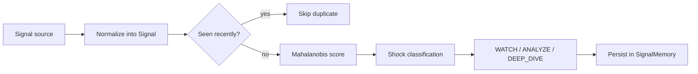

## FAAB Benchmark

The repository now includes `scripts/benchmark_faab/` for longitudinal evaluation of whether memory, interest-driven attention, and the deterministic simulator improve `T_1` forecasting versus simpler baselines.

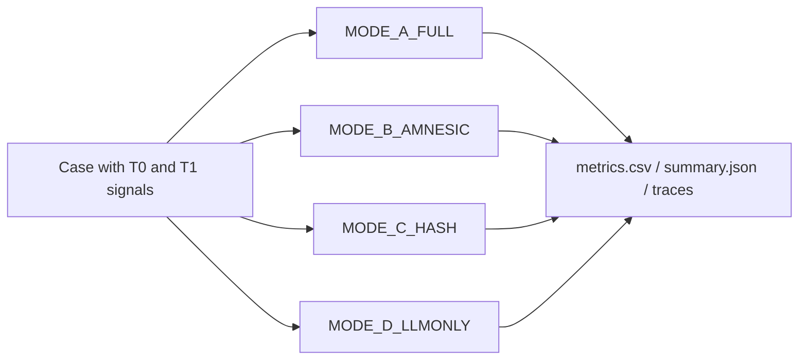

Recorded run artifact:

- `runs/faab_real_regime_v1/`

Observed mean accuracies in the recorded run:

- `MODE_A_FULL`: `t0_mean=0.50`, `t1_mean=0.75`
- `MODE_B_AMNESIC`: `t0_mean=0.50`, `t1_mean=0.50`
- `MODE_C_HASH`: `t0_mean=0.50`, `t1_mean=0.50`
- `MODE_D_LLMONLY`: `t0_mean=0.50`, `t1_mean=1.00`

### Attention Scheduler

The scheduler implements a UCB-inspired allocation rule:

```text
a_t = argmax_i [interest_i(t) + beta * sqrt(ln(t) / n_i(t))]
```

The exploration bonus keeps the familiar UCB form, but Freeman normalizes heterogeneous interest components before summation. This means the scheduler should be understood as a heuristic inspired by UCB1 rather than a setting where classical logarithmic-regret guarantees hold automatically.

```text
interest_i(t) =
  (
    EIG_tilde_i
    + anomaly_tilde_i
    + semanticGap_tilde_i
    + confidenceGap_tilde_i
    + obligationPressure_tilde_i(t)
  ) / cost_i
```

Each `x_tilde` is a rolling z-score over the recent component history, clipped to `[-3, 3]`. During the warm-up phase, when a component has not yet accumulated enough variance, the scheduler falls back to the raw component value instead of dividing by a near-zero standard deviation.

`obligationPressure` is normalized on its own history, because it aggregates deadline-like pressure from:

- `ForecastDebt`: open forecasts approaching their verification horizon
- `ConflictDebt`: aged review conflicts in the KG
- `AnomalyDebt`: unprocessed anomaly signals

Task states:

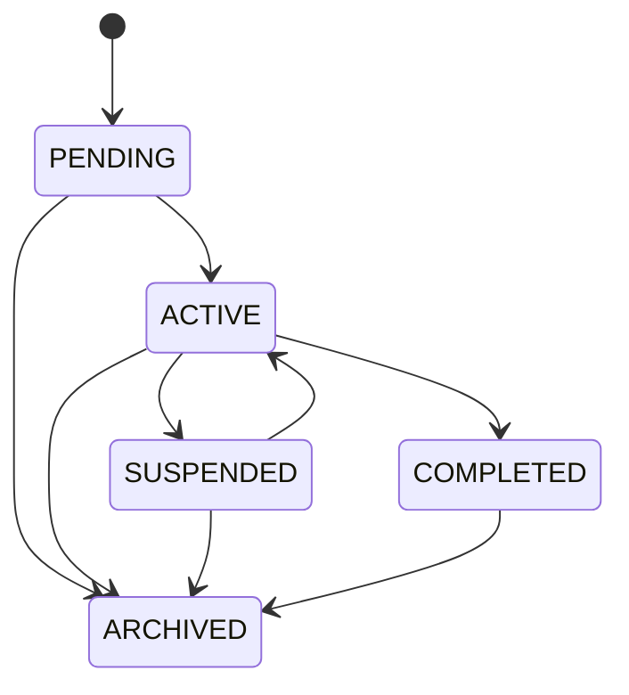

### Cost Governance

`freeman.agent.costmodel` estimates explicit task cost from:

- LLM calls
- embedding tokens
- simulation steps
- number of actors
- number of resources
- number of domains
- KG updates

It can:

- approve
- downgrade `DEEP_DIVE -> ANALYZE -> WATCH`
- stop when hard limits are exceeded

### Forecast Registry and Self-Model

`freeman.agent.forecastregistry` records each outcome forecast with a finite horizon and can attach `ForecastDebt` entries to the scheduler as soon as the forecast is created.

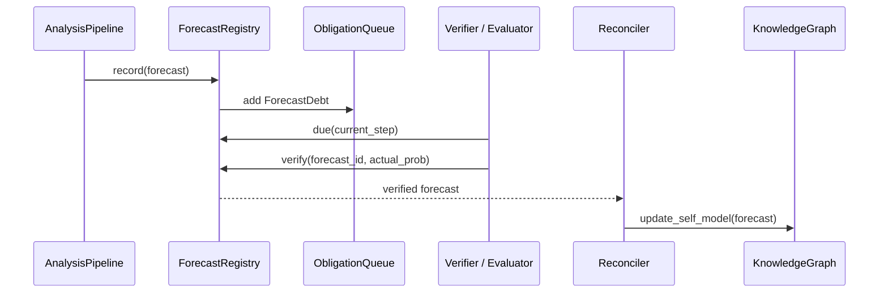

Self-model nodes store a rolling window of signed forecast errors:

- node type: `self_observation`
- identifier: `self:forecast_error:{domain_id}:{outcome_id}`
- metrics: `mean_abs_error`, `bias`, `n_forecasts`
- rolling window: last 50 verified errors

### Proactive Events

`freeman.agent.proactiveemitter.ProactiveEmitter` converts material pipeline changes into structured interface events:

- `alert` for hard verifier violations
- `forecast_update` for outcome shifts above the configured probability threshold
- `question_to_human` when confidence falls below the review floor

These events are attached to `AnalysisPipelineResult.proactive_events` and are designed for interface or notification layers rather than simulator internals.

## v0.2 Extensions

### Compile Validation

`freeman.core.compilevalidator` adds:

- `CompileCandidate`
- `HistoricalFitScore`
- `OperatorFitReport`
- `CompileValidationReport`
- backtesting against historical series
- ensemble sign voting / consensus
- operator comparison across `linear`, `stock_flow`, `logistic`, `threshold`, `coupled`
- optional `fit_outcome_weights()` suggestion path for calibrating outcome weight vectors from historical `(state, outcome)` data
- `review_required` on sign conflict

### Uncertainty

`freeman.core.uncertainty` adds:

- `ParameterDistribution`
- `ScenarioSample`
- `OutcomeDistribution`
- `ConfidenceReport`

Monte Carlo produces probabilistic outcome distributions and confidence from variance stability.

## Behavioral Harness

`tests/harness.py` provides a deterministic replay loop for stimulus logic. It is intentionally separate from the production interface layer and is used to assert agent behavior over curated JSONL streams.

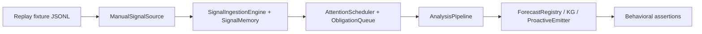

Current behavioral contracts cover:

- shock streams trigger at least one analysis action
- null streams remain in `WATCH`
- aged obligations force a return to unresolved tasks
- verifier violations surface as proactive alerts

## Human Override Path

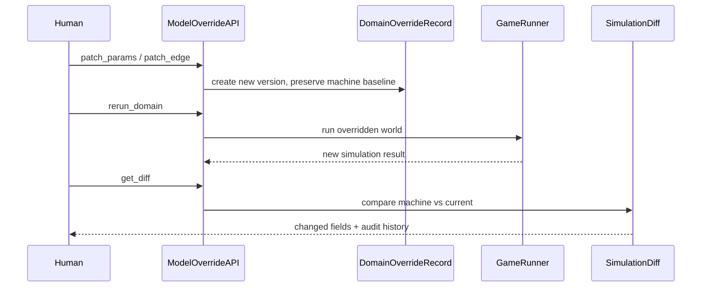

The machine hypothesis is never overwritten. Manual edits append audit entries and advance the version.

## Interface Layer

### CLI

Implemented commands:

- `run`
- `identity`
- `explain`
- `query`
- `export-kg`
- `status`
- `reconcile`
- `kg-archive`
- `kg-reindex`
- `override-param`
- `override-sign`
- `rerun-domain`
- `diff-domain`

### REST

Implemented endpoints:

- `GET /status`
- `POST /query`
- `PATCH /domain/{id}/params`
- `PATCH /domain/{id}/edges/{edge_id}`
- `POST /domain/{id}/rerun`
- `GET /domain/{id}/diff`

## Persistence

- KG path is read from `config.yaml -> memory.json_path`
- default path: `runs/memory/knowledge_graph.json`
- session logs are JSON-serializable via `SessionLog.save()`
- local runtime checkpoints are managed by `freeman.runtime.checkpoint.CheckpointManager`
- append-only runtime trace events are stored in `config.yaml -> runtime.event_log_path`
- committed stream ids are persisted by `freeman.runtime.stream.StreamCursorStore`
- replayable consciousness traces live in `ConsciousState.trace_state` and are included in checkpoint payloads

## Testing

Coverage includes:

- unit tests for all newly introduced layers
- regression tests for existing simulator/verifier behavior
- end-to-end integration test with:
  - 30-step simulation
  - reconciliation
  - KG export
  - end-to-end invariant validation
