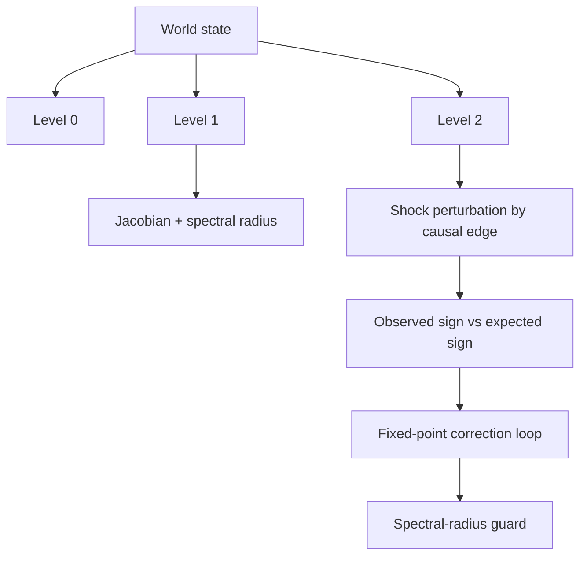
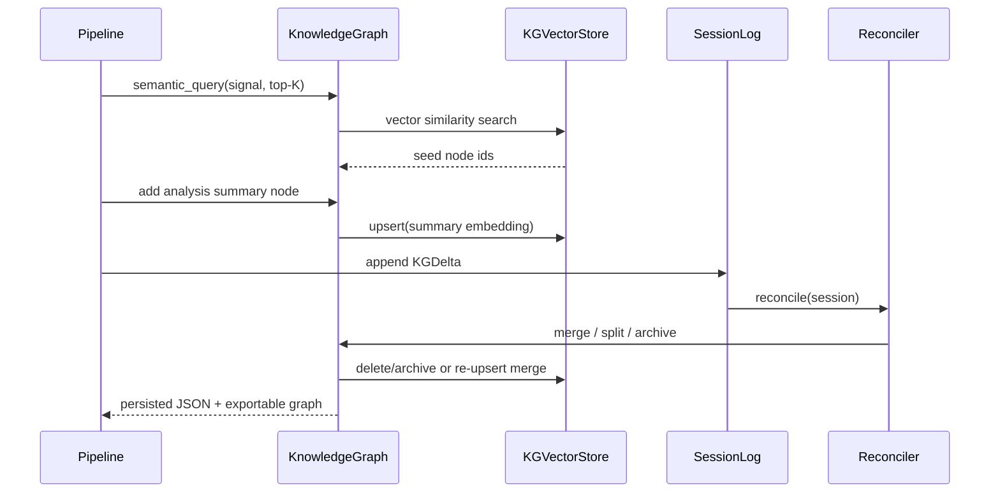
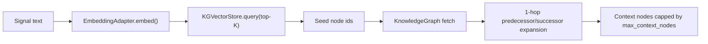
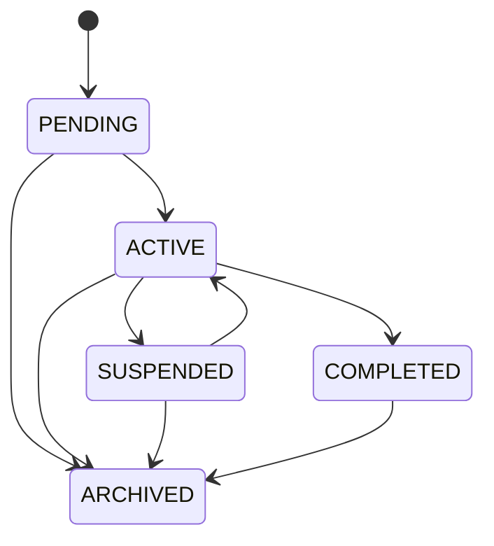
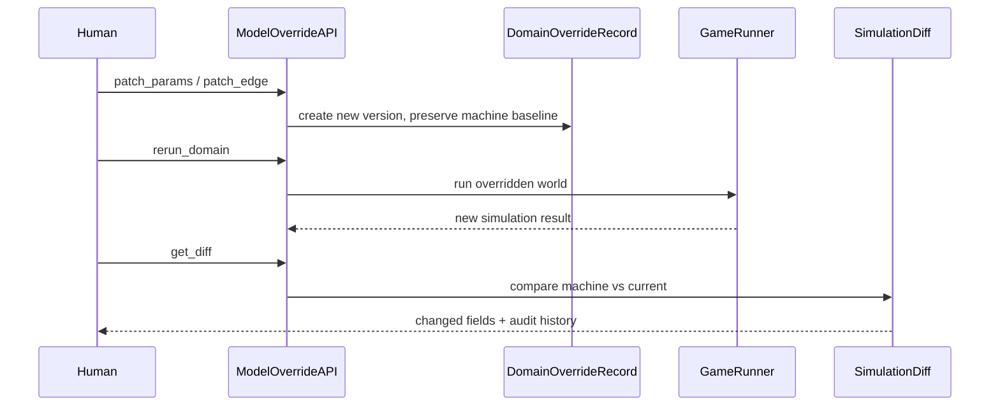

# Freeman Architecture

This document describes the implemented USIM-AGENT architecture in the current repository, with emphasis on data flow, execution stages, verification, memory, and human override paths.

## System Overview

Freeman is organized into five layers:

1. `freeman.core`: deterministic world model, transition operators, scoring, uncertainty, compile validation.
2. `freeman.verifier`: invariant checks, structural stability checks, sign consistency, fixed-point correction.
3. `freeman.memory`: long-term knowledge graph, session log, confidence reconciliation.
4. `freeman.agent`: end-to-end analysis pipeline, signal ingestion, attention scheduling, cost governance.
5. `freeman.interface`: CLI, REST endpoints, export, override and diff utilities.

## High-Level Flow

```mermaid
flowchart LR
    A["Natural-language brief or domain schema"] --> B["DomainCompiler / CompileValidator"]
    B --> C["WorldGraph / WorldState"]
    C --> D["Verifier Level 1 + Level 2 precheck"]
    D --> E["GameRunner"]
    E --> F["Outcome scoring + confidence"]
    F --> G["KnowledgeGraph update"]
    G --> H["SessionLog + Reconciler"]
    H --> I["CLI / REST / Human override / Export"]
```

## Core Simulation Layer

### World Model

- `WorldGraph` is the spec-facing state container.
- `WorldState` is a backward-compatible alias used by the rest of the repo.
- The state contains:
  - actors
  - resources
  - relations
  - outcome registry
  - causal DAG
  - actor update rules
  - metadata

### Transition Operator

The simulator implements:

\[
S_{t+1} = S_t + F_{\theta_D}(S_t, \pi_t)
\]

Operationally, each resource uses one evolution operator:

- `linear`
- `stock_flow`
- `logistic`
- `threshold`
- `coupled`

`EvolutionRegistry` provides the spec-facing factory over these operators.

### Outcome Scoring

For outcomes \(o\), the raw score is:

\[
z_o = W_o \cdot S_t
\]

and the probability is:

\[
p(o_t) = \frac{\exp(z_o)}{\sum_j \exp(z_j)}
\]

implemented in `freeman.core.scorer`.

## Verification Layer

### Level 0

`freeman.verifier.level0` enforces:

- conservation
- non-negativity
- probability simplex
- bounds

Hard violations trigger `HardStopException`.

### Level 1

`freeman.verifier.level1` checks:

- null-action convergence
- shock decay
- spectral radius \( \rho(J_\Phi) < 1 \)
- causal sign precheck through the current DAG

### Level 2

`freeman.verifier.level2` checks local sign consistency with DAG perturbations. `freeman.verifier.fixedpoint` adds bounded correction iterations and the guard:

\[
\rho(J_\Phi) < 1
\]

The aggregate API lives in `freeman.verifier.verifier.Verifier`.

## Memory and Reconciliation

### Knowledge Graph

`freeman.memory.knowledgegraph` uses `networkx.MultiDiGraph` with JSON persistence. Supported operations:

- query
- semantic query with top-K retrieval plus 1-hop neighbors
- add node / edge
- split node
- archive node
- export HTML / JSON / DOT

When semantic memory is enabled, each `KGNode` also stores an embedding vector and the graph is synchronized with `freeman.memory.vectorstore.KGVectorStore` backed by ChromaDB.

### Semantic Retrieval

Retrieval policy:

- never send the full KG to downstream LLM-facing paths when semantic memory is enabled
- retrieve top-K semantically similar nodes from ChromaDB
- expand by one graph hop to preserve local structural context
- apply a hard cap with `memory.max_context_nodes`

Confidence status mapping:

- `active`: \( c \ge 0.60 \)
- `uncertain`: \( 0.30 \le c < 0.60 \)
- `review`: \( 0.15 \le c < 0.30 \)
- `archived`: \( c < 0.15 \)

### Reconciler

The implemented confidence update follows the requested multiplicative form:

\[
c_v(n+1) = c_v(n)\cdot\frac{S_v}{S_v + S_v^-} - \text{prior\_strength\_penalty}
\]

followed by clipping to \([0,1]\) and status remapping.

Conflict handling:

- same `claim_key` + same content: merge
- same `claim_key` + conflicting content: split the node and archive the previous aggregate
- confidence below threshold: archive

## Agent Layer

### Analysis Pipeline

`freeman.agent.analysispipeline.AnalysisPipeline` executes:

1. compile schema to world
2. run verifier
3. simulate trajectory
4. score outcomes
5. write summary node to KG
6. append session deltas
7. reconcile memory

If semantic memory is enabled, step 5 is preceded by retrieval-bounded context selection:

1. embed the incoming signal text
2. retrieve semantically similar nodes from ChromaDB
3. expand by one hop in the NetworkX graph
4. cap the resulting context to the configured token budget

### Signal Ingestion

`freeman.agent.signalingestion` supports normalized source adapters:

- manual
- RSS-like records
- Tavily-like records

Trigger logic combines:

- Mahalanobis anomaly score
- semantic shock classification

Modes:

- `WATCH`
- `ANALYZE`
- `DEEP_DIVE`

### Attention Scheduler

The scheduler implements UCB allocation:

\[
a_t = \arg\max_i\left[\text{interest}_i(t) + \beta\sqrt{\frac{\ln t}{n_i(t)}}\right]
\]

Current interest term:

\[
\text{interest}_i(t) =
\frac{\text{EIG}_i + \text{anomaly}_i + \text{semanticGap}_i + \text{confidenceGap}_i}{\text{cost}_i}
\]

Task states:

### Cost Governance

`freeman.agent.costmodel` estimates explicit task cost from:

- LLM calls
- embedding tokens
- simulation steps
- number of actors
- number of resources
- number of domains
- KG updates

It can:

- approve
- downgrade `DEEP_DIVE -> ANALYZE -> WATCH`
- stop when hard limits are exceeded

## v0.2 Extensions

### Compile Validation

`freeman.core.compilevalidator` adds:

- `CompileCandidate`
- `HistoricalFitScore`
- `CompileValidationReport`
- backtesting against historical series
- ensemble sign voting / consensus
- `review_required` on sign conflict

### Uncertainty

`freeman.core.uncertainty` adds:

- `ParameterDistribution`
- `ScenarioSample`
- `OutcomeDistribution`
- `ConfidenceReport`

Monte Carlo produces probabilistic outcome distributions and confidence from variance stability.

## Human Override Path

The machine hypothesis is never overwritten. Manual edits append audit entries and advance the version.

## Interface Layer

### CLI

Implemented commands:

- `run`
- `query`
- `export-kg`
- `status`
- `reconcile`
- `kg-archive`
- `override-param`
- `override-sign`
- `rerun-domain`
- `diff-domain`

### REST

Implemented endpoints:

- `GET /status`
- `POST /query`
- `PATCH /domain/{id}/params`
- `PATCH /domain/{id}/edges/{edge_id}`
- `POST /domain/{id}/rerun`
- `GET /domain/{id}/diff`

## Persistence

- KG path is read from `config.yaml -> memory.json_path`
- default path: `runs/memory/knowledge_graph.json`
- session logs are JSON-serializable via `SessionLog.save()`

## Testing

Coverage includes:

- unit tests for all newly introduced layers
- regression tests for existing simulator/verifier behavior
- end-to-end integration test with:
  - 30-step simulation
  - reconciliation
  - KG export
  - end-to-end invariant validation
