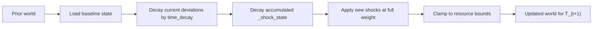
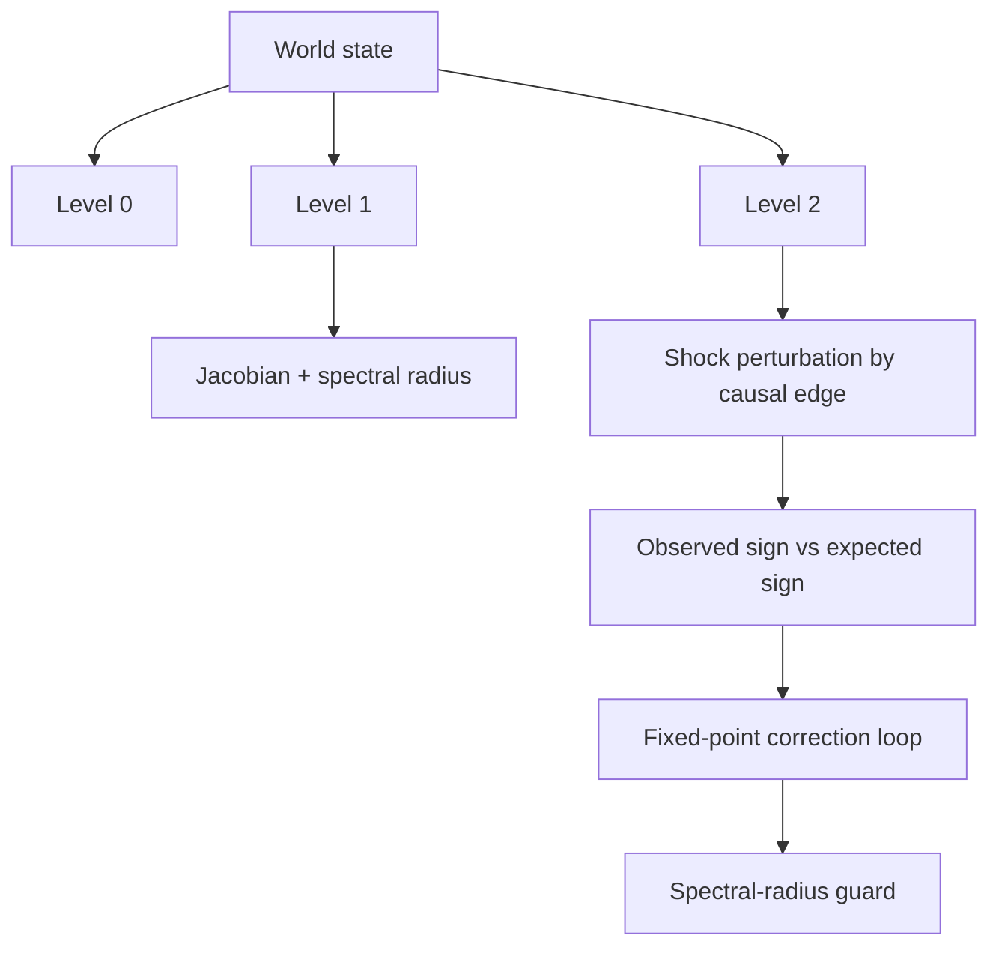
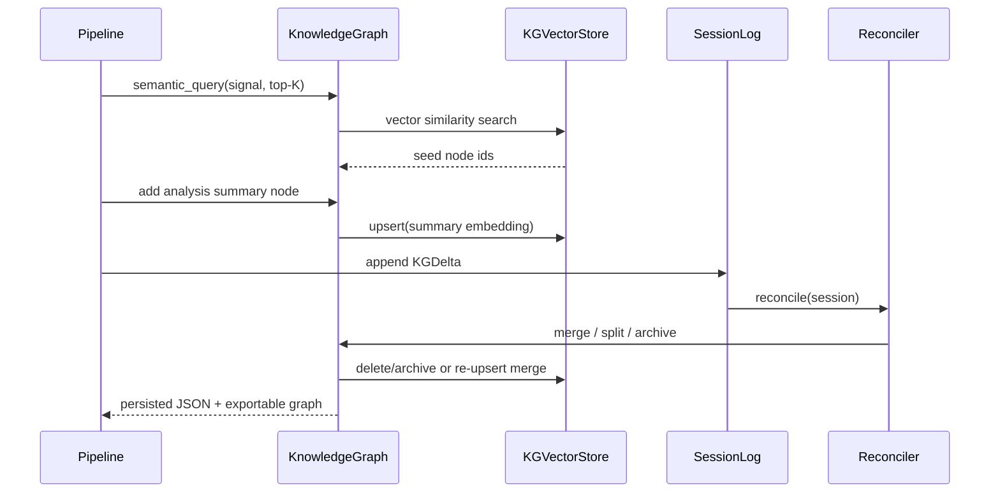
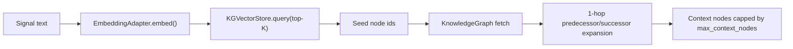
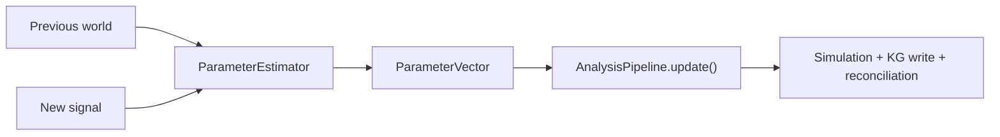
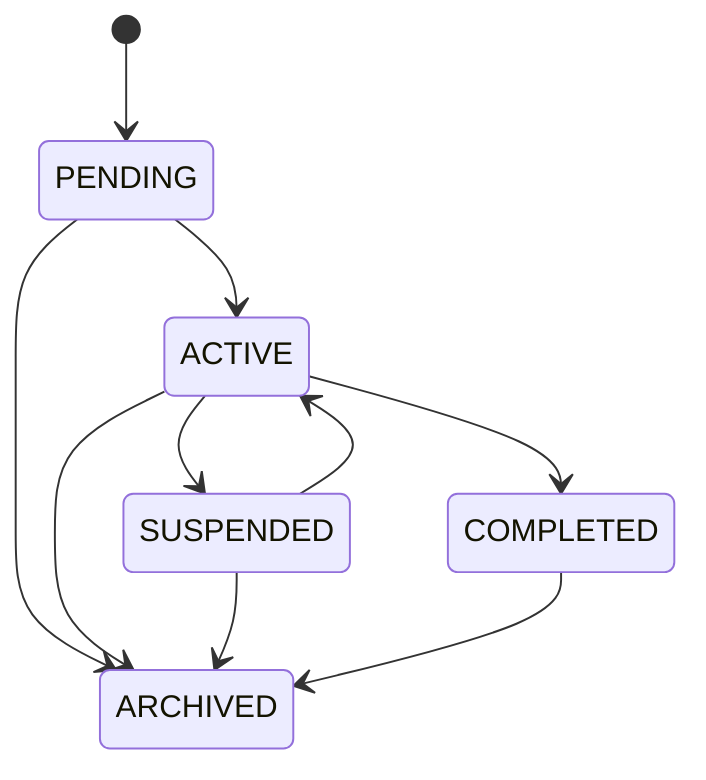
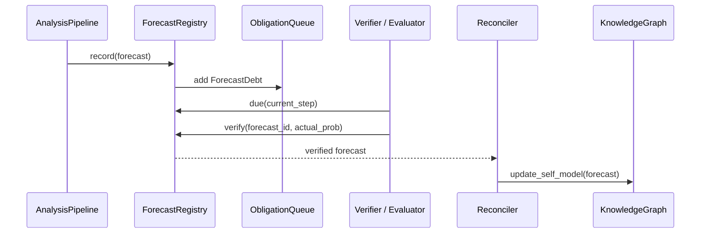
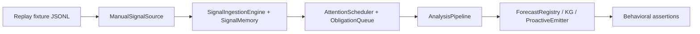
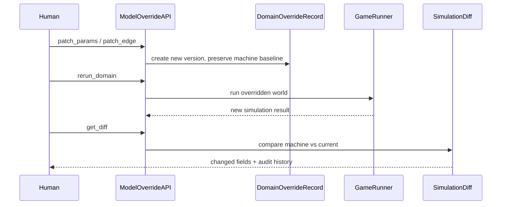

# Freeman Architecture

This document describes the implemented USIM-AGENT architecture in the current repository, with emphasis on data flow, execution stages, verification, memory, and human override paths.

## System Overview

Freeman is organized into five layers:

1. `freeman.core`: deterministic world model, transition operators, scoring, uncertainty, compile validation.
2. `freeman.verifier`: invariant checks, structural stability checks, sign consistency, fixed-point correction.
3. `freeman.memory`: long-term knowledge graph, semantic vector store, session log, confidence reconciliation, self-model feedback.
4. `freeman.agent`: signal ingestion, signal memory, obligation-driven attention scheduling, end-to-end analysis pipeline, forecast tracking, proactive emission, cost governance.
5. `freeman.interface`: CLI, REST endpoints, export, override and diff utilities.

## High-Level Flow

```mermaid
flowchart LR
    A["Incoming signals or schema"] --> B["SignalIngestionEngine + SignalMemory"]
    B --> C["AttentionScheduler + ObligationQueue"]
    C --> D["DomainCompiler / CompileValidator"]
    D --> E["WorldGraph / WorldState"]
    E --> F["Verifier Level 1 + Level 2 precheck"]
    F --> G["GameRunner"]
    G --> H["Outcome scoring + confidence"]
    H --> I["ForecastRegistry + ProactiveEmitter"]
    H --> J["KnowledgeGraph update"]
    J --> K["SessionLog + Reconciler"]
    I --> L["Self-model updates after verification"]
    K --> M["CLI / REST / Human override / Export"]
    L --> M
```



## Core Simulation Layer

### World Model

- `WorldGraph` is the spec-facing state container.
- `WorldState` is a backward-compatible alias used by the rest of the repo.
- The state contains:
  - actors
  - resources
  - relations
  - outcome registry
  - causal DAG
  - actor update rules
  - metadata
  - `parameter_vector`

### Transition Operator

The simulator implements:

$$
S_{t+1} = S_t + F_{\theta_D}(S_t, \pi_t)
$$

Operationally, each resource uses one evolution operator:

- `linear`
- `stock_flow`
- `logistic`
- `threshold`
- `coupled`

`EvolutionRegistry` provides the spec-facing factory over these operators.

## Operator Selection Criteria

By default the schema still chooses an operator explicitly, but `CompileValidator.compare_operators()` can now compare that choice against alternatives on a historical resource series. The validator runs each candidate operator on the observed trajectory, computes RMSE, and warns when the chosen operator is materially worse than the best alternative.

| Operator | When to use it | Typical signal in data |
| --- | --- | --- |
| `linear` | smooth trend-like dynamics | approximately affine step-to-step update |
| `stock_flow` | accumulation with inflow/outflow | drift toward or away from a stock level |
| `logistic` | bounded S-curve growth | inflection plus saturation near a ceiling |
| `threshold` | regime change around a level | different dynamics below vs above a cutoff |
| `coupled` | blended operator behavior | no single family dominates cleanly |

If historical data are available, the validator reports:

- per-operator RMSE for each resource
- the best operator under that metric
- a relative RMSE gap for the schema-chosen operator
- `warn=True` when the chosen operator exceeds the configured gap threshold

### Stateful Shock Update

Longitudinal updates now keep an explicit baseline-relative shock state:

$$
d_{t+1} = \lambda d_t + \Delta_{t+1}, \qquad S_{t+1} = S_{\mathrm{base}} + d_{t+1}
$$

where:

- $d_t$ is the accumulated decayed deviation stored in `metadata["_shock_state"]`
- $\lambda$ is `time_decay`
- $\Delta_{t+1}$ is the newly inferred shock vector

`WorldGraph.apply_shocks()` implements this in a deterministic way:



### Parameter Vector

The simulator now supports a universal dynamic calibration layer:

$$
\Theta_t = \{\text{outcome\_modifiers}, \text{shock\_decay}, \text{edge\_weight\_deltas}\}
$$

`ParameterVector` is stored directly on the world state and is preserved by snapshot/clone operations. It lets the system recalibrate a world at `T_1` without rewriting the base ontology generated at `T_0`.

Its three active channels are:

- outcome-level multiplicative scaling
- global decay of previously accumulated shock state
- additive adjustment of causal edge weights in resource and actor-state updates

### Outcome Scoring

For outcomes $o$, the raw score is:

$$
z_o = W_o \cdot S_t
$$

and the probability is:

$$
p(o_t) = \frac{\exp(z_o)}{\sum_j \exp(z_j)}
$$

implemented in `freeman.core.scorer`.

### Regime Shifts

Each `Outcome` may now define conditional multipliers:

$$
z_o \leftarrow m_o z_o \quad \text{if} \quad C_o(d_t)=\text{true}
$$

where `C_o` is a safe boolean expression over the accumulated shock context. Plain identifiers in regime-shift conditions are interpreted as decayed deviations, while `level_<name>` and `abs_<name>` expose absolute levels.

Examples:

- macro: `business_demand <= -5 AND policyrate >= 5`
- film: `criticsentiment <= -5 AND boxofficelegs <= -5`

Dynamic `ParameterVector.outcome_modifiers` are applied after static regime shifts:

$$
z_o \leftarrow z_o \cdot m_o
$$

with $m_o = 1$ by default.

### Dynamic Edge Calibration

Resource and actor-state transitions now read:

$$
w_{ij}^{\mathrm{eff}} = w_{ij} + \Delta w_{ij}
$$

where $\Delta w_{ij}$ comes from `ParameterVector.edge_weight_deltas`. This is how a new signal can temporarily strengthen or weaken one causal relation without changing the original schema.

## Verification Layer



### Level 0

`freeman.verifier.level0` enforces:

- conservation
- non-negativity
- probability simplex
- bounds

Hard violations trigger `HardStopException`.

### Level 1

`freeman.verifier.level1` checks:

- null-action convergence
- shock decay
- spectral radius $\rho(J_\Phi) < 1$
- causal sign precheck through the current DAG

### Level 2

`freeman.verifier.level2` checks local sign consistency with DAG perturbations. `freeman.verifier.fixedpoint` adds bounded correction iterations and the guard:

$$
\rho(J_\Phi) < 1
$$

The aggregate API lives in `freeman.verifier.verifier.Verifier`.

## Memory and Reconciliation



### Knowledge Graph

`freeman.memory.knowledgegraph` uses `networkx.MultiDiGraph` with JSON persistence. Supported operations:

- query
- semantic query with top-K retrieval plus 1-hop neighbors
- add node / edge
- split node
- archive node
- export HTML / JSON / DOT

When semantic memory is enabled, each `KGNode` also stores an embedding vector and the graph is synchronized with `freeman.memory.vectorstore.KGVectorStore` backed by ChromaDB.

### Semantic Retrieval



Retrieval policy:

- never send the full KG to downstream LLM-facing paths when semantic memory is enabled
- retrieve top-K semantically similar nodes from ChromaDB
- expand by one graph hop to preserve local structural context
- apply a hard cap with `memory.max_context_nodes`

Confidence status mapping:

- `active`: $c \ge 0.60$
- `uncertain`: $0.30 \le c < 0.60$
- `review`: $0.15 \le c < 0.30$
- `archived`: $c < 0.15$

### Reconciler

The default reconciliation update is now a Bayesian log-odds rule with optional exponential forgetting. Let

$$
L_v(n) = \log\frac{c_v(n)}{1 - c_v(n)}
$$

For `support = S_v` and `contradiction = S_v^-`, Freeman treats each unit observation as a repeated Bayes factor relative to a prior-strength pseudocount $S_{v0}$:

$$
L_v(n+1) = e^{-\gamma}L_v(n) + w_s S_v \log\left(\frac{S_{v0}+1}{S_{v0}}\right) - w_c S_v^- \log\left(\frac{S_{v0}+1}{S_{v0}}\right)
$$

$$
c_v(n+1) = \sigma(L_v(n+1)), \qquad \sigma(x)=\frac{1}{1+e^{-x}}
$$

So support multiplies posterior odds, conflict divides them, and $e^{-\gamma}$ decays stale evidence back toward neutral confidence $0.5$. A compatibility path remains available through `Reconciler(mode="legacy")`, which preserves the older multiplicative update.

Conflict handling:

- same `claim_key` + same content: merge
- same `claim_key` + conflicting content: split the node and archive the previous aggregate
- confidence below threshold: archive
- verified forecast errors: update rolling `self_observation` nodes keyed by `(domain_id, outcome_id)`

## Agent Layer

### Analysis Pipeline

`freeman.agent.analysispipeline.AnalysisPipeline` executes:

1. compile schema to world
2. run verifier
3. simulate trajectory
4. score outcomes
5. write summary node to KG
6. append session deltas
7. reconcile memory

For longitudinal updates it now also exposes:



`AnalysisPipeline.update()`:

1. clones the previous world
2. replaces its `parameter_vector`
3. re-runs verify/simulate/score on the preserved ontology
4. writes the chosen parameter vector into KG metadata for auditability

If semantic memory is enabled, step 5 is preceded by retrieval-bounded context selection:

1. embed the incoming signal text
2. retrieve semantically similar nodes from ChromaDB
3. expand by one hop in the NetworkX graph
4. cap the resulting context to the configured token budget

### Signal Ingestion

`freeman.agent.signalingestion` supports normalized source adapters:

- manual
- RSS-like records
- Tavily-like records

Trigger logic combines:

- Mahalanobis anomaly score
- semantic shock classification
- cross-session duplicate suppression through `SignalMemory`
- exponentially decayed replay weight for repeated signals

Modes:

- `WATCH`
- `ANALYZE`
- `DEEP_DIVE`

Signal decay uses a half-life $h$:

$$
w_s(t) = 2^{-\Delta t / h}
$$

```mermaid
flowchart LR
    A["Signal source"] --> B["Normalize into Signal"]
    B --> C{"Seen recently?"}
    C -->|yes| D["Skip duplicate"]
    C -->|no| E["Mahalanobis score"]
    E --> F["Shock classification"]
    F --> G["WATCH / ANALYZE / DEEP_DIVE"]

## FAAB Benchmark

The repository now includes `scripts/benchmark_faab/` for longitudinal evaluation of whether memory, interest-driven attention, and the deterministic simulator improve `T_1` forecasting versus simpler baselines.

```mermaid
flowchart LR
    A["Case with T0 and T1 signals"] --> B["MODE_A_FULL"]
    A --> C["MODE_B_AMNESIC"]
    A --> D["MODE_C_HASH"]
    A --> E["MODE_D_LLMONLY"]
    B --> F["metrics.csv / summary.json / traces"]
    C --> F
    D --> F
    E --> F
```

Recorded run artifact:

- `runs/faab_real_regime_v1/`

Observed mean accuracies in the recorded run:

- `MODE_A_FULL`: `t0_mean=0.50`, `t1_mean=0.75`
- `MODE_B_AMNESIC`: `t0_mean=0.50`, `t1_mean=0.50`
- `MODE_C_HASH`: `t0_mean=0.50`, `t1_mean=0.50`
- `MODE_D_LLMONLY`: `t0_mean=0.50`, `t1_mean=1.00`
    G --> H["Persist in SignalMemory"]
```

### Attention Scheduler

The scheduler implements a UCB-inspired allocation rule:

$$
a_t = \arg\max_i\left[\text{interest}_i(t) + \beta\sqrt{\frac{\ln t}{n_i(t)}}\right]
$$

The exploration bonus keeps the familiar UCB form, but Freeman normalizes heterogeneous interest components before summation. This means the scheduler should be understood as a heuristic inspired by UCB1 rather than a setting where classical logarithmic-regret guarantees hold automatically.

$$
\text{interest}_i(t) =
\frac{
\tilde{\text{EIG}}_i + \tilde{\text{anomaly}}_i + \widetilde{\text{semanticGap}}_i + \widetilde{\text{confidenceGap}}_i + \widetilde{\text{obligationPressure}}_i(t)
}{\text{cost}_i}
$$

Each $\tilde{x}$ is a rolling z-score over the recent component history, clipped to $[-3, 3]$. During the warm-up phase, when a component has not yet accumulated enough variance, the scheduler falls back to the raw component value instead of dividing by a near-zero standard deviation.

`obligationPressure` is normalized on its own history, because it aggregates deadline-like pressure from:

- `ForecastDebt`: open forecasts approaching their verification horizon
- `ConflictDebt`: aged review conflicts in the KG
- `AnomalyDebt`: unprocessed anomaly signals

Task states:



### Cost Governance

`freeman.agent.costmodel` estimates explicit task cost from:

- LLM calls
- embedding tokens
- simulation steps
- number of actors
- number of resources
- number of domains
- KG updates

It can:

- approve
- downgrade `DEEP_DIVE -> ANALYZE -> WATCH`
- stop when hard limits are exceeded

### Forecast Registry and Self-Model

`freeman.agent.forecastregistry` records each outcome forecast with a finite horizon and can attach `ForecastDebt` entries to the scheduler as soon as the forecast is created.



Self-model nodes store a rolling window of signed forecast errors:

- node type: `self_observation`
- identifier: `self:forecast_error:{domain_id}:{outcome_id}`
- metrics: `mean_abs_error`, `bias`, `n_forecasts`
- rolling window: last 50 verified errors

### Proactive Events

`freeman.agent.proactiveemitter.ProactiveEmitter` converts material pipeline changes into structured interface events:

- `alert` for hard verifier violations
- `forecast_update` for outcome shifts above the configured probability threshold
- `question_to_human` when confidence falls below the review floor

These events are attached to `AnalysisPipelineResult.proactive_events` and are designed for interface or notification layers rather than simulator internals.

## v0.2 Extensions

### Compile Validation

`freeman.core.compilevalidator` adds:

- `CompileCandidate`
- `HistoricalFitScore`
- `OperatorFitReport`
- `CompileValidationReport`
- backtesting against historical series
- ensemble sign voting / consensus
- operator comparison across `linear`, `stock_flow`, `logistic`, `threshold`, `coupled`
- optional `fit_outcome_weights()` suggestion path for calibrating outcome weight vectors from historical `(state, outcome)` data
- `review_required` on sign conflict

### Uncertainty

`freeman.core.uncertainty` adds:

- `ParameterDistribution`
- `ScenarioSample`
- `OutcomeDistribution`
- `ConfidenceReport`

Monte Carlo produces probabilistic outcome distributions and confidence from variance stability.

## Behavioral Harness

`tests/harness.py` provides a deterministic replay loop for stimulus logic. It is intentionally separate from the production interface layer and is used to assert agent behavior over curated JSONL streams.



Current behavioral contracts cover:

- shock streams trigger at least one analysis action
- null streams remain in `WATCH`
- aged obligations force a return to unresolved tasks
- verifier violations surface as proactive alerts

## Human Override Path



The machine hypothesis is never overwritten. Manual edits append audit entries and advance the version.

## Interface Layer

### CLI

Implemented commands:

- `run`
- `query`
- `export-kg`
- `status`
- `reconcile`
- `kg-archive`
- `kg-reindex`
- `override-param`
- `override-sign`
- `rerun-domain`
- `diff-domain`

### REST

Implemented endpoints:

- `GET /status`
- `POST /query`
- `PATCH /domain/{id}/params`
- `PATCH /domain/{id}/edges/{edge_id}`
- `POST /domain/{id}/rerun`
- `GET /domain/{id}/diff`

## Persistence

- KG path is read from `config.yaml -> memory.json_path`
- default path: `runs/memory/knowledge_graph.json`
- session logs are JSON-serializable via `SessionLog.save()`

## Testing

Coverage includes:

- unit tests for all newly introduced layers
- regression tests for existing simulator/verifier behavior
- end-to-end integration test with:
  - 30-step simulation
  - reconciliation
  - KG export
  - end-to-end invariant validation
