# FAAB Benchmark

> Legacy note: this document describes a benchmark/research harness from an earlier Freeman iteration. It remains useful for evaluation history, but it is not the operational daemon runtime described in `docs/ARCHITECTURE.md`.

FAAB is the Freeman Autonomous Analyst Benchmark: a longitudinal `T_0 -> T_1` evaluation designed to test whether the full Freeman stack uses memory, attention, and simulation to update its world model more effectively than simpler baselines.

## Objective

Each case provides:

- a `T_0` signal
- a `T_1` signal that may reverse or sharpen the situation
- a ground-truth `T_2` dominant outcome

The key question is whether Freeman can carry forward useful state and then revise that state when `T_1` introduces a genuine regime shift.

## Modes

- `MODE_A_FULL`: semantic memory + attention + deterministic simulator
- `MODE_A_FULL` now uses `ParameterEstimator -> AnalysisPipeline.update()` on `T_1`
- `MODE_B_AMNESIC`: same stack but memory cleared before `T_1`
- `MODE_C_HASH`: semantic retrieval replaced with local hashing embeddings
- `MODE_D_LLMONLY`: direct advanced-LLM baseline without Freeman simulation

## Stateful Update

The simulator now uses a decayed stateful update:

```text
d_t+1 = lambda * d_t + Delta_t+1
S_t+1 = S_base + d_t+1
```

where:

- `d_t` is the accumulated shock state
- `lambda` is `time_decay`
- `Delta_t+1` is the fresh shock inferred from the new signal

Outcome scoring then applies optional nonlinear regime shifts:

```text
z_o = W_o * S_t
if C_o(d_t) is true:
  z_o = m_o * z_o
```

The universal update path adds a dynamic `ParameterVector`:

```text
Theta_t+1 = LLM(S_t, signal_t+1)
```

with fields:

- `outcome_modifiers`
- `shock_decay`
- `edge_weight_deltas`
- `rationale`

## Execution Flow

```mermaid
flowchart LR
    A["Dataset case"] --> B["T0 signal"]
    B --> C["Freeman or baseline mode"]
    C --> D["Forecast + memory write"]
    D --> E["T1 signal"]
    E --> F["ParameterEstimator"]
    F --> G["ParameterVector"]
    G --> H["Stateful decay + new shocks"]
    H --> I["AnalysisPipeline.update()"]
    I --> J["Final T1 forecast"]
    J --> K["metrics.csv / summary.json / traces / KG snapshots"]
```



## Commands

Run the default dataset with the full benchmark:

```bash
python scripts/benchmark_faab/run_benchmark.py --dataset scripts/benchmark_faab/dataset/cases.jsonl --output-dir runs/faab_real_regime_v1
```

Run the deterministic smoke version:

```bash
python scripts/benchmark_faab/run_benchmark.py --dry-run --dataset scripts/benchmark_faab/dataset/cases.jsonl --output-dir runs/faab_universal_dryrun
```

## Recorded Run

Tracked artifact:

- `runs/faab_real_regime_v1/`

Mean accuracies from the recorded run:

| Mode | T0 mean | T1 mean | Delta |
| --- | ---: | ---: | ---: |
| `MODE_A_FULL` | 0.50 | 0.75 | +0.25 |
| `MODE_B_AMNESIC` | 0.50 | 0.50 | +0.00 |
| `MODE_C_HASH` | 0.50 | 0.50 | +0.00 |
| `MODE_D_LLMONLY` | 0.50 | 1.00 | +0.50 |

## Calibration Metric

FAAB now also records the multiclass Brier score:

```text
BS = sum over outcomes o of (p(o) - 1{o = o*})^2
```

where `o*` is the realized dominant outcome. Lower is better.

- ideal forecast: `0.0`
- roughly good calibration: `< 0.2`
- poor calibration: `> 0.5`
- uniform random forecast over `K` outcomes:

```text
BS_random = (K - 1) / K
```

For the common binary case this reduces to `0.5`.

## Repeatability Metrics

FAAB now also records repeatability under repeated execution of the same `(case, mode)` pair:

```text
primary TAR@N   = 1{ max_{r,s<=N} ||p^(r) - p^(s)||_1 <= epsilon }
secondary TAR@N = 1{ dominant_outcome^(1) = ... = dominant_outcome^(N) }
```

where `p^(r)` is the normalized outcome distribution from repeat `r`.

Operational notes:

- `--repeat-runs N` repeats each case `N` times
- `--tar-probability-epsilon <eps>` sets the L1 tolerance for primary TAR
- `t0_max_l1_repeat_distance` and `t1_max_l1_repeat_distance` are stored alongside the binary TAR flags for diagnostics
- on deterministic dry-run paths these values should be near `0.0` and TAR should be `1.0`

## Interpretation

- The stateful simulator update now materially improves `MODE_A_FULL` at `T_1` relative to its own `T_0` and relative to `MODE_B_AMNESIC`.
- The clearest repaired case is `macro_trade_to_recession`: `MODE_A_FULL` flips to `recession_spiral`, while `MODE_B_AMNESIC` remains stuck in `inflation_persistence`.
- The `film_buzz_frontload` case still does not fully flip under `MODE_A_FULL`, so film-domain template calibration remains an open issue rather than a memory or retrieval failure.

## Universal Dry-Run Result

The current universal `ParameterVector` path is validated in:

- `runs/faab_universal_dryrun/` (local run artifact)

Dry-run means after the universal update integration:

| Mode | T0 mean | T1 mean |
| --- | ---: | ---: |
| `MODE_A_FULL` | 0.50 | 1.00 |
| `MODE_B_AMNESIC` | 0.50 | 0.50 |
| `MODE_C_HASH` | 0.50 | 0.75 |
| `MODE_D_LLMONLY` | 0.25 | 1.00 |

## Output Files

- `metrics.csv`: one row per `(case_id, mode)`
  includes `t0_accuracy`, `t1_accuracy`, `t0_brier_score`, `t1_brier_score`, `t0_max_l1_repeat_distance`, `t1_max_l1_repeat_distance`, `t0_primary_tar`, `t1_primary_tar`, `t0_secondary_tar`, `t1_secondary_tar`, `repeat_runs`, `successful_runs`
- `summary.json`: full serialized benchmark output
  includes per-repeat payloads under `repeats`
- `traces/*.json`: prompts, retrieval, and predictions for each case/mode
- `kg_snapshots/*.json`: persisted KG after `T_1`
