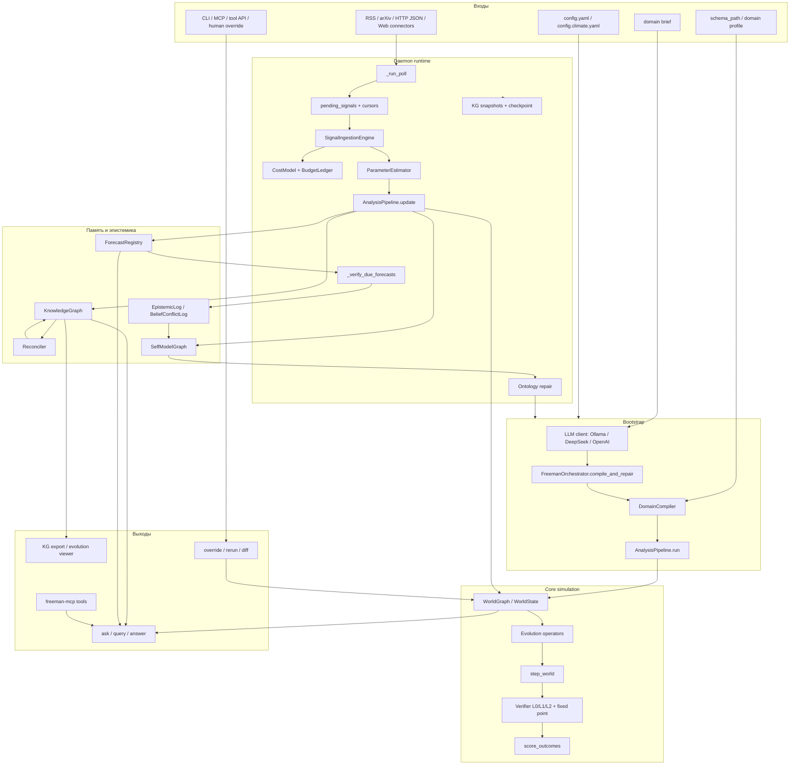
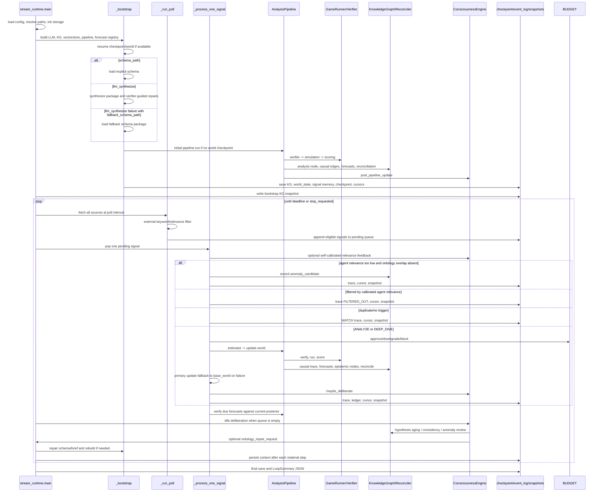
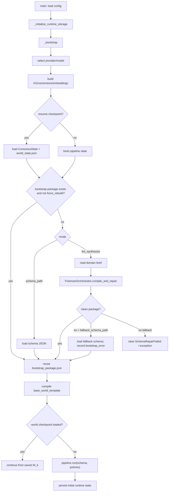
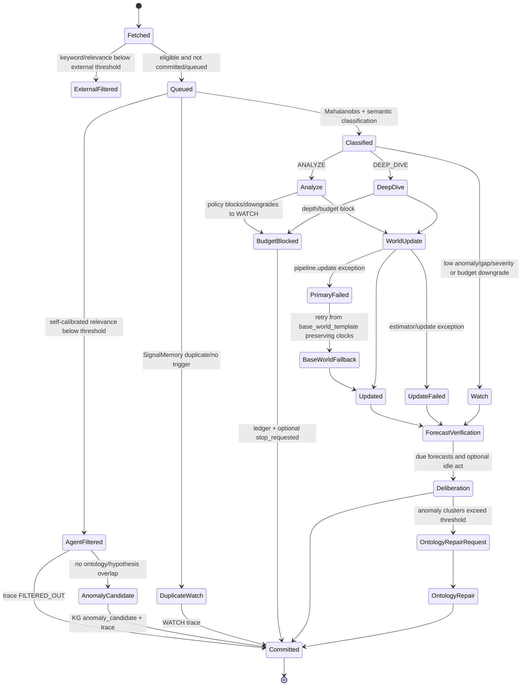
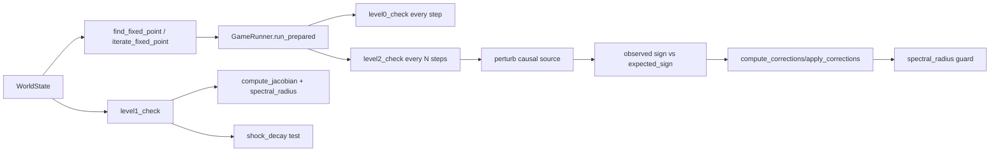
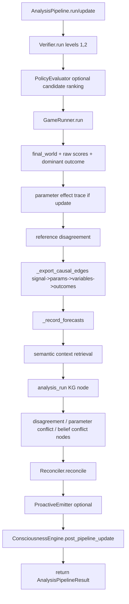
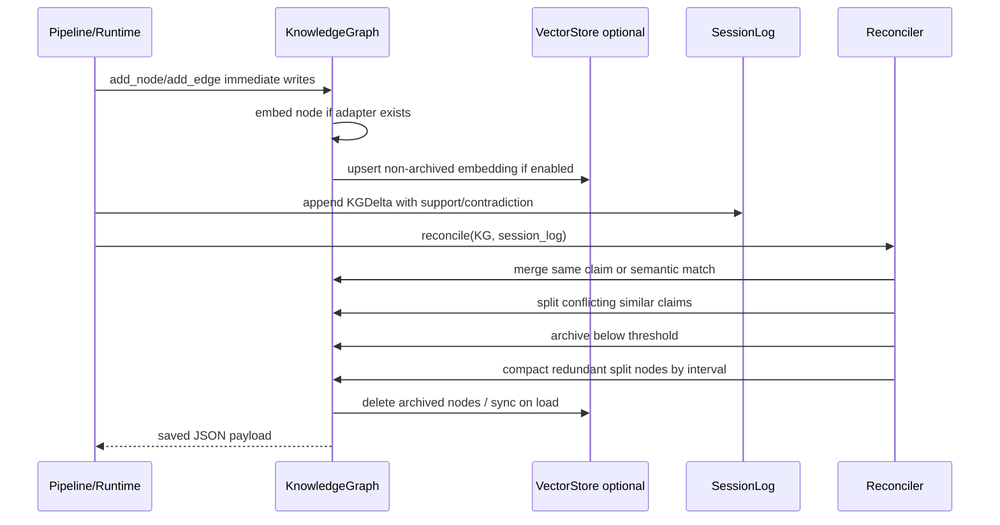
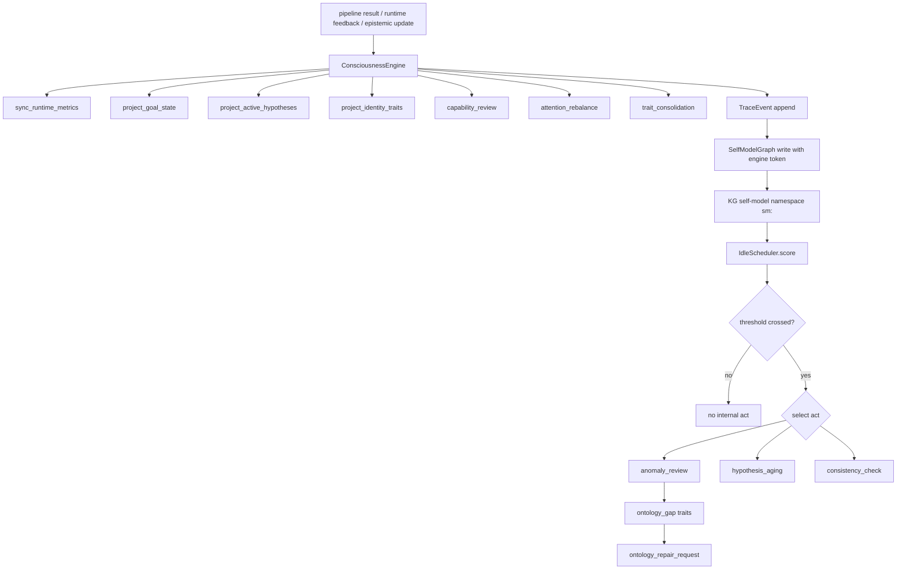
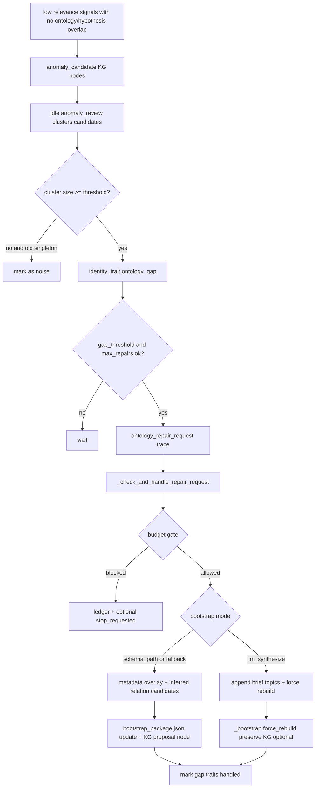
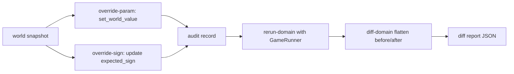

# Freeman: полная архитектура агентно-симуляционной системы

> Срез построен по текущему рабочему дереву ветки `main`. Документ описывает реализованное поведение кода, включая runtime, CLI, MCP/tools, LLM-bootstrap, симулятор, память, consciousness layer, connectors, исследовательские harness-сценарии и fallback-механизмы. Untracked локальные файлы не включались в архитектурную модель.

> Единый интерактивный 3D-визуал архитектуры: [FREEMAN_ARCHITECTURE_3D.html](FREEMAN_ARCHITECTURE_3D.html).

## 0. Формальная постановка

Freeman реализует дискретную агентно-симуляционную систему с долговременной памятью. Минимальное состояние runtime в момент `k`:

$$
R_k = (W_k, K_k, C_k, F_k, Q_k, U_k, B_k, L_k),
$$

где:

- `W_k` - `WorldState`/`WorldGraph`: акторы, ресурсы, связи, outcomes, causal DAG, `ParameterVector`, `t`, `runtime_step`.
- `K_k` - `KnowledgeGraph`: persistent `networkx.MultiDiGraph` + optional embeddings/vectorstore.
- `C_k` - `ConsciousState`: self-model, goal state, attention state, trace events, runtime metadata.
- `F_k` - `ForecastRegistry`: pending/verified forecasts and causal paths.
- `Q_k` - pending signal queue + stream cursors + signal memory.
- `U_k` - unresolved obligations: forecast debt, conflict debt, anomaly debt.
- `B_k` - budget ledger and cost policy.
- `L_k` - append-only event log and checkpoints.

Внешний сигнал `x_k` и внутренний акт `u_k` задают переход:

$$
R_{k+1} = \Phi(R_k, x_k, u_k),
$$

а внутренняя симуляция мира на шаге `t`:

$$
W_{t+1}=\operatorname{Verify}_0\left(W_t + F_{\theta,D}(W_t, \pi_t)\right).
$$

Динамическая калибровка хранится в:

$$
\theta_k = (\alpha_k, \lambda_k, \Delta W_k),
$$

где `alpha` соответствует `outcome_modifiers`, `lambda` - `shock_decay`, `DeltaW` - `edge_weight_deltas`.

## 1. Карта слоёв

## 2. Главная временная шкала runtime

## 3. Bootstrap paths and fallback tree

Порядок verifier-guided LLM repair внутри `FreemanOrchestrator.compile_and_repair`:

1. `chat_json` создаёт пакет `{schema, policies, assumptions}`.
2. `_normalize_package` чинит поверхностные поля (`source` -> `source_id`, `type` -> `relation_type`, default `weights`).
3. `DomainCompiler.compile` ловит schema/reference ошибки.
4. `level1_check` ловит структурную нестабильность.
5. `_trial_level0_violations` ловит hard-инварианты на коротком rollout.
6. `level2_check` ловит sign-consistency DAG.
7. На каждой ошибке `repair_schema` получает structured feedback, error history и schema spec.
8. После `max_retries` выбрасывается `SchemaRepairFailed`; runtime может перейти к `fallback_schema_path`.

## 4. Signal state machine

## 5. Core simulation transformations

### 5.1 Schema -> WorldState

`DomainCompiler.compile(schema)` performs a deterministic structural transformation:

$$
\text{schema} \mapsto W_0=(A,R,E,O,D,\rho,\mu),
$$

where actors/resources/relations/outcomes/causal edges are converted into dataclasses. Validation rejects unknown IDs, invalid evolution operators, invalid scoring keys, invalid DAG endpoints, invalid actor update rules and invalid exogenous inflows.

### 5.2 Resource transition

For each resource `r_i`, `step_world` selects `get_operator(resource.evolution_type, params)` and computes:

$$
r_{i,t+1}=f_i(r_{i,t}, W_t, \pi_t, \Delta W_t, dt).
$$

Implemented operators:

- `linear`: affine transition plus policy and coupling terms.
- `stock_flow`: stock update `value + dt * (phi - delta * value)`.
- `logistic`: bounded logistic growth with forcing and coupling.
- `threshold`: piecewise branch below/above `theta`.
- `coupled`: weighted composition of other operators.

Dynamic edge calibration uses:

$$
w^{eff}_{ij}=w_{ij}+\Delta w_{ij},
$$

where `ParameterVector.edge_weight_deltas` is matched by normalized `source.target` tokens.

### 5.3 Actor-state transition

If `actor_update_rules` exist, each actor state field is updated by:

$$
s' = decay\cdot s + base + policy\_scale\cdot\sum_a \pi_a + \sum_j w^{eff}_{j\to s}x_j,
$$

then optional min/max bounds are applied.

### 5.4 Stateful shocks

`WorldGraph.apply_shocks` preserves a baseline and decays deviations before adding new shocks:

$$
d_{k+1}=\lambda\cdot d_k+\Delta_{k+1},\qquad S_{k+1}=S_{base}+d_{k+1}.
$$

Resource shocks are bounded by resource min/max. Actor-state shocks use `actor_id.state_key`. Metadata shocks reject reserved `_` keys.

### 5.5 Outcome scoring

For outcome `o`:

$$
z_o = \sum_i w_{oi}x_i.
$$

Regime shifts safely evaluate boolean expressions over baseline-relative deviations and absolute aliases (`level_*`, `abs_*`), then multiply `z_o`. Dynamic outcome modifiers are applied after static shifts:

$$
z'_o = m_o z_o.
$$

Softmax produces probabilities:

$$
p(o)=\frac{\exp(z'_o-\max_jz'_j)}{\sum_j\exp(z'_j-\max_lz'_l)}.
$$

Confidence combines entropy concentration and soft violation penalty.

## 6. Verification and correction

- Level 0 hard invariants: conservation, non-negativity, probability simplex. Bounds are soft unless hard stop occurs through `HardStopException`.
- Level 1: null-policy convergence, Jacobian spectral radius, shock-decay tests for up to three resources, and aggregate `Verifier.level1` also imports sign precheck violations.
- Level 2: local DAG sign consistency by perturbing sources and comparing target deltas; weak edges downgrade sign failures to soft.
- Fixed point: sign violations become additive corrections on targets, stopped by convergence, correction tolerance, max iterations or Jacobian guard.

## 7. Pipeline run/update order

Important invariant: `pipeline.update` never mutates the previous world in place; it clones, installs a new `ParameterVector`, runs `_run_world`, then returns a cloned final world to runtime.

## 8. Knowledge graph lifecycle

Semantic retrieval order:

1. If query empty: return active nodes by confidence.
2. If embedding adapter exists: embed query and lazily embed nodes.
3. If vectorstore exists: use vectorstore as candidate generator.
4. Score candidates by embedding + lexical score; hashing embeddings use more lexical weight.
5. Apply strict acceptance floor; no unrelated high-confidence fallback is substituted.
6. Add one-hop graph neighbors with downweighted scores.
7. Runtime query augments KG hits with forecast, causal-edge and world-state evidence.

## 9. Consciousness and self-model cycle

The self-model write guard is explicit: only `ConsciousnessEngine` with `_ENGINE_CALLER_TOKEN` may mutate `SelfModelGraph`; other writes raise `SelfModelAccessError`.

## 10. Ontology repair

Schema-path repair is metadata-first and can auto-append weak causal edges inferred from semantic co-mentions. LLM-synthesize repair appends observed topics to the domain brief, deletes the package and rebuilds through `_bootstrap`; it preserves KG by default.

## 11. Budget governance

Budget decisions are pre-run gates, not after-the-fact accounting. Cost is estimated from LLM calls, sim steps, actors, resources, domains, KG updates and embedding tokens:

$$
\hat c = .015\,n_{llm}+.001\,n_{sim}+.0005\,n_A+.0005\,n_R+.002\,n_D+.0005\,n_{kg}+2e^{-7}\,n_{tok}.
$$

Fallbacks:

- Hard task limits (`max_llm_calls`, `max_sim_steps`, `max_domains`) block to WATCH/stop.
- `DEEP_DIVE` downgrades to `ANALYZE` when depth exceeds policy.
- Cost above remaining budget downgrades `DEEP_DIVE -> ANALYZE -> WATCH`; WATCH may stop on hard exhaustion.
- Ledger records requested mode, approved mode, allowed/block state, realized cost and stop reason.

## 12. Interface paths

### CLI

- `freeman init`: writes default config and creates storage directories.
- `freeman run`: explicit schema run if `schema_path` exists; otherwise returns config-first idle status.
- `freeman ask`: runtime evidence retrieval + optional LLM answer generation.
- `freeman query`: KG filters or semantic runtime query.
- `freeman status`: KG/runtime/source/budget/storage status.
- `freeman export-kg`: HTML, 3D HTML, JSON-LD, DOT.
- `freeman export-kg-evolution`: ordered KG snapshot timeline viewer.
- `freeman reconcile`, `kg-archive`, `kg-reindex`: memory maintenance.
- `override-param`, `override-sign`, `rerun-domain`, `diff-domain`: human override workflow.
- `identity`, `explain`: self-model and trace rendering.

### Tool API and MCP

`freeman.api.tool_api` exposes in-memory compile/run/verify tools plus persistent daemon query tools. `freeman.mcp.server` builds an MCP server by converting JSON schemas into Python call signatures and routing calls through `invoke_tool`.

### REST API

`InterfaceAPI` provides status/query/domain registration/patch/rerun/diff methods; `run_server` wraps it in a local HTTP server.

## 13. Human override path

Human overrides are intentionally outside the autonomous stream loop. They register a domain snapshot, patch params or edge signs, rerun the deterministic simulator and export a diff.

## 14. Connectors and external sources

Connector sources are intentionally separate from core runtime and normalize all records into `freeman.agent.signalingestion.Signal`:

- RSS/Atom: `RSSFeedSignalSource`, `ArxivSignalSource`.
- HTTP JSON: `HTTPJSONSignalSource` with `item_path` and `field_map`.
- Web page: `WebPageSignalSource` extracting title and paragraph text.

Runtime source failures are non-fatal: `_run_poll` catches source exceptions, logs a warning and continues with other sources.

## 15. Research/benchmark processes

The codebase also contains experimental paths outside the main daemon loop:

- `freeman.realworld.manifold`: Manifold market snapshots, BBC/GDELT/NewsAPI/GNews historical news, market feature extraction, binary market schemas, Brier scores and experiment reports.
- `freeman.realworld.test_a_preflight` and `test_a_experiment`: market filtering/stratification and focused test-A evaluation.
- `freeman.realworld.test_c_cross_domain` and `causal_graph`: cross-domain causal tests and Paris causal graph test.
- `freeman.causal.estimator`: optional causal ML edge-weight estimation with fallback estimators depending on available libraries and treatment type.
- `scripts/benchmark_faab`: benchmark dataset generation, runners and metrics.
- `scripts/seed_climate_kg.py`: deterministic climate seed graph generation.

These processes share the same domain compiler, simulator, KG and scoring primitives, but are not the persistent stream runtime.

## 16. Fallback matrix

| Trigger | Code path | Fallback/action | Preserved invariant |
| --- | --- | --- | --- |
| Missing config | `_load_yaml`, query `_load_config` | Merge with default runtime/query config | Runtime has paths and budget defaults |
| Ollama `auto` unavailable | `_select_ollama_model` | Prefer known Qwen tags, else first model, else `qwen2.5-coder:14b` | Bootstrap has a model string |
| DeepSeek/OpenAI key absent | `_build_chat_client` | Raise runtime error for bootstrap; interface builder returns `(None, error)` for answer path | No silent unauthenticated remote call |
| LLM bootstrap compile/verifier failure | `FreemanOrchestrator.compile_and_repair` | Structured feedback -> `repair_schema` loop | Package must satisfy compile/L1/L0 trial/L2 |
| LLM bootstrap exhausted | `_bootstrap` | Use `fallback_schema_path` if configured | Runtime can start deterministically |
| Existing `bootstrap_package.json` | `_bootstrap` | Reuse package unless `force_rebuild` | Avoid unnecessary LLM drift |
| Checkpoint/world exists with resume | `_bootstrap` | Load `ConsciousState` and `world_state.json` | Runtime time continuity |
| Source fetch error | `_run_poll` | Warn and continue other sources | Poll loop survives bad feeds |
| Duplicate signal | `SignalMemory`, cursor store | Skip to WATCH/no trigger | Idempotent processing |
| External relevance low | `_run_poll` | Do not enqueue | Queue only relevant signals |
| Calibrated agent relevance low | `_process_one_signal` | FILTERED_OUT trace or anomaly candidate | Post-calibration avoids ontology drift |
| No ontology/hypothesis overlap | `_process_one_signal` | Record `anomaly_candidate` | Preserve unknown signal evidence |
| Trigger above budget | `_signal_budget_decision` | Downgrade or block to WATCH | Cost policy respected |
| Budget hard exhaustion | cost model/runtime | Record ledger and may set `stop_requested` | Runtime stops safely |
| Estimator hallucinated outcome ID | `ParameterEstimator._repair_outcome_ids` | Case/fuzzy repair or drop; record conflict | ParameterVector valid outcome IDs only |
| Rationale contradicts YES/NO modifier | `_validate_sign_consistency` | Dampen wrong-side modifier to 1.0 | Literal binary semantics protected |
| Primary `pipeline.update` fails | `_process_one_signal` | Retry from `base_world_template` preserving `runtime_step`, `t`, `seed` | Longitudinal clocks never rewind |
| Fallback update regresses world step | `_process_one_signal` | Raise update failure | No time regression accepted |
| Due forecasts absent | `_verify_due_forecasts` | No-op | Forecast verification is safe every step |
| Forecast causal edge missing | `verify_causal_path` | Mark `unknown` | Explanation stays honest |
| Vector store disabled | factory/KG query | Direct embedding or lexical-semantic ranking | Retrieval still works |
| Chroma missing while enabled | `KGVectorStore.__init__` | Runtime error with install hint | Optional dependency explicit |
| No runtime evidence for query | `RuntimeAnswerEngine.answer` | Return no answer and no LLM call | No fabricated answer |
| Answer LLM not configured | `build_chat_client` | Return evidence payload with `llm_error` | Retrieval remains usable |
| Answer budget blocked | `RuntimeAnswerEngine` | Ledger + no answer generation | Query path follows budget policy |
| Ontology repair max reached | `_trigger_ontology_repair` | Skip repair | Bounded self-modification |
| Ontology repair budget blocked | `_trigger_ontology_repair` | Ledger + optional stop | Bounded repair cost |
| Schema-path repair lacks schema/topics | `_apply_schema_path_ontology_repair` | Mark gap traits failed | No invalid overlay |
| LLM repair bootstrap fails | `_trigger_ontology_repair` | Mark traits failed, ledger error | Previous runtime preserved |
| Reconciler conflicting similar claim | `_apply_delta` | Split node and archive parent | Contradiction not silently merged |
| Node confidence below review floor | `reconcile/archive` | Archive and delete vector entry | Low-confidence claims do not dominate retrieval |
| MCP optional dependency missing | `build_mcp_server` | Runtime error explaining extra | Core package remains lightweight |

## 17. Runtime artifacts

Default paths from `config.yaml`:

- KG: `data/kg_state.json`.
- Runtime dir: `data/runtime`.
- Event log: `data/runtime/event_log.jsonl`.
- Checkpoint: `data/runtime/checkpoint.json`.
- World checkpoint: `data/runtime/world_state.json`.
- Forecasts: `data/runtime/forecasts.json`.
- Signal memory: `data/runtime/signal_memory.json`.
- Pending queue: `data/runtime/pending_signals.json`.
- Cursors: `data/runtime/cursors.json`.
- Budget ledger: `data/runtime/cost_ledger.jsonl` when tracking is enabled.
- Bootstrap package: `data/runtime/bootstrap_package.json`.
- Ontology repair queue/history: `ontology_repair_queue.jsonl`, `domain_brief_history.jsonl`.
- KG snapshots: configured under `runtime.kg_snapshots.path`.

## 18. Scenario catalog

| Scenario | Entry | Main sequence | Result |
| --- | --- | --- | --- |
| Explicit schema analysis | `freeman run --schema-path` | load schema -> `AnalysisPipeline.run` -> KG update | Completed JSON with simulation and warnings |
| Daemon from schema | `stream_runtime --bootstrap-mode schema_path` | schema package -> compile -> initial run -> stream loop | Persistent runtime state |
| Daemon from brief | `stream_runtime --bootstrap-mode llm_synthesize` | brief -> LLM synth/repair -> initial run -> stream loop | Synthesized `bootstrap_package.json` |
| Climate RSS stream | `config.climate.yaml` | connectors -> filtering -> queue -> signal processing | Climate-specific KG/runtime |
| WATCH-only signal | stream loop | signal classified routine or budget-downgraded -> no update | Trace + forecast verification only |
| ANALYZE/DEEP_DIVE | stream loop | estimator -> parameter vector -> pipeline update | New world, causal trace, forecasts |
| Anomaly/ontology gap | low agent relevance | anomaly candidate -> cluster -> ontology gap trait | Later repair request |
| Forecast verification | every processed signal | due forecasts vs current posterior | epistemic log + self-observation |
| Idle deliberation | empty queue and high idle score | aging/consistency/anomaly review | internal TraceEvents |
| Ontology repair | repair request | schema overlay or LLM rebuild | updated package/world/KG proposal |
| Runtime query | `freeman query --text` / tool API | load artifacts -> semantic query | evidence payload |
| Runtime answer | `freeman ask` / `freeman_answer_query` | retrieval -> budget -> LLM answer | answer or explicit no-answer |
| Human override | CLI override/rerun/diff | patch world -> rerun -> diff | audit/diff payload |
| MCP use | `freeman-mcp` | expose `FREEMAN_TOOLS` | external agents inspect runtime |
| Realworld benchmark | `freeman.realworld.*` | fetch/transform market/news -> schema -> Freeman probability | experiment reports |

## 19. Function and transformation index

The following index is generated from source files. It uses each symbol's docstring when available; otherwise the comment is a compact name-based description. Private helpers are included because many fallback branches live there.

### `freeman/__init__.py`
- `module`: Freeman simulation engine.

### `freeman/agent/__init__.py`
- `module`: Agent-level orchestration primitives.

### `freeman/agent/analysispipeline.py`
- `module`: Compile -> simulate -> verify -> score -> update-KG pipeline.
- `class AnalysisPipelineResult`: Structured output of one analysis pipeline run.
- `class CausalStep`: One resolved causal edge in a forecast explanation.
  - `CausalStep.to_dict(self)`: To dict.
- `class ForecastSummary`: Compact forecast listing for runtime query mode.
  - `ForecastSummary.to_dict(self)`: To dict.
- `class ForecastExplanation`: Structured explanation of one forecast and its causal path.
  - `ForecastExplanation.to_dict(self)`: To dict.
  - `ForecastExplanation.to_text(self)`: To text.
- `class AnalysisPipelineConfig`: Retrieval limits used by the analysis pipeline.
  - `AnalysisPipelineConfig.from_config(cls, config_path=...)`: From config.
- `class AnalysisPipeline`: Orchestrate the main v0.1 agent analysis path.
  - `AnalysisPipeline.__init__(self, *, compiler=..., sim_config=..., verifier_config=..., knowledge_graph=..., reconciler=..., forecast_registry=..., emitter=..., config=..., config_path=...)`: Init.
  - `AnalysisPipeline.run(self, schema, *, policies=..., candidate_policies=..., policy_evaluator=..., session_log=...)`: Run the full compile/simulate/verify/score/update workflow.
  - `AnalysisPipeline.update(self, previous_world, parameter_vector, *, policies=..., candidate_policies=..., policy_evaluator=..., signal_text=..., signal_id=..., session_log=...)`: Apply a new dynamic parameter layer to an existing world and re-run simulation.
  - `AnalysisPipeline._run_world(self, world, *, policies=..., candidate_policies=..., policy_evaluator=..., session_log=..., prior_outcome_probs=..., update_signal_text=..., update_signal_id=..., extra_summary_metadata=...)`: Execute the compile/simulate/verify/score/update workflow from an initialized world.
  - `AnalysisPipeline._extract_historical_data(self, schema)`: Return optional resource histories bundled with a raw schema payload.
  - `AnalysisPipeline._load_consciousness_config(self, config_path)`: Load consciousness config with defaults.
  - `AnalysisPipeline._merge_config_tree(self, base, override)`: Recursively merge nested config dictionaries.
  - `AnalysisPipeline._operator_fit_warning_messages(self, reports)`: Format operator-selection warnings for interface layers.
  - `AnalysisPipeline._signal_text(self, world, session_log)`: Build a compact retrieval query from the incoming signal context.
  - `AnalysisPipeline._get_context_nodes(self, signal_text)`: Select retrieval context without exposing the full KG to downstream LLMs.
  - `AnalysisPipeline._record_forecasts(self, final_world, final_outcome_probs, session_log, *, belief_confidence, reference_outcome_probs, analysis_node_id, causal_edge_ids=...)`: Record probabilistic outcome forecasts for later verification.
  - `AnalysisPipeline._export_causal_edges(self, *, final_world, sim_result, session_log, signal_id, final_outcome_probs)`: Persist a deterministic causal trace from signal -> params -> variables -> outcomes.
  - `AnalysisPipeline._ensure_causal_node(self, *, node_id, label, node_type, content, confidence, metadata)`: Ensure causal node.
  - `AnalysisPipeline._parameter_delta_specs(self, final_world)`: Return stable parameter-delta descriptors for causal export.
  - `AnalysisPipeline._forecast_causal_path(self, edge_ids, *, outcome_id)`: Attach general causal edges plus outcome-specific threshold edges to one forecast.
  - `AnalysisPipeline.verify_forecast(self, forecast_id, *, actual_prob, verified_at, current_signal_id=..., session_log=...)`: Verify a forecast and persist an epistemic error trace into the KG.
  - `AnalysisPipeline.list_forecasts(self, status=...)`: Return compact forecast summaries for runtime query mode.
  - `AnalysisPipeline.explain_forecast(self, forecast_id)`: Return one human-readable, structured explanation for a forecast.
  - `AnalysisPipeline.record_anomaly_candidate(self, signal_id, signal_text, signal_topic, runtime_step)`: Persist one ontology-blind runtime signal for later anomaly review.
  - `AnalysisPipeline._momentum_reference(self, domain_id, prior_outcome_probs)`: Return the pre-prior belief surface needed to estimate current momentum.
  - `AnalysisPipeline._append_outcome_history(self, domain_id, outcome_probs)`: Keep a short rolling history of belief surfaces per domain.
  - `AnalysisPipeline._same_probability_surface(self, left, right, *, tolerance=...)`: Return whether two outcome distributions are effectively identical.
  - `AnalysisPipeline._parameter_effect_trace(self, prior_outcome_probs, posterior_outcome_probs, parameter_vector, *, tolerance=...)`: Compare intended modifier directions with realized posterior probability shifts.
  - `AnalysisPipeline._build_parameter_effect_conflict_node(self, *, domain_id, step, mismatches, rationale, signal_text)`: Persist simulator sign mismatches between intended and realized outcome motion.

### `freeman/agent/attentionscheduler.py`
- `module`: Attention budgeting and UCB task scheduling.
- `class ForecastDebt`: Open forecast awaiting verification at a finite horizon.
  - `ForecastDebt.__post_init__(self)`: Post init.
- `class ConflictDebt`: Open review/conflict node that has aged in the KG.
  - `ConflictDebt.__post_init__(self)`: Post init.
- `class AnomalyDebt`: Open anomaly signal that has not been analyzed yet.
  - `AnomalyDebt.__post_init__(self)`: Post init.
- `class ObligationQueue`: Track unresolved obligations and expose their aggregate pressure.
  - `ObligationQueue.add_forecast_debt(self, debt)`: Add forecast debt.
  - `ObligationQueue.add_conflict_debt(self, debt)`: Add conflict debt.
  - `ObligationQueue.add_anomaly_debt(self, debt)`: Add anomaly debt.
  - `ObligationQueue.pressure(self, task_id)`: Return the cumulative obligation pressure for one task.
- `class InterestNormalizer`: Rolling z-score normalizer for heterogeneous interest components.
  - `InterestNormalizer.normalize(self, component_name, value)`: Return a clipped rolling z-score using previously observed values.
  - `InterestNormalizer.observe(self, component_name, value)`: Store one raw component value in the rolling history.
  - `InterestNormalizer.is_ready(self, component_name)`: Return True when the component has enough variation for normalization.
- `class AttentionTask`: Task competing for the finite attention budget.
  - `AttentionTask.__post_init__(self)`: Post init.
- `class AttentionDecision`: One scheduler choice.
- `class AttentionScheduler`: Finite-budget UCB scheduler over analysis tasks.
  - `AttentionScheduler.__init__(self, attention_budget, ucb_beta=..., obligation_queue=..., interest_normalizer=...)`: Init.
  - `AttentionScheduler.add_task(self, task)`: Add task.
  - `AttentionScheduler.transition(self, task_id, new_state)`: Transition.
  - `AttentionScheduler.interest_score(self, task)`: Expected information gain per cost with anomaly and semantic terms.
  - `AttentionScheduler._interest_components(self, task)`: Return raw component values before normalization.
  - `AttentionScheduler._normalize_components(self, components)`: Normalize each component when rolling statistics are available.
  - `AttentionScheduler._observe_components(self, components_by_task)`: Update rolling statistics from the current decision frontier.
  - `AttentionScheduler.eligible_tasks(self)`: Eligible tasks.
  - `AttentionScheduler.select_task(self)`: Choose the next task by UCB and consume its budget.

### `freeman/agent/consciousness.py`
- `module`: Deterministic consciousness-state primitives and operators for Freeman.
- `_to_datetime(value)`: To datetime.
- `_datetime_to_iso(value)`: Datetime to iso.
- `class TraceEvent`: One deterministic consciousness transition trace.
  - `TraceEvent.__post_init__(self)`: Post init.
  - `TraceEvent.to_dict(self)`: To dict.
  - `TraceEvent.from_dict(cls, data)`: From dict.
- `class ConsciousState`: Serializable consciousness state wrapper.
  - `ConsciousState.to_dict(self)`: To dict.
  - `ConsciousState.from_dict(cls, data, kg)`: From dict.
- `class ConsciousnessEngine`: Deterministic writer for self-model updates and trace events.
  - `ConsciousnessEngine.__init__(self, state, config)`: Init.
  - `ConsciousnessEngine.post_pipeline_update(self, pipeline_result, kg)`: Run deterministic post-pipeline self-model updates.
  - `ConsciousnessEngine.refresh_after_epistemic_update(self, *, world_ref, runtime_metadata=...)`: Recompute self-model operators after forecast verification updates the KG.
  - `ConsciousnessEngine.refresh_after_runtime_feedback(self, *, world_ref, runtime_metadata=...)`: Refresh capability and attention after non-world runtime feedback.
  - `ConsciousnessEngine._sync_runtime_metrics(self, pipeline_result)`: Sync runtime metrics.
  - `ConsciousnessEngine._project_goal_state(self, pipeline_result)`: Project goal state.
  - `ConsciousnessEngine._project_active_hypotheses(self, pipeline_result)`: Project active hypotheses.
  - `ConsciousnessEngine._project_identity_traits(self)`: Project identity traits.
  - `ConsciousnessEngine.maybe_deliberate(self, now)`: Run one internal deliberation act if the idle threshold is exceeded.
  - `ConsciousnessEngine._capability_review(self)`: Capability review.
  - `ConsciousnessEngine._attention_rebalance(self)`: Attention rebalance.
  - `ConsciousnessEngine._trait_consolidation(self)`: Trait consolidation.
  - `ConsciousnessEngine._hypothesis_aging(self)`: Hypothesis aging.
  - `ConsciousnessEngine._consistency_check(self)`: Consistency check.
  - `ConsciousnessEngine._anomaly_review(self)`: Anomaly review.
  - `ConsciousnessEngine._apply_diff(self, diff)`: Apply diff.
  - `ConsciousnessEngine._write_trace(self, *, operator, diff, trigger_type, transition_type, rationale, timestamp=...)`: Write trace.
  - `ConsciousnessEngine._self_model_node(self, node_type, domain_id)`: Self model node.
  - `ConsciousnessEngine._node_by_id(self, node_id)`: Node by id.
  - `ConsciousnessEngine._trace_input_refs(self, diff)`: Trace input refs.
  - `ConsciousnessEngine._desired_goal_outcomes(self, world_metadata, raw_scores, *, available_outcomes)`: Desired goal outcomes.
  - `ConsciousnessEngine._node_changed(self, existing, candidate)`: Node changed.
  - `ConsciousnessEngine._edge_exists(self, edge_id)`: Edge exists.
  - `ConsciousnessEngine._select_deliberation_act(self)`: Select deliberation act.
  - `ConsciousnessEngine._cluster_anomaly_candidates(self, candidates, similarity_threshold)`: Cluster anomaly candidates.
  - `ConsciousnessEngine._anomaly_similarity(self, left, right)`: Anomaly similarity.
  - `ConsciousnessEngine._text_tokens_for_anomaly(self, node)`: Text tokens for anomaly.
  - `ConsciousnessEngine._anomaly_cluster_signature(self, cluster)`: Anomaly cluster signature.
  - `ConsciousnessEngine._mark_anomaly_candidate_reviewed(self, candidate, *, review_outcome, current_runtime_step, cluster_signature=...)`: Mark anomaly candidate reviewed.
  - `ConsciousnessEngine._pending_ontology_gap_traits(self)`: Pending ontology gap traits.
  - `ConsciousnessEngine._should_trigger_ontology_repair(self)`: Should trigger ontology repair.
  - `ConsciousnessEngine._emit_ontology_repair_request(self)`: Emit ontology repair request.
  - `ConsciousnessEngine._merge_config(self, base, override)`: Merge config.
- `class IdleScheduler`: Deterministic idle-deliberation scorer.
  - `IdleScheduler.__init__(self, config)`: Init.
  - `IdleScheduler.score(self, state, now)`: Score.
  - `IdleScheduler.should_deliberate(self, state, now)`: Should deliberate.
  - `IdleScheduler._normalize(self, state, name, value, *, default_max)`: Normalize.
  - `IdleScheduler._time_since_last_update(self, state, now)`: Time since last update.
  - `IdleScheduler._mean_hypothesis_age(self, state)`: Mean hypothesis age.
  - `IdleScheduler._attention_deficit(self, state)`: Attention deficit.

### `freeman/agent/costmodel.py`
- `module`: Formal task cost model and budget governance.
- `class CostEstimate`: Estimated and realized compute cost for one task.
- `class BudgetPolicy`: Hard budget limits for v0.2 governance.
- `class BudgetDecision`: Outcome of a pre-check against the budget policy.
- `class BudgetLedgerEntry`: One persisted budget-governance event.
  - `BudgetLedgerEntry.snapshot(self)`: Snapshot.
  - `BudgetLedgerEntry.from_snapshot(cls, payload)`: From snapshot.
- `class CostModel`: Estimate task cost and downgrade/stop on budget pressure.
  - `CostModel.__init__(self, policy=...)`: Init.
  - `CostModel.estimate(self, *, task_id, llm_calls, sim_steps, actors, resources, domains=..., kg_updates=..., embedding_tokens_used=...)`: Estimate.
  - `CostModel.precheck(self, *, requested_mode, estimate, budget_spent, deep_dive_depth=...)`: Approve, downgrade, or stop before running a task.
  - `CostModel.record_actual(self, estimate, actual_cost, *, budget_spent)`: Record actual.
- `class BudgetLedger`: Append-only runtime budget ledger with cached spend summary.
  - `BudgetLedger.__init__(self, path, *, policy, auto_load=...)`: Init.
  - `BudgetLedger.load(self)`: Load.
  - `BudgetLedger.append(self, entry)`: Append.
  - `BudgetLedger.record(self, *, task_type, requested_mode, decision, actual_cost=..., metadata=...)`: Record.
  - `BudgetLedger.summary(self)`: Summary.
- `build_budget_policy(config)`: Build one budget policy from config defaults plus runtime overrides.
- `budget_tracking_enabled(config)`: Return whether runtime budget governance is enabled by config.
- `resolve_budget_decision(*, cost_model, requested_mode, estimate_for_mode, budget_spent, deep_dive_depth=...)`: Resolve budget gating across downgraded modes until stable.

### `freeman/agent/domainregistry.py`
- `module`: Domain template registry and multi-domain composition helpers.
- `class DomainTemplate`: Reusable domain template stored as a schema payload.
  - `DomainTemplate.snapshot(self)`: Snapshot.
- `class DomainTemplateRegistry`: Register templates, compile worlds, and build multi-domain worlds.
  - `DomainTemplateRegistry.__init__(self, compiler=...)`: Init.
  - `DomainTemplateRegistry.register(self, template)`: Register.
  - `DomainTemplateRegistry.get(self, template_id)`: Get.
  - `DomainTemplateRegistry.list(self)`: List.
  - `DomainTemplateRegistry.compile_world(self, template_id)`: Compile world.
  - `DomainTemplateRegistry.compile_many(self, template_ids)`: Compile many.
  - `DomainTemplateRegistry.build_multiworld(self, template_ids, shared_resource_ids)`: Build multiworld.

### `freeman/agent/epistemic.py`
- `module`: Helpers for epistemic logging, disagreement tracking, and belief conflicts.
- `extract_reference_outcome_probs(world)`: Return an external/reference probability surface when the world exposes one.
- `compute_confidence_weighted_disagreement(predicted_probs, reference_probs, *, belief_confidence)`: Return a disagreement snapshot against an external/reference belief surface.
- `summarize_primary_disagreement(disagreement_snapshot)`: Return the strongest disagreement outcome by weighted absolute gap.
- `build_disagreement_node(*, domain_id, step, disagreement_snapshot, threshold=...)`: Create a KG node for a meaningful external disagreement.
- `detect_belief_conflict(prior_outcome_probs, posterior_outcome_probs, *, momentum_reference_outcome_probs=..., signal_source=..., signal_text=..., rationale=..., parameter_conflict_flag=..., prior_threshold=..., delta_threshold=..., momentum_threshold=..., signal_strength_threshold=...)`: Detect whether an update materially contradicts the prior belief state.
- `build_belief_conflict_node(*, domain_id, step, conflict_snapshot, rationale=..., signal_text=...)`: Create a KG node capturing a contradiction-driven belief revision.
- `build_epistemic_log_node(forecast)`: Create a factual post-verification epistemic memory node for one forecast.

### `freeman/agent/forecastregistry.py`
- `module`: Forecast registry with verification horizons and optional persistence.
- `_now_utc()`: Now utc.
- `_serialize_dt(value)`: Serialize dt.
- `_parse_dt(value)`: Parse dt.
- `class Forecast`: One probabilistic forecast awaiting later verification.
  - `Forecast.__post_init__(self)`: Post init.
  - `Forecast.deadline_step(self)`: Deadline step.
  - `Forecast.snapshot(self)`: Snapshot.
  - `Forecast.from_snapshot(cls, data)`: From snapshot.
- `class ForecastRegistry`: In-memory forecast registry with optional JSON persistence.
  - `ForecastRegistry.__init__(self, *, json_path=..., auto_load=..., auto_save=..., obligation_queue=...)`: Init.
  - `ForecastRegistry.record(self, forecast)`: Record.
  - `ForecastRegistry.pending(self)`: Pending.
  - `ForecastRegistry.all(self)`: All.
  - `ForecastRegistry.get(self, forecast_id)`: Get.
  - `ForecastRegistry.due(self, current_step)`: Due.
  - `ForecastRegistry.verify(self, forecast_id, actual_prob, verified_at)`: Verify.
  - `ForecastRegistry.snapshot(self)`: Snapshot.
  - `ForecastRegistry.save(self, path=...)`: Save.
  - `ForecastRegistry.load(self, path=...)`: Load.
  - `ForecastRegistry._maybe_save(self)`: Maybe save.

### `freeman/agent/parameterestimator.py`
- `module`: LLM-backed estimator for the dynamic simulator parameter vector.
- `class ParameterEstimator`: Ask the LLM to calibrate the dynamic parameter vector for a world update.
  - `ParameterEstimator.__init__(self, llm_client, *, epistemic_log=..., belief_conflict_log=..., max_epistemic_examples=...)`: Init.
  - `ParameterEstimator.estimate(self, previous_world, new_signal_text)`: Call the LLM to produce a dynamic parameter vector for the next update.
  - `ParameterEstimator._world_summary(self, world)`: Return a compact JSON summary of world structure and active scores.
  - `ParameterEstimator._epistemic_memory_context(self, world)`: Return relevant verified forecast errors for this domain family.
  - `ParameterEstimator._belief_conflict_context(self, world)`: Return recent domain conflict traces for prompt conditioning.
  - `ParameterEstimator._binary_outcome_ids(self, world)`: Return the literal YES/NO outcome ids when the world exposes them.
  - `ParameterEstimator._repair_outcome_ids(self, modifiers, *, valid_outcome_ids, fuzzy_threshold=...)`: Repair hallucinated outcome ids before constructing a validated ParameterVector.
  - `ParameterEstimator._extract_directional_intent(self, rationale)`: Infer whether the rationale favors literal YES or NO.
  - `ParameterEstimator._validate_sign_consistency(self, world, vector)`: Dampen modifiers that contradict the direction stated in the rationale.

### `freeman/agent/policyevaluator.py`
- `module`: Counterfactual policy evaluation on top of the deterministic simulator.
- `_coerce_policy(policy_like)`: Normalize one policy payload.
- `_coerce_policy_bundle(candidate)`: Normalize one candidate into a policy bundle plus metadata.
- `_expected_utility(outcome_probs, raw_scores)`: Return a scale-normalized expected outcome utility.
- `class PolicyEvalResult`: Ranked result for one counterfactual policy bundle.
  - `PolicyEvalResult.policy(self)`: Backward-compatible access for single-policy candidates.
  - `PolicyEvalResult.snapshot(self)`: Return a JSON-serializable result payload.
- `class PolicyEvaluator`: Short-horizon deterministic policy planner.
  - `PolicyEvaluator.__init__(self, *, sim_config=..., epistemic_log=..., planning_horizon=..., max_candidates=..., stability_tol=..., stability_patience=..., min_stability_steps=...)`: Init.
  - `PolicyEvaluator.evaluate(self, world, candidate_policies)`: Run short deterministic counterfactual rollouts and rank the results.
  - `PolicyEvaluator._normalize_candidates(self, candidate_policies)`: Deduplicate and bound the candidate list.

### `freeman/agent/proactiveemitter.py`
- `module`: Structured proactive events emitted from pipeline results.
- `class ProactiveEvent`: One interface-facing proactive signal from the agent.
  - `ProactiveEvent.__post_init__(self)`: Post init.
- `class ProactiveEmitter`: Generate human-facing events from material pipeline changes.
  - `ProactiveEmitter.__init__(self, *, forecast_shift_threshold=..., confidence_floor=...)`: Init.
  - `ProactiveEmitter.evaluate(self, result, prev_probs=...)`: Evaluate.

### `freeman/agent/signalingestion.py`
- `module`: Signal ingestion, anomaly detection, and trigger logic.
- `_now_iso()`: Now iso.
- `_parse_timestamp(value)`: Parse timestamp.
- `_signal_from_mapping(payload)`: Signal from mapping.
- `class Signal`: Normalized incoming signal.
- `class SignalRecord`: One persisted signal observation across sessions.
  - `SignalRecord.__post_init__(self)`: Post init.
  - `SignalRecord.snapshot(self)`: Snapshot.
  - `SignalRecord.from_snapshot(cls, data)`: From snapshot.
- `class SignalMemory`: Cross-session deduplication and exponential decay of signal weights.
  - `SignalMemory.__init__(self, decay_halflife_hours=...)`: Init.
  - `SignalMemory.see(self, signal, trigger_mode)`: See.
  - `SignalMemory.is_duplicate(self, signal, *, within_hours=...)`: Return True when the same signal was seen within the duplicate window.
  - `SignalMemory.effective_weight(self, signal_id, now=...)`: Return exponentially decayed signal weight.
  - `SignalMemory.snapshot(self)`: Snapshot.
  - `SignalMemory.load_snapshot(self, records)`: Load snapshot.
- `class ShockClassification`: Semantic interpretation of a signal.
- `class SignalTrigger`: Trigger decision for a signal.
- `class ManualSignalSource`: Manual signals provided directly by the caller.
  - `ManualSignalSource.__init__(self, signals)`: Init.
  - `ManualSignalSource.fetch(self)`: Fetch.
- `class RSSSignalSource`: RSS-backed source over already fetched items.
  - `RSSSignalSource.__init__(self, items)`: Init.
- `class TavilySignalSource`: Tavily-backed source over already fetched items.
  - `TavilySignalSource.__init__(self, items)`: Init.
- `class SignalIngestionEngine`: Normalize signals, compute anomaly scores, and decide trigger modes.
  - `SignalIngestionEngine.feature_matrix(self, signals)`: Feature matrix.
  - `SignalIngestionEngine.mahalanobis_scores(self, signals, ridge=...)`: Return Mahalanobis distances for all signals.
  - `SignalIngestionEngine.classify_shock(self, signal, classifier=...)`: Classify a signal into a shock type using an injected classifier or heuristics.
  - `SignalIngestionEngine.trigger_mode(self, mahalanobis_score, classification, *, anomaly_lambda=..., semantic_threshold=...)`: Map statistical and semantic triggers into WATCH / ANALYZE / DEEP_DIVE.
  - `SignalIngestionEngine.novelty_score(self, signal, *, signal_memory=...)`: Return a generic novelty score from signal recurrence, independent of domain.
  - `SignalIngestionEngine.interest_score(self, *, mahalanobis_score, classification, novelty, anomaly_lambda=...)`: Score how much compute attention a signal deserves, without filtering domains.
  - `SignalIngestionEngine._estimated_mode_cost(self, mode, *, analyze_cost, deep_dive_cost)`: Estimated mode cost.
  - `SignalIngestionEngine._apply_interest_budget(self, triggers, *, analysis_budget, analyze_cost, deep_dive_cost)`: Downgrade expensive analysis modes by generic interest ranking, not by topic.
  - `SignalIngestionEngine.ingest(self, source, *, classifier=..., signal_memory=..., skip_duplicates_within_hours=..., anomaly_lambda=..., semantic_threshold=..., analysis_budget=..., analyze_cost=..., deep_dive_cost=...)`: Fetch, score, classify, and rank signals for compute attention.

### `freeman/api/__init__.py`
- `module`: API surface for Freeman tools.

### `freeman/api/tool_api.py`
- `module`: OpenAI-compatible tool functions for Freeman.
- `class RuntimeArtifacts`: Resolved runtime artifacts for persistent query tools.
- `_repo_root()`: Repo root.
- `_default_config_path()`: Default config path.
- `_resolve_config_path(config_path=...)`: Resolve config path.
- `_resolve_path(base, candidate, default)`: Resolve path.
- `_load_config(config_path=...)`: Load config.
- `_build_sim_config(config)`: Build sim config.
- `_load_runtime_artifacts(config_path=...)`: Load runtime artifacts.
- `_read_json(path, default)`: Read json.
- `_snapshot_entries(snapshot_dir)`: Snapshot entries.
- `_contains(haystack, needle)`: Contains.
- `_node_matches(knowledge_graph, node_id, query)`: Node matches.
- `_edge_matches(knowledge_graph, edge, *, source=..., target=..., relation_type=...)`: Edge matches.
- `_edge_dict(knowledge_graph, edge)`: Edge dict.
- `_node_snapshot(node)`: Node snapshot.
- `_next_world_id(domain_id)`: Return a new in-memory world id.
- `_coerce_policies(policies)`: Convert policy-like inputs into ``Policy`` instances.
- `freeman_compile_domain(schema)`: Compile ``schema`` into a world and store it in the in-memory registry.
- `freeman_run_simulation(world_id, policies, max_steps=..., seed=...)`: Run a simulation for a compiled world and return serialized JSON.
- `freeman_get_world_state(world_id, t=...)`: Return a stored world snapshot, defaulting to the latest timestep.
- `freeman_verify_domain(world_id, levels=...)`: Run selected verification levels for a compiled world.
- `freeman_get_runtime_summary(config_path=...)`: Return a compact summary of the persisted daemon state.
- `freeman_query_forecasts(config_path=..., status=..., outcome_id=..., limit=...)`: Return saved forecasts for one runtime.
- `freeman_explain_forecast(config_path=..., forecast_id=...)`: Return one structured causal explanation for a saved forecast.
- `freeman_query_anomalies(config_path=..., limit=...)`: Return anomaly candidates plus ontology-gap traits from the KG.
- `freeman_query_causal_edges(config_path=..., source=..., target=..., relation_type=..., limit=...)`: Return current KG causal edges, optionally filtered by source, target, or relation.
- `freeman_query_runtime_context(config_path=..., text=..., limit=...)`: Return semantic runtime evidence across KG, forecasts, edges, and world state.
- `freeman_answer_query(config_path=..., text=..., limit=...)`: Answer a question from persisted runtime evidence using the configured LLM.
- `freeman_trace_relation_learning(config_path=..., source=..., target=..., relation_type=..., last_n_steps=...)`: Trace how a relation appears across recent KG snapshots.
- `resolve_tool(name)`: Resolve a Freeman tool by name.
- `invoke_tool(name, arguments=...)`: Invoke one Freeman tool by name.

### `freeman/causal/__init__.py`
- `module`: Optional causal-estimation tools for Freeman.

### `freeman/causal/estimator.py`
- `module`: Optional data-driven estimators for numeric causal edge weights.
- `_optional_import(name)`: Import an optional dependency and return ``None`` when unavailable.
- `class _SingleEdgeEstimate`: Internal container for one estimated edge.
- `class EdgeWeightEstimator`: Estimate numeric weights for an existing causal DAG from data.
  - `EdgeWeightEstimator.__init__(self, model=..., *, bootstrap_samples=..., ci_level=..., n_estimators=..., min_samples_leaf=..., random_state=...)`: Init.
  - `EdgeWeightEstimator.fit(self, data, edges, *, treatment_col=..., outcome_col=..., covariate_cols=...)`: Estimate point weights and confidence intervals for ``edges``.
  - `EdgeWeightEstimator._normalize_edge(self, edge)`: Coerce a supported edge representation into a ``(source, target)`` tuple.
  - `EdgeWeightEstimator._resolve_covariates(self, frame, *, treatment_col, outcome_col, covariate_cols)`: Select numeric covariates, defaulting to all remaining numeric columns.
  - `EdgeWeightEstimator._estimate_single_edge(self, frame, *, treatment_col, outcome_col, covariate_cols)`: Estimate one edge weight from a clean sub-frame.
  - `EdgeWeightEstimator._bootstrap_interval(self, covariates, treatment, outcome, *, is_binary)`: Estimate a percentile confidence interval by bootstrap resampling.
  - `EdgeWeightEstimator._estimate_effect(self, covariates, treatment, outcome, *, is_binary)`: Dispatch to the configured point-estimate backend.
  - `EdgeWeightEstimator._estimate_binary_t_learner(self, covariates, treatment, outcome)`: Estimate an average treatment effect with a T-learner.
  - `EdgeWeightEstimator._estimate_binary_s_learner(self, covariates, treatment, outcome)`: Estimate an average treatment effect with a single learner.
  - `EdgeWeightEstimator._estimate_binary_causal_forest(self, covariates, treatment, outcome)`: Estimate an average treatment effect with CausalML or a forest fallback.
  - `EdgeWeightEstimator._estimate_continuous_effect(self, covariates, treatment, outcome)`: Estimate a partial linear effect for continuous treatments.
  - `EdgeWeightEstimator._is_binary_treatment(self, treatment)`: Return whether a treatment vector is effectively binary.

### `freeman/causal/result.py`
- `module`: Structured results for data-driven causal edge estimation.
- `class EstimationResult`: Point estimates, confidence intervals, and provenance for causal edges.
  - `EstimationResult.__getitem__(self, key)`: Getitem.
  - `EstimationResult.__iter__(self)`: Iter.
  - `EstimationResult.__len__(self)`: Len.
  - `EstimationResult.to_weight_dict(self)`: Return a shallow copy of the estimated edge weights.
  - `EstimationResult.snapshot(self)`: Return a JSON-serializable result payload.

### `freeman/core/__init__.py`
- `module`: Core Freeman primitives.

### `freeman/core/access.py`
- `module`: Helpers for reading and mutating world values.
- `get_world_value(world, key)`: Return a resource value or actor-state aggregate referenced by ``key``.
- `set_world_value(world, key, value)`: Set a resource value or actor-state aggregate referenced by ``key``.
- `apply_delta(world, key, delta)`: Add a small perturbation to a world quantity and return the same world.
- `resource_vector(world)`: Return resource values in deterministic order as a float64 vector.
- `numeric_state_map(obj)`: Flatten a world or snapshot into a comparable numeric mapping.
- `state_distance(prev, curr)`: Compute the max absolute difference between two world states.

### `freeman/core/compilevalidator.py`
- `module`: Compile validation, backtesting, and ensemble sign consensus.
- `class HistoricalFitScore`: Backtest quality summary for one compile candidate.
- `class OperatorFitReport`: RMSE comparison between the chosen operator and alternatives.
- `class CompileCandidate`: One machine-generated domain compile candidate.
  - `CompileCandidate.reviewRequired(self)`: ReviewRequired.
- `class CompileValidationReport`: Aggregate compile-validation result.
  - `CompileValidationReport.reviewRequired(self)`: ReviewRequired.
- `class CompileValidator`: Validate compiled domains by historical fit and ensemble sign consensus.
  - `CompileValidator.__init__(self, *, compiler=..., sim_config=..., backtest_horizon=..., historical_fit_threshold=..., sign_conflict_action=...)`: Init.
  - `CompileValidator.validate(self, candidate, *, historical_data=..., knowledge_graph=...)`: Validate a single compile candidate or raw schema.
  - `CompileValidator.backtest(self, candidate, historical_data, *, horizon=...)`: Compare simulated trajectories to observed historical paths.
  - `CompileValidator.sign_voting_consensus(self, candidates)`: Vote on edge signs across the ensemble.
  - `CompileValidator.validate_candidates(self, candidates, *, historical_data=..., knowledge_graph=...)`: Validate an ensemble of compile candidates.
  - `CompileValidator.ensemble_compile(self, compile_fn, *, ensemble_size=..., historical_data=..., knowledge_graph=...)`: Call the supplied compiler function 2-3 times and validate the ensemble.
  - `CompileValidator.compare_operators(self, resource_id, historical_series, params, warn_threshold=...)`: Compare all evolution operators against one observed resource series.
  - `CompileValidator.fit_outcome_weights(self, historical_series, learning_rate=..., max_iter=..., l2_reg=...)`: Fit outcome scoring weights by softmax cross-entropy on historical state/outcome pairs.
  - `CompileValidator._operator_fit_reports_for_schema(self, schema, historical_data)`: Return operator-comparison reports for schema resources with history.
  - `CompileValidator._simulate_operator_series(self, resource_id, historical_series, operator_name, params)`: Generate a univariate trajectory for one operator without mutating world state.
  - `CompileValidator._fit_operator_params(self, operator_name, historical_series)`: Estimate simple operator parameters from the observed series itself.
  - `CompileValidator._fit_linear_params(self, historical_series)`: Fit ``y_(t+1) = a y_t + c`` by least squares.
  - `CompileValidator._fit_stock_flow_params(self, historical_series)`: Fit a stock-flow approximation from the same affine recurrence.
  - `CompileValidator._fit_logistic_params(self, historical_series)`: Fit logistic growth without external forcing from a univariate series.
  - `CompileValidator._fit_threshold_params(self, historical_series)`: Fit separate affine branches above and below the median level.
  - `CompileValidator._fit_coupled_params(self, historical_series)`: Blend linear and logistic candidates into a side-effect-free coupled proxy.
  - `CompileValidator._fit_affine_params(self, historical_series)`: Return least-squares ``a`` and ``c`` for ``y_(t+1) = a y_t + c``.
  - `CompileValidator._fit_affine_subset(self, current, nxt, mask, *, fallback)`: Fit affine dynamics on a masked subset or return the fallback.
  - `CompileValidator._operator_priority(self, operator_name)`: Prefer simpler operators when RMSE ties exactly.

### `freeman/core/evolution.py`
- `module`: Evolution operators and registry.
- `_policy_sum(policy)`: Return the total action intensity of a policy.
- `_normalize_edge_token(value)`: Return a normalized token used for dynamic edge matching.
- `effective_edge_weight(world, source_key, target_key, base_weight)`: Return a coupling weight adjusted by the current parameter vector.
- `_coupling_term(world, weights, *, target_key)`: Return a linear combination of world values.
- `class EvolutionOperator`: Abstract interface for all resource evolution operators.
  - `EvolutionOperator.delta(self, resource, world, policy, dt=...)`: Return the net increment F(D, S(t), t) implied by the operator.
  - `EvolutionOperator.step(self, resource, world, policy, dt=...)`: Return the next resource value after one simulation step.
  - `EvolutionOperator.stability_bound(self)`: Return a rough one-step growth bound used by structural verification.
- `class LinearTransition`: Affine resource transition with optional policy and coupling terms.
  - `LinearTransition.__init__(self, a=..., b=..., c=..., coupling_weights=...)`: Init.
  - `LinearTransition.step(self, resource, world, policy, dt=...)`: Step.
  - `LinearTransition.stability_bound(self)`: Return an affine upper bound based on operator coefficients.
- `class StockFlowTransition`: Stock-flow operator with linear inflow specification.
  - `StockFlowTransition.__init__(self, delta=..., phi_params=...)`: Init.
  - `StockFlowTransition._phi(self, resource, world, policy)`: Phi.
  - `StockFlowTransition.step(self, resource, world, policy, dt=...)`: Step.
  - `StockFlowTransition.stability_bound(self)`: Return a simple bound derived from decay and inflow magnitudes.
- `class LogisticGrowthTransition`: Logistic growth with optional external forcing.
  - `LogisticGrowthTransition.__init__(self, r=..., K=..., external=..., policy_scale=..., coupling_weights=...)`: Init.
  - `LogisticGrowthTransition.step(self, resource, world, policy, dt=...)`: Step.
  - `LogisticGrowthTransition.stability_bound(self)`: Return the carrying capacity as the effective bound.
- `class ThresholdTransition`: Piecewise transition with low and high regimes.
  - `ThresholdTransition.__init__(self, theta, low_params=..., high_params=...)`: Init.
  - `ThresholdTransition._branch_value(self, current, target_key, world, policy, dt, branch)`: Branch value.
  - `ThresholdTransition.step(self, resource, world, policy, dt=...)`: Step.
  - `ThresholdTransition.stability_bound(self)`: Return the larger of the branch-specific bounds.
- `class CoupledTransition`: Weighted composition of other transition operators.
  - `CoupledTransition.__init__(self, components)`: Init.
  - `CoupledTransition.step(self, resource, world, policy, dt=...)`: Step.
  - `CoupledTransition.stability_bound(self)`: Return the weighted sum of component stability bounds.
- `class EvolutionRegistry`: Factory/registry for named evolution operators.
  - `EvolutionRegistry.__post_init__(self)`: Post init.
  - `EvolutionRegistry.register(self, evolution_type, operator_cls)`: Register a new operator class.
  - `EvolutionRegistry.get(self, evolution_type)`: Return the operator class registered under ``evolution_type``.
  - `EvolutionRegistry.create(self, evolution_type, params=...)`: Instantiate an operator from the registry.
  - `EvolutionRegistry.available(self)`: Return registered operator names in deterministic order.
- `get_operator(evolution_type, params)`: Instantiate an evolution operator from the registry.

### `freeman/core/multiworld.py`
- `module`: Multi-domain composition via shared resources.
- `class SharedResourceBus`: Mutable shared resource store used across multiple domains.
  - `SharedResourceBus.read(self, resource_id)`: Read the current value of a shared resource.
  - `SharedResourceBus.write(self, resource_id, value)`: Write a shared resource value.
- `class MultiDomainSimResult`: Serializable result of one multi-domain step.
  - `MultiDomainSimResult.to_json(self)`: Serialize the result to deterministic JSON.
- `class MultiDomainWorld`: Compose multiple worlds through a shared resource bus.
  - `MultiDomainWorld.__init__(self, domains, shared_resource_ids)`: Init.
  - `MultiDomainWorld._find_resource(self, resource_id)`: Find and clone a resource from the domain list.
  - `MultiDomainWorld._sync_from_bus(self, domain)`: Copy shared resource values from the bus into a domain.
  - `MultiDomainWorld._sync_to_bus(self, domain)`: Copy shared resource values from a domain back to the bus.
  - `MultiDomainWorld.step(self, policies)`: Advance each domain once while synchronizing shared resources.

### `freeman/core/scorer.py`
- `module`: Outcome scoring and confidence estimation.
- `_normalize_identifier(name)`: Return a compact lowercase alias for one world quantity.
- `_baseline_context(world)`: Return baseline values stored for regime-shift evaluation.
- `_shock_context(world)`: Return accumulated shock/deviation values stored on the world.
- `_register_condition_value(context, name, *, level, deviation)`: Register deviation and absolute aliases for one quantity.
- `_condition_context(world)`: Build a safe numeric context for regime-shift conditions.
- `_normalize_condition(condition)`: Translate SQL-style boolean operators into Python syntax.
- `_safe_eval(node, context)`: Safely evaluate a restricted boolean / numeric AST.
- `regime_shift_matches(world, condition)`: Safely evaluate one regime-shift condition.
- `_apply_regime_shifts(outcome, world, base_score)`: Apply multiplicative regime-shift rules on top of a linear base score.
- `pre_modifier_outcome_scores(world)`: Return outcome scores after static regime shifts, before parameter-vector modifiers.
- `_apply_outcome_modifier(score, modifier, *, modifier_mode=...)`: Apply one outcome modifier.
- `scored_outcome_scores(world)`: Return outcome scores after regime shifts and active parameter-vector modifiers.
- `raw_outcome_scores(world)`: Backward-compatible alias for post-modifier outcome scores.
- `softmax_distribution(scores)`: Return a numerically stable softmax distribution.
- `score_outcomes(world)`: Score outcomes from world values and return a softmax distribution.
- `compute_confidence(outcome_probs, violations)`: Compute confidence from outcome concentration and soft-violation count.

### `freeman/core/transition.py`
- `module`: Main world transition operator.
- `_merge_policies(policies)`: Aggregate multiple policies per actor into a single action map.
- `_update_actor_states(world, next_world, policy_map)`: Update actor state vectors from metadata-defined linear rules when present.
- `step_world(world, policies, dt=...)`: Advance the world by one timestep and run level-0 verification.

### `freeman/core/types.py`
- `module`: Core dataclasses for Freeman.
- `_decode_float(value)`: Decode special float markers used in snapshots.
- `_encode_float(value)`: Encode float values for strict JSON serialization.
- `class Actor`: Domain actor with arbitrary numeric state and metadata.
  - `Actor.__post_init__(self)`: Post init.
  - `Actor.snapshot(self)`: Return a JSON-serializable actor snapshot.
  - `Actor.from_snapshot(cls, data)`: Recreate an actor from a snapshot.
- `class Resource`: Numeric world resource with configurable evolution operator.
  - `Resource.__post_init__(self)`: Post init.
  - `Resource.snapshot(self)`: Return a JSON-serializable resource snapshot.
  - `Resource.from_snapshot(cls, data)`: Recreate a resource from a snapshot.
- `class Relation`: Directed typed relation between actors.
  - `Relation.__post_init__(self)`: Post init.
  - `Relation.snapshot(self)`: Return a JSON-serializable relation snapshot.
  - `Relation.from_snapshot(cls, data)`: Recreate a relation from a snapshot.
- `class Outcome`: Named outcome scored from world values.
  - `Outcome.__post_init__(self)`: Post init.
  - `Outcome.snapshot(self)`: Return a JSON-serializable outcome snapshot.
  - `Outcome.from_snapshot(cls, data)`: Recreate an outcome from a snapshot.
- `class ParameterVector`: LLM-generated dynamic calibration layer applied on top of the static world schema.
  - `ParameterVector.__post_init__(self)`: Post init.
  - `ParameterVector.snapshot(self)`: Return a JSON-serializable parameter-vector snapshot.
  - `ParameterVector.from_snapshot(cls, data, *, valid_outcome_ids=...)`: Recreate a parameter vector from a snapshot.
- `class CausalEdge`: Expected qualitative causal relationship between two world quantities.
  - `CausalEdge.__post_init__(self)`: Post init.
  - `CausalEdge.snapshot(self)`: Return a JSON-serializable edge snapshot.
  - `CausalEdge.from_snapshot(cls, data)`: Recreate a causal edge from a snapshot.
- `class Policy`: Actor policy as a mapping from action names to intensities.
  - `Policy.__post_init__(self)`: Post init.
  - `Policy.snapshot(self)`: Return a JSON-serializable policy snapshot.
  - `Policy.from_snapshot(cls, data)`: Recreate a policy from a snapshot.
- `class Violation`: Verifier violation emitted by one of the validation levels.
  - `Violation.__post_init__(self)`: Post init.
  - `Violation.snapshot(self)`: Return a JSON-serializable violation snapshot.
  - `Violation.from_snapshot(cls, data)`: Recreate a violation from a snapshot.

### `freeman/core/uncertainty.py`
- `module`: Monte Carlo uncertainty propagation for Freeman.
- `class ParameterDistribution`: Distribution attached to a dotted model parameter path.
  - `ParameterDistribution.sample(self, rng)`: Sample.
- `class ScenarioSample`: One Monte Carlo scenario.
- `class OutcomeDistribution`: Distribution of outcome probabilities across scenarios.
- `class ConfidenceReport`: Confidence derived from outcome-probability variance.
- `_set_snapshot_value(snapshot, path, value)`: Set snapshot value.
- `class UncertaintyEngine`: Run Monte Carlo sampling and derive confidence from variance.
  - `UncertaintyEngine.__init__(self, sim_config=...)`: Init.
  - `UncertaintyEngine.monte_carlo(self, world, distributions, *, monte_carlo_samples=..., policies=..., seed=...)`: Monte carlo.
  - `UncertaintyEngine.confidence_from_variance(self, distribution, *, uncertainty_threshold=...)`: Confidence from variance.

### `freeman/core/world.py`
- `module`: World graph container and outcome registry.
- `class OutcomeRegistry`: Mutable registry of named outcomes used by the scorer.
  - `OutcomeRegistry.__post_init__(self)`: Post init.
  - `OutcomeRegistry.add(self, outcome)`: Register or replace an outcome by id.
  - `OutcomeRegistry.extend(self, outcomes)`: Register a collection of outcomes.
  - `OutcomeRegistry.get(self, outcome_id)`: Return an outcome by id when present.
  - `OutcomeRegistry.remove(self, outcome_id)`: Remove an outcome and return it.
  - `OutcomeRegistry.items(self)`: Iterate over registered outcomes.
  - `OutcomeRegistry.values(self)`: Iterate over registered outcome values.
  - `OutcomeRegistry.snapshot(self)`: Return a JSON-serializable registry snapshot.
  - `OutcomeRegistry.from_snapshot(cls, data)`: Recreate a registry from a snapshot payload.
  - `OutcomeRegistry.clone(self)`: Return a deep copy of the registry.
- `class WorldGraph`: Full simulator state at a discrete timestep.
  - `WorldGraph.__post_init__(self)`: Post init.
  - `WorldGraph.outcome_registry(self)`: Return the canonical outcome registry.
  - `WorldGraph.add_actor(self, actor)`: Register or replace an actor by id.
  - `WorldGraph.add_resource(self, resource)`: Register or replace a resource by id.
  - `WorldGraph.add_relation(self, relation)`: Append a relation to the graph.
  - `WorldGraph.add_outcome(self, outcome)`: Register or replace an outcome in the registry.
  - `WorldGraph.edges(self, *, as_objects=...)`: Return causal edges as tuples by default or as ``CausalEdge`` objects.
  - `WorldGraph.update_edge_weights(self, weights, source=..., *, confidence_intervals=..., metadata=...)`: Apply numeric causal-edge weights and annotate provenance.
  - `WorldGraph.snapshot(self)`: Return a fully JSON-serializable snapshot of the world.
  - `WorldGraph.from_snapshot(cls, data)`: Recreate a world state from a snapshot.
  - `WorldGraph.clone(self)`: Return a deep copy of the world with no shared mutable state.
  - `WorldGraph.apply_shocks(self, resource_shocks=..., *, actor_state_shocks=..., metadata_shocks=..., time_decay=...)`: Apply stateful shocks on top of a decayed prior state.
  - `WorldGraph._ensure_baseline_state(self)`: Persist and return the immutable baseline state for decay calculations.
  - `WorldGraph._decay_toward_baseline(self, baseline, time_decay)`: Shrink all stored deviations toward the baseline state.
  - `WorldGraph._ensure_shock_state(self, baseline)`: Persist and return the accumulated shock/deviation state.
  - `WorldGraph._decay_shock_state(self, shock_state, time_decay)`: Decay the stored shock/deviation state in-place.
  - `WorldGraph._apply_resource_shocks(self, resource_shocks)`: Apply additive resource shocks with resource bounds.
  - `WorldGraph._apply_actor_state_shocks(self, actor_state_shocks)`: Apply additive shocks to actor state fields.
  - `WorldGraph._apply_metadata_shocks(self, metadata_shocks)`: Apply additive shocks to numeric world metadata fields.
  - `WorldGraph._apply_resource_coupling_weight(self, target_key, source_key, weight)`: Write a numeric edge weight into the target resource evolution parameters.
  - `WorldGraph._set_coupling_weight_recursive(self, node, source_key, weight)`: Recursively update matching ``coupling_weights`` entries in nested params.

### `freeman/core/world_graph.py`
- `module`: Compatibility exports for the canonical world graph container.

### `freeman/domain/__init__.py`
- `module`: Domain compilation and registry.

### `freeman/domain/compiler.py`
- `module`: Domain compiler from JSON schema to ``WorldState``.
- `class DomainCompiler`: Compile and validate Freeman domain schemas.
  - `DomainCompiler.compile(self, schema)`: Validate ``schema`` and return an initialized ``WorldState``.
  - `DomainCompiler._validate_schema(self, schema)`: Validate references, operator types, and score keys inside a domain schema.
  - `DomainCompiler._collect_valid_value_keys(self, resource_ids, actor_state_keys)`: Return all keys that may legally reference world values.
  - `DomainCompiler._validate_actor_update_rules(self, schema, actor_ids, valid_value_keys)`: Validate explicit actor update rules declared in the schema.

### `freeman/domain/registry.py`
- `module`: Built-in domain profile registry.
- `class DomainRegistry`: Load built-in domain schemas packaged with Freeman.
  - `DomainRegistry.__init__(self)`: Init.
  - `DomainRegistry.list_profiles(self)`: Return the list of bundled profile ids.
  - `DomainRegistry.load_schema(self, profile_id)`: Load a bundled schema by id.

### `freeman/domain/schema.py`
- `module`: Schema helpers for Freeman domains.
- `validate_required_keys(schema)`: Validate the presence of top-level required schema keys.
- `ensure_unique_ids(items, item_name)`: Ensure that each item in a schema collection has a unique ``id`` field.
- `collect_actor_state_keys(schema)`: Return all actor-state keys accepted by outcome and causal references.

### `freeman/exceptions.py`
- `module`: Package-wide exceptions.
- `class HardStopException`: Raised when a hard verifier violation requires stopping the simulation.
  - `HardStopException.__init__(self, violations)`: Init.
- `class ValidationError`: Raised when a domain schema is invalid.
- `class SchemaRepairFailed`: Raised when the automated LLM repair loop cannot produce a valid schema.

### `freeman/game/__init__.py`
- `module`: Simulation runner and result types.

### `freeman/game/result.py`
- `module`: Simulation result container.
- `class SimResult`: Serializable simulation output.
  - `SimResult.snapshot(self)`: Return a JSON-serializable simulation result.
  - `SimResult.to_json(self)`: Serialize the result to deterministic JSON.

### `freeman/game/runner.py`
- `module`: Simulation runner.
- `class SimConfig`: Configuration for a single simulation run.
- `class PreparedSimulationState`: Policy-invariant simulation precomputation for one world.
- `_distribution_l1_distance(prev, curr)`: Return the L1 distance between two categorical distributions.
- `class GameRunner`: Run the full Freeman simulation loop.
  - `GameRunner.__init__(self, config=...)`: Init.
  - `GameRunner.prepare(self, world)`: Run the policy-invariant prechecks once for a world.
  - `GameRunner.run_prepared(self, prepared, policies, *, max_steps=..., stability_tol=..., stability_patience=..., min_stability_steps=...)`: Run a simulation from a prepared world state.
  - `GameRunner.run(self, world, policies)`: Run a simulation from ``world`` under ``policies``.

### `freeman/interface/__init__.py`
- `module`: User-facing CLI and API helpers.

### `freeman/interface/api.py`
- `module`: Minimal REST interface for Freeman.
- `_query_node_payload(node)`: Serialize a node for query responses without large embedding vectors.
- `class InterfaceAPI`: Read-only v0.1 API surface over the knowledge graph.
  - `InterfaceAPI.__init__(self, knowledge_graph=..., override_api=...)`: Init.
  - `InterfaceAPI.get_status(self)`: Get status.
  - `InterfaceAPI.post_query(self, *, text=..., status=..., node_type=..., min_confidence=..., semantic=..., limit=...)`: Post query.
  - `InterfaceAPI.register_domain(self, world, *, machine_simulation=...)`: Register domain.
  - `InterfaceAPI.patch_domain_params(self, domain_id, overrides, *, actor=...)`: Patch domain params.
  - `InterfaceAPI.patch_domain_edge(self, domain_id, edge_id, expected_sign, *, actor=...)`: Patch domain edge.
  - `InterfaceAPI.rerun_domain(self, domain_id)`: Rerun domain.
  - `InterfaceAPI.get_domain_diff(self, domain_id)`: Get domain diff.
- `run_server(host=..., port=..., api=...)`: Start a small HTTP server serving GET /status and POST /query.

### `freeman/interface/cli.py`
- `module`: Command-line interface for Freeman.
- `_merge_dicts(base, override)`: Recursively merge two config dictionaries.
- `_load_payload(path)`: Load payload.
- `_coerce_scalar(value)`: Coerce scalar.
- `_load_config(path)`: Load config.
- `_resolve_path(base, candidate, default)`: Resolve path.
- `_print_json(payload)`: Print json.
- `_budget_status(config, *, config_path)`: Budget status.
- `_query_node_payload(node)`: Serialize a node for CLI query responses without embedding payloads.
- `_add_config_option(command_parser)`: Attach the shared config option to a subcommand parser.
- `_memory_json_path(config, *, config_path)`: Memory json path.
- `_runtime_path(config, *, config_path)`: Runtime path.
- `_event_log_path(config, *, config_path)`: Event log path.
- `_build_vectorstore(config, *, config_path)`: Build vectorstore.
- `_build_embedding_adapter(config, *, use_stub=...)`: Build embedding adapter.
- `_build_chat_client(config)`: Build chat client.
- `_build_sim_config(config)`: Build sim config.
- `_bootstrap_storage(config, *, config_path)`: Create the empty KG and storage directories for a fresh agent.
- `_write_default_config(path, *, force=...)`: Persist the default config template.
- `_build_knowledge_graph(config, *, config_path, embedding_adapter=..., vectorstore=...)`: Instantiate the KG using the resolved config paths.
- `_source_statuses(config)`: Summarize configured sources for CLI reporting.
- `_retrieve_nodes(knowledge_graph, query, *, limit, status=..., node_type=..., min_confidence=...)`: Retrieve KG nodes using semantic search when available.
- `_summarize_query(query, nodes, *, chat_client)`: Generate a text answer from retrieved KG nodes when an LLM is configured.
- `build_parser()`: Build parser.
- `main(argv=...)`: Main.

### `freeman/interface/factory.py`
- `module`: Shared config-driven builders for Freeman interface layers.
- `resolve_path(base, candidate, default)`: Resolve a possibly-relative path against ``base``.
- `resolve_memory_json_path(config, *, config_path)`: Resolve memory json path.
- `resolve_runtime_path(config, *, config_path)`: Resolve runtime path.
- `resolve_event_log_path(config, *, config_path)`: Resolve event log path.
- `resolve_semantic_min_score(config)`: Return the retrieval acceptance floor used by semantic query layers.
- `build_vectorstore(config, *, config_path)`: Build the configured KG vector store, if enabled.
- `build_embedding_adapter(config, *, use_stub=...)`: Build the configured embedding adapter.
- `build_chat_client(config)`: Build the configured chat client used by answer-generation layers.
- `build_knowledge_graph(config, *, config_path, embedding_adapter=..., vectorstore=..., auto_load=..., auto_save=...)`: Instantiate a config-backed knowledge graph.

### `freeman/interface/identity.py`
- `module`: Identity-state helpers for CLI and interface layers.
- `build_identity_state(knowledge_graph, *, trace_state=..., runtime_metadata=...)`: Build a read-only consciousness snapshot from persisted state.

### `freeman/interface/kgevolution.py`
- `module`: HTML timeline exporter for Freeman knowledge-graph evolution.
- `_utc_now_iso()`: Utc now iso.
- `class SnapshotFrame`: SnapshotFrame.
- `class KnowledgeGraphEvolutionExporter`: Render a standalone HTML viewer over a directory or glob of KG snapshots.
  - `KnowledgeGraphEvolutionExporter.export_html(self, snapshot_source, output_path)`: Export html.
  - `KnowledgeGraphEvolutionExporter._resolve_snapshot_paths(self, snapshot_source)`: Resolve snapshot paths.
  - `KnowledgeGraphEvolutionExporter._sort_key(self, path)`: Sort key.
  - `KnowledgeGraphEvolutionExporter._load_frames(self, snapshot_paths)`: Load frames.
  - `KnowledgeGraphEvolutionExporter._render_html(self, payload)`: Render html.

### `freeman/interface/kgexport.py`
- `module`: Knowledge-graph export helpers.
- `class KnowledgeGraphExporter`: Export a knowledge graph in interface-facing formats.
  - `KnowledgeGraphExporter.export_html(self, knowledge_graph, path)`: Export html.
  - `KnowledgeGraphExporter.export_html_3d(self, knowledge_graph, path)`: Export a richer interactive 3D HTML view of the knowledge graph.
  - `KnowledgeGraphExporter.export_dot(self, knowledge_graph, path)`: Export dot.
  - `KnowledgeGraphExporter.export_json_ld(self, knowledge_graph, path)`: Export nodes and edges as a simple JSON-LD graph.
  - `KnowledgeGraphExporter._render_3d_html(self, payload)`: Render 3d html.

### `freeman/interface/modeloverride.py`
- `module`: Human override API for domain parameters and causal-edge signs.
- `_now_iso()`: Now iso.
- `_resolve_path(container, path)`: Resolve path.
- `_get_path_value(container, path)`: Get path value.
- `_set_path_value(container, path, value)`: Set path value.
- `class OverrideAuditEntry`: Audit-log entry for a human override.
  - `OverrideAuditEntry.snapshot(self)`: Snapshot.
- `class DomainOverrideRecord`: Base machine hypothesis plus editable human-adjusted versions.
- `class ModelOverrideAPI`: Editable domain API matching the v0.2 override requirements.
  - `ModelOverrideAPI.__init__(self, sim_config=...)`: Init.
  - `ModelOverrideAPI.register_domain(self, domain_id, world, *, machine_simulation=...)`: Register domain.
  - `ModelOverrideAPI.patch_params(self, domain_id, overrides, *, actor=...)`: Patch params.
  - `ModelOverrideAPI.patch_edge(self, domain_id, edge_id, expected_sign, *, actor=...)`: Patch edge.
  - `ModelOverrideAPI.rerun_domain(self, domain_id, *, policies=...)`: Rerun domain.
  - `ModelOverrideAPI.get_diff(self, domain_id)`: Get diff.
  - `ModelOverrideAPI.get_diff_report(self, domain_id)`: Get diff report.

### `freeman/interface/simulationdiff.py`
- `module`: Simulation diff and override-history export.
- `class DiffEntry`: One changed field between two payloads.
- `class SimulationDiffReport`: Structured diff for world/simulation comparisons.
  - `SimulationDiffReport.snapshot(self)`: Snapshot.
- `_flatten(value, prefix=...)`: Flatten.
- `build_simulation_diff(*, domain_id, before, after, override_history=...)`: Build simulation diff.
- `export_simulation_diff(report, path)`: Export simulation diff.

### `freeman/llm/__init__.py`
- `module`: LLM orchestration helpers for Freeman.
- `__getattr__(name)`: Getattr.

### `freeman/llm/adapter.py`
- `module`: Embedding adapter primitives.
- `class EmbeddingAdapter`: Minimal embedding interface used by semantic memory.
  - `EmbeddingAdapter.embed(self, text)`: Return an embedding vector for the provided text.
- `class DeterministicEmbeddingAdapter`: Offline-safe embedding stub used in tests and local reindexing.
  - `DeterministicEmbeddingAdapter.embed(self, text)`: Embed.
- `class HashingEmbeddingAdapter`: Deterministic lexical-semantic embedding adapter without external APIs.
  - `HashingEmbeddingAdapter.embed(self, text)`: Embed.

### `freeman/llm/deepseek.py`
- `module`: Minimal DeepSeek API client.
- `_strip_code_fences(text)`: Remove surrounding Markdown code fences from a model response.
- `class DeepSeekChatClient`: Small OpenAI-compatible client for DeepSeek chat completions.
  - `DeepSeekChatClient.create_chat_completion(self, messages, *, temperature=..., max_tokens=..., response_format=...)`: Call the DeepSeek chat completion endpoint and return parsed JSON.
  - `DeepSeekChatClient.chat_json(self, messages, *, temperature=..., max_tokens=...)`: Request a JSON object from DeepSeek and parse the response content.
  - `DeepSeekChatClient.chat_text(self, messages, *, temperature=..., max_tokens=...)`: Request free-form text from DeepSeek.
  - `DeepSeekChatClient.embed(self, text)`: Offline-safe embedding stub for adapters that only support chat.
  - `DeepSeekChatClient.repair_schema(self, package, violations, *, domain_description=..., error_history=..., verifier_schema_spec=..., repair_stage=..., max_tokens=...)`: Repair a Freeman package using structured verifier feedback.

### `freeman/llm/explanation_renderer.py`
- `module`: Read-only explanation rendering for consciousness trace events.
- `class ExplanationRenderer`: Render trace events into human-readable explanations.
  - `ExplanationRenderer.__init__(self, llm_client)`: Init.
  - `ExplanationRenderer.explain_trace(self, trace_slice)`: Convert a trace slice into a readable explanation.
  - `ExplanationRenderer.explain_node_update(self, event)`: Explain one trace event in plain language.

### `freeman/llm/identity_narrator.py`
- `module`: Read-only narration over the Freeman consciousness state.
- `class IdentityNarrator`: Project structured consciousness state into machine and prose views.
  - `IdentityNarrator.__init__(self, llm_client)`: Init.
  - `IdentityNarrator.structured_snapshot(self, state)`: Return the primary machine-readable summary without calling an LLM.
  - `IdentityNarrator.render(self, state)`: Return a human-readable identity narrative without mutating state.

### `freeman/llm/ollama.py`
- `module`: Local Ollama clients (chat + embeddings).
- `_coerce_embedding_list(values)`: Coerce embedding list.
- `_strip_code_fences(text)`: Strip code fences.
- `_extract_json_object(text)`: Parse a JSON object from model output, with fenced and substring fallback.
- `class OllamaChatClient`: OpenAI-style chat interface over a local Ollama server.
  - `OllamaChatClient.create_chat_completion(self, messages, *, temperature=..., max_tokens=..., json_mode=...)`: Create chat completion.
  - `OllamaChatClient.chat_json(self, messages, *, temperature=..., max_tokens=...)`: Chat json.
  - `OllamaChatClient.chat_text(self, messages, *, temperature=..., max_tokens=...)`: Chat text.
  - `OllamaChatClient.repair_schema(self, package, violations, *, domain_description=..., error_history=..., verifier_schema_spec=..., repair_stage=..., max_tokens=...)`: Repair a Freeman package using structured verifier feedback.
  - `OllamaChatClient._request(self, path, payload)`: Request.
- `class OllamaEmbeddingClient`: Embedding client for a local Ollama server.
  - `OllamaEmbeddingClient.embed(self, text)`: Embed one text item.
  - `OllamaEmbeddingClient.embed_many(self, texts)`: Embed multiple texts, batching when ``/api/embed`` is available.
  - `OllamaEmbeddingClient._prepare_text(self, text)`: Prepare text.
  - `OllamaEmbeddingClient._request(self, path, payload)`: Request.
  - `OllamaEmbeddingClient._parse_single_embedding(self, payload)`: Parse single embedding.
  - `OllamaEmbeddingClient._parse_many_embeddings(self, payload)`: Parse many embeddings.

### `freeman/llm/openai.py`
- `module`: Minimal OpenAI-compatible clients.
- `class OpenAIEmbeddingClient`: Small client for OpenAI embeddings.
  - `OpenAIEmbeddingClient.embed(self, text)`: Embed text with the configured OpenAI model.
- `class OpenAIChatClient`: Small client for OpenAI chat completions.
  - `OpenAIChatClient.create_chat_completion(self, messages, *, temperature=..., max_tokens=...)`: Call the OpenAI chat completion endpoint and return parsed JSON.
  - `OpenAIChatClient.chat_text(self, messages, *, temperature=..., max_tokens=...)`: Request free-form text from OpenAI.

### `freeman/llm/orchestrator.py`
- `module`: LLM-driven domain synthesis and Freeman tool execution.
- `class LLMDrivenSimulationRun`: Serializable result of an LLM-synthesized Freeman simulation.
  - `LLMDrivenSimulationRun.snapshot(self)`: Return a JSON-serializable view of the full run.
  - `LLMDrivenSimulationRun.to_json(self)`: Serialize the run to deterministic JSON.
- `class FreemanOrchestrator`: Generate Freeman domain packages with an LLM client and execute them locally.
  - `FreemanOrchestrator.__init__(self, client)`: Init.
  - `FreemanOrchestrator._synthesis_messages(self, domain_description)`: Build the initial prompt sequence for Freeman package synthesis.
  - `FreemanOrchestrator._normalize_package(self, package)`: Ensure a package carries the standard top-level Freeman synthesis keys.
  - `FreemanOrchestrator._verifier_schema_spec(self)`: Return the structural contract a package must satisfy to be verifier-clean.
  - `FreemanOrchestrator._coerce_policies(self, package)`: Convert synthesized policy snapshots into ``Policy`` objects.
  - `FreemanOrchestrator._compiler_feedback(self, exc)`: Convert a compile-time exception into structured repair feedback.
  - `FreemanOrchestrator._violation_feedback(self, phase, violations)`: Serialize verifier violations into structured repair feedback.
  - `FreemanOrchestrator._feedback_summary(self, feedback)`: Compress structured feedback into one deterministic summary line.
  - `FreemanOrchestrator._repair_stage(self, attempt)`: Escalate repair context as attempts accumulate.
  - `FreemanOrchestrator._trial_level0_violations(self, package, trial_steps, dt)`: Run a short rollout to surface level-0 violations quickly.
  - `FreemanOrchestrator.compile_and_repair(self, domain_description, *, max_retries=..., trial_steps=..., config=...)`: Synthesize, verify, and iteratively repair a Freeman package until it compiles cleanly.
  - `FreemanOrchestrator.synthesize_package(self, domain_description, max_attempts=...)`: Use an LLM client to produce a verified Freeman schema and baseline policies.
  - `FreemanOrchestrator.interpret_run(self, domain_description, package, simulation, verification)`: Ask the configured LLM client to interpret the simulation outputs.
  - `FreemanOrchestrator.run(self, domain_description, *, max_steps=..., seed=..., verify_levels=...)`: Synthesize a domain from text, run Freeman, and return the full result bundle.
  - `FreemanOrchestrator.save_run(self, run, output_path)`: Persist a run artifact to disk as JSON.
  - `FreemanOrchestrator._summarize_trajectory(self, simulation)`: Compress the trajectory into start/end deltas for interpretation.

### `freeman/mcp/__init__.py`
- `module`: MCP integration for Freeman.

### `freeman/mcp/server.py`
- `module`: MCP server exposing Freeman tools.
- `_python_type(json_schema)`: Python type.
- `_build_tool_callable(spec)`: Build tool callable.
- `build_mcp_server(*, name=..., instructions=..., host=..., port=...)`: Build an MCP server that exposes all Freeman tools.
- `_build_parser()`: Build parser.
- `main(argv=...)`: CLI entrypoint for the Freeman MCP server.

### `freeman/memory/__init__.py`
- `module`: Memory and knowledge-graph primitives.

### `freeman/memory/beliefconflictlog.py`
- `module`: Queryable conflict trace memory built on top of the knowledge graph.
- `class BeliefConflictRecord`: One logged contradiction between momentum and an incoming signal.
  - `BeliefConflictRecord.from_node(cls, node)`: From node.
  - `BeliefConflictRecord.prompt_payload(self)`: Return a compact JSON-ready conflict payload for prompting.
- `class BeliefConflictLog`: Thin query layer over belief conflict nodes in the KG.
  - `BeliefConflictLog.__init__(self, knowledge_graph)`: Init.
  - `BeliefConflictLog.record(self, node)`: Persist a conflict node into the KG.
  - `BeliefConflictLog.query(self, *, domain_id=..., limit=...)`: Return logged conflicts, optionally restricted to one domain.

### `freeman/memory/epistemiclog.py`
- `module`: Persistent epistemic memory built on top of the knowledge graph.
- `normalize_causal_chain(value)`: Normalize a causal-chain payload into a stable list of string labels.
- `infer_domain_family(domain_id, metadata=...)`: Infer a stable domain family for epistemic memory retrieval.
- `infer_world_tags(world)`: Return stable retrieval tags for a world.
- `class EpistemicRecord`: One verified forecast remembered for later calibration.
  - `EpistemicRecord.from_node(cls, node)`: From node.
  - `EpistemicRecord.prompt_payload(self)`: Return a compact JSON-ready payload for LLM conditioning.
- `class EpistemicLog`: Queryable verified-forecast memory stored as KG nodes.
  - `EpistemicLog.__init__(self, knowledge_graph)`: Init.
  - `EpistemicLog.record(self, forecast)`: Persist one verified forecast as an epistemic KG node.
  - `EpistemicLog.query(self, *, domain_id=..., domain_family=..., causal_chain=..., outcome_id=..., limit=...)`: Return verified forecast records filtered by domain tags.
  - `EpistemicLog.relevant_for_world(self, world, *, limit=...)`: Return the most relevant verified errors for a world.
  - `EpistemicLog.context_for_world(self, world, *, limit=...)`: Return compact epistemic memory payloads for prompting.
  - `EpistemicLog.domain_mae(self, domain_id, *, fallback=...)`: Return the rolling mean absolute error for one domain when available.
  - `EpistemicLog.domain_weight(self, domain_id, *, fallback=...)`: Return an inverse-noise epistemic weight from the domain MAE.

### `freeman/memory/knowledgegraph.py`
- `module`: Knowledge graph with a NetworkX + JSON backend.
- `_now_iso()`: Now iso.
- `_status_for_confidence(confidence)`: Status for confidence.
- `_repo_root()`: Repo root.
- `_memory_config(config_path=...)`: Memory config.
- `_default_json_path(config_path=...)`: Default json path.
- `class KGNode`: Knowledge graph node.
  - `KGNode.__post_init__(self)`: Post init.
  - `KGNode.snapshot(self)`: Snapshot.
  - `KGNode.from_snapshot(cls, data)`: From snapshot.
- `class KGEdge`: Knowledge graph edge.
  - `KGEdge.__post_init__(self)`: Post init.
  - `KGEdge.snapshot(self)`: Snapshot.
  - `KGEdge.from_snapshot(cls, data)`: From snapshot.
- `class KGSemanticHit`: One ranked semantic-retrieval hit.
  - `KGSemanticHit.snapshot(self)`: Snapshot.
- `class KGSemanticSearchResult`: Structured semantic-query response with ranking trace.
  - `KGSemanticSearchResult.matched(self)`: Matched.
  - `KGSemanticSearchResult.nodes(self)`: Nodes.
  - `KGSemanticSearchResult.trace(self)`: Trace.
- `class KnowledgeGraph`: NetworkX-backed knowledge graph with optional semantic retrieval.
  - `KnowledgeGraph.__init__(self, *, json_path=..., config_path=..., auto_load=..., auto_save=..., llm_adapter=..., vectorstore=...)`: Init.
  - `KnowledgeGraph.add_node(self, node)`: Insert a node and embed it if an adapter is available.
  - `KnowledgeGraph.update_node(self, node)`: Update an existing node and re-embed if content changed.
  - `KnowledgeGraph.get_node(self, node_id, *, lazy_embed=...)`: Return a node by id, lazily re-embedding legacy nodes if possible.
  - `KnowledgeGraph.nodes(self, *, lazy_embed=...)`: Return all nodes.
  - `KnowledgeGraph.add_edge(self, edge)`: Insert or replace an edge.
  - `KnowledgeGraph.remove_edge(self, edge_id)`: Remove one edge by id if present.
  - `KnowledgeGraph.remove_node(self, node_id)`: Remove one node and all incident edges.
  - `KnowledgeGraph.edges(self)`: Return all edges.
  - `KnowledgeGraph.get_edge(self, edge_id)`: Return one edge by id if present.
  - `KnowledgeGraph.query(self, *, text=..., status=..., node_type=..., min_confidence=..., metadata_filters=..., metadata_contains=...)`: Return nodes matching the provided filters.
  - `KnowledgeGraph._metadata_matches(self, metadata, filters)`: Return whether all metadata filter values match exactly.
  - `KnowledgeGraph._metadata_contains(self, metadata, filters)`: Return whether metadata collections contain at least one requested value.
  - `KnowledgeGraph._metadata_lookup(self, metadata, key)`: Resolve dotted metadata paths against a node payload.
  - `KnowledgeGraph.semantic_search(self, query_text, top_k=..., *, min_score=...)`: Return a structured semantic retrieval result plus 1-hop neighbors.
  - `KnowledgeGraph.semantic_query(self, query_text, top_k=..., *, min_score=...)`: Return semantically relevant nodes plus 1-hop graph neighbors.
  - `KnowledgeGraph._semantic_ranked_hits(self, query_text, *, query_embedding, top_k, min_score)`: Rank active nodes by embedding similarity or lexical-semantic fallback.
  - `KnowledgeGraph._semantic_score_node(self, query_text, *, node, query_embedding)`: Score one node for semantic retrieval.
  - `KnowledgeGraph._semantic_score_weights(self)`: Return calibrated score weights for the configured embedding backend.
  - `KnowledgeGraph._passes_semantic_acceptance(self, *, score, lexical, embedding_similarity, min_score)`: Apply a stricter floor for embedding-only matches.
  - `KnowledgeGraph._uses_hashing_embeddings(self)`: Uses hashing embeddings.
  - `KnowledgeGraph._lexical_semantic_score(self, query_text, node)`: Return a deterministic lexical-semantic relevance score.
  - `KnowledgeGraph._semantic_haystack(self, node)`: Build one lowercase retrieval document for a node.
  - `KnowledgeGraph._semantic_tokens(self, text)`: Tokenize text for deterministic lexical retrieval.
  - `KnowledgeGraph._semantic_ngrams(self, tokens, *, size)`: Return ordered token n-grams.
  - `KnowledgeGraph._embedding_similarity(self, query_embedding, node)`: Return cosine similarity between query and node embeddings.
  - `KnowledgeGraph._cosine_similarity(self, left, right)`: Return cosine similarity for two vectors.
  - `KnowledgeGraph.explain_causal_path(self, edge_ids)`: Resolve ordered edge ids into human-readable causal steps.
  - `KnowledgeGraph._causal_label(self, node, *, fallback_id)`: Causal label.
  - `KnowledgeGraph.archive(self, node_id, reason=...)`: Archive a node in place and remove it from the vector store.
  - `KnowledgeGraph.archive_node(self, node_id, reason=...)`: Alias for compatibility with the semantic layer requirements.
  - `KnowledgeGraph.split_node(self, node_id, new_nodes, *, redistribute_edges=...)`: Archive one node and replace it by several more specific nodes.
  - `KnowledgeGraph.to_payload(self)`: Return a JSON-serializable graph payload.
  - `KnowledgeGraph.save(self, path=...)`: Persist the graph as JSON.
  - `KnowledgeGraph.load(self, path=...)`: Load graph data from JSON.
  - `KnowledgeGraph.export_json(self, path=...)`: Export the graph as JSON.
  - `KnowledgeGraph.export_dot(self, path=...)`: Export the graph as Graphviz DOT.
  - `KnowledgeGraph.export_html(self, path=...)`: Export the graph as a simple D3-backed HTML file.
  - `KnowledgeGraph.cosine_similarity(self, left, right)`: Return cosine similarity between two node embeddings when available.
  - `KnowledgeGraph._prepare_node(self, node, previous)`: Prepare node.
  - `KnowledgeGraph._deserialize_node(self, attrs, *, lazy_embed)`: Deserialize node.
  - `KnowledgeGraph._sync_vectorstore(self, node)`: Sync vectorstore.
  - `KnowledgeGraph._maybe_save(self)`: Maybe save.

### `freeman/memory/reconciler.py`
- `module`: Session-log to knowledge-graph reconciliation.
- `class ConfidenceThresholds`: Status thresholds for KG nodes.
- `class ReconciliationResult`: Summary of a reconciliation run.
- `class Reconciler`: Merge session-log deltas into a persistent knowledge graph.
  - `Reconciler.__init__(self, *, thresholds=..., mode=..., prior_strength_penalty=..., prior_strength=..., w_support=..., w_conflict=..., gamma=..., clip_eps=..., merge_threshold=..., compaction_interval=...)`: Init.
  - `Reconciler.from_config(cls, config_path=...)`: Instantiate a reconciler from config.yaml when available.
  - `Reconciler.beta_update(self, confidence, support, contradiction, *, prior_strength_penalty=...)`: Update confidence using the configured reconciliation mode.
  - `Reconciler._legacy_update(self, confidence, support, contradiction, *, prior_strength_penalty=...)`: Apply the legacy multiplicative confidence update and clip to [0, 1].
  - `Reconciler._log_odds_update(self, confidence, support, contradiction)`: Apply a Bayesian-style log-odds update with exponential forgetting.
  - `Reconciler.classify_status(self, confidence)`: Map confidence to the configured status bands.
  - `Reconciler.reconcile(self, knowledge_graph, session_log, *, step_index=..., last_compaction_step=...)`: Merge all KG deltas from a session into the graph.
  - `Reconciler._apply_delta(self, knowledge_graph, delta, result)`: Apply delta.
  - `Reconciler._node_from_delta(self, delta)`: Node from delta.
  - `Reconciler._find_candidate_node(self, knowledge_graph, incoming)`: Find candidate node.
  - `Reconciler._claim_key(self, node)`: Claim key.
  - `Reconciler._same_claim(self, existing, incoming)`: Same claim.
  - `Reconciler._claim_similarity(self, knowledge_graph, existing, incoming)`: Claim similarity.
  - `Reconciler._merge_nodes(self, existing, incoming)`: Merge nodes.
  - `Reconciler.kg_compact(self, knowledge_graph)`: Merge redundant ``__split_*`` nodes back into their archived parent.
  - `Reconciler.kg_health(self, knowledge_graph, compaction_last_step)`: Return a compact health summary for checkpoint/runtime inspection.
  - `Reconciler._split_parents(self, knowledge_graph, node_id)`: Split parents.
  - `Reconciler._split_children(self, knowledge_graph, parent_id)`: Split children.
  - `Reconciler._is_redundant_split(self, knowledge_graph, parent_id, split_node_id, sibling_ids)`: Is redundant split.
  - `Reconciler._edge_signature_set(self, knowledge_graph, node_id)`: Edge signature set.
  - `Reconciler.verify_causal_path(self, knowledge_graph, forecast, current_signal_id)`: Check whether a forecast causal path is still confirmed by the KG.
  - `Reconciler.update_self_model(self, knowledge_graph, forecast, *, current_signal_id=...)`: Accumulate verified forecast errors into a self-observation KG node.
  - `Reconciler._causal_edge_refuted(self, edge_record, edge_records, current_signal_ref)`: Causal edge refuted.

### `freeman/memory/selfmodel.py`
- `module`: Structured self-model graph stored on top of the knowledge graph.
- `_now()`: Now.
- `_to_datetime(value)`: To datetime.
- `_datetime_to_iso(value)`: Datetime to iso.
- `class SelfModelAccessError`: Raised when a non-engine caller attempts to mutate the self-model.
- `class SelfModelNode`: One node in the structured self-model.
  - `SelfModelNode.__post_init__(self)`: Post init.
  - `SelfModelNode.to_dict(self)`: To dict.
  - `SelfModelNode.from_dict(cls, data)`: From dict.
  - `SelfModelNode.to_kg_node(self)`: To kg node.
  - `SelfModelNode.from_kg_node(cls, node)`: From kg node.
- `class SelfModelEdge`: One edge in the structured self-model.
  - `SelfModelEdge.__post_init__(self)`: Post init.
  - `SelfModelEdge.to_dict(self)`: To dict.
  - `SelfModelEdge.from_dict(cls, data)`: From dict.
  - `SelfModelEdge.to_kg_edge(self)`: To kg edge.
  - `SelfModelEdge.from_kg_edge(cls, edge)`: From kg edge.
- `class SelfModelGraph`: Restricted writer wrapper over a knowledge graph self-model namespace.
  - `SelfModelGraph.__init__(self, knowledge_graph, caller_token=...)`: Init.
  - `SelfModelGraph.__eq__(self, other)`: Eq.
  - `SelfModelGraph.write(self, node_or_edge, caller_token)`: Persist a self-model node or edge if the caller is authorized.
  - `SelfModelGraph.get_nodes_by_type(self, node_type)`: Return all self-model nodes of the requested type.
  - `SelfModelGraph.get_edges_by_type(self, edge_type)`: Return all self-model edges of the requested type.
  - `SelfModelGraph.snapshot(self)`: Return a full self-model snapshot.
  - `SelfModelGraph.load_snapshot(self, data)`: Replace the current self-model namespace with the provided snapshot.

### `freeman/memory/sessionlog.py`
- `module`: Session log primitives for attention and KG updates.
- `_now_iso()`: Now iso.
- `class KGDelta`: A knowledge-graph mutation emitted during a session.
  - `KGDelta.snapshot(self)`: Snapshot.
  - `KGDelta.from_snapshot(cls, data)`: From snapshot.
- `class AttentionStep`: One attention-allocation step.
  - `AttentionStep.snapshot(self)`: Snapshot.
  - `AttentionStep.from_snapshot(cls, data)`: From snapshot.
- `class TaskRecord`: Tracked task inside a session.
  - `TaskRecord.add_attention_step(self, step)`: Add attention step.
  - `TaskRecord.snapshot(self)`: Snapshot.
  - `TaskRecord.from_snapshot(cls, data)`: From snapshot.
- `class SessionLog`: Serializable record of tasks, attention, and KG deltas.
  - `SessionLog.get_task(self, task_id)`: Get task.
  - `SessionLog.add_task(self, task)`: Add task.
  - `SessionLog.add_attention_step(self, task_id, step)`: Add attention step.
  - `SessionLog.add_kg_delta(self, delta)`: Add kg delta.
  - `SessionLog.snapshot(self)`: Snapshot.
  - `SessionLog.from_snapshot(cls, data)`: From snapshot.
  - `SessionLog.save(self, path)`: Save.
  - `SessionLog.load(cls, path)`: Load.

### `freeman/memory/vectorstore.py`
- `module`: ChromaDB-backed semantic index for knowledge-graph nodes.
- `class KGVectorStore`: Persistent vector store for KG nodes.
  - `KGVectorStore.__init__(self, path, collection_name=..., *, client=...)`: Init.
  - `KGVectorStore.upsert(self, node)`: Insert or update one node embedding.
  - `KGVectorStore.delete(self, node_id)`: Remove a node from the vector store.
  - `KGVectorStore.query(self, query_embedding, top_k=..., min_confidence=...)`: Return node ids ordered by cosine similarity.
  - `KGVectorStore.sync_from_kg(self, kg)`: Bulk upsert all nodes that already have embeddings.

### `freeman/realworld/__init__.py`
- `module`: Real-world experiment adapters and utilities.

### `freeman/realworld/causal_graph.py`
- `module`: Causal graph consistency test over real Manifold backtest markets.
- `class TargetSpec`: One expected causal neighbor of the anchor event.
- `class TargetResult`: Observed before/after update for one neighboring market.
- `_load_backtest_rows(path)`: Load backtest rows.
- `_find_row(rows, substring)`: Find row.
- `_row_to_features(row)`: Row to features.
- `_row_to_market(row)`: Row to market.
- `_signal_text(anchor_row, target_row, spec)`: Signal text.
- `_direction_label(delta, eps=...)`: Direction label.
- `_build_kg(output_dir)`: Build kg.
- `run_paris_causal_graph_test(*, backtest_csv, output_dir, deepseek_api_key_path=...)`: Run the structural causal-graph test around Paris-withdrawal.

### `freeman/realworld/manifold.py`
- `module`: Manifold-backed real-world experiment for Freeman.
- `_now_utc()`: Now utc.
- `_clip(value, lower, upper)`: Clip.
- `_logit(probability, eps=...)`: Logit.
- `_ms_to_iso(timestamp_ms)`: Ms to iso.
- `_rss_timestamp_to_iso(value)`: Rss timestamp to iso.
- `_gdelt_timestamp_to_iso(value)`: Gdelt timestamp to iso.
- `_to_gdelt_datetime(value)`: To gdelt datetime.
- `_ordered_tokens(text)`: Ordered tokens.
- `_normalize_tokens(text)`: Normalize tokens.
- `_question_direction(question)`: Question direction.
- `_infer_domain_polarity(question, description=...)`: Infer whether the literal YES outcome is favorable or adverse.
- `_http_get_json(url, params=..., timeout=..., headers=...)`: Http get json.
- `_http_get_text(url, timeout=...)`: Http get text.
- `_market_target_probability(market)`: Market target probability.
- `class MarketBet`: Compact Manifold bet record.
- `class RSSHeadline`: Normalized BBC RSS headline.
- `class GDELTArticle`: Normalized GDELT article hit.
- `class MarketFeatures`: Structured state for one market at a cutoff.
- `class ManifoldBacktestResult`: Evaluation row for one resolved market.
- `class LiveMarketSnapshot`: Live open-market analysis snapshot.
- `class ExperimentReport`: Saved experiment artifact.
- `class ManifoldClient`: Thin client for the public Manifold API.
  - `ManifoldClient.__init__(self, base_url=..., timeout=...)`: Init.
  - `ManifoldClient.search_markets(self, *, term, limit=..., market_filter=..., contract_type=..., sort=..., topic_slug=...)`: Search markets.
  - `ManifoldClient.get_market(self, market_id)`: Get market.
  - `ManifoldClient.get_bets(self, contract_id, limit=...)`: Get bets.
- `class BBCRSSClient`: Fetch a small BBC RSS snapshot for live climate signals.
  - `BBCRSSClient.__init__(self, feeds=..., timeout=...)`: Init.
  - `BBCRSSClient.fetch(self)`: Fetch.
- `class HistoricalNewsProvider`: Minimal interface for historical article backfills.
  - `HistoricalNewsProvider.search_articles(self, query, *, start_time, end_time, max_records=...)`: Search articles.
- `class GDELTDocClient`: Rate-limited GDELT DOC API client with local JSON caching.
  - `GDELTDocClient.__init__(self, *, cache_dir=..., timeout=..., rate_limit_seconds=..., max_retries=...)`: Init.
  - `GDELTDocClient.search_articles(self, query, *, start_time, end_time, max_records=...)`: Fetch and cache article hits for one query window.
  - `GDELTDocClient._sleep_if_needed(self)`: Sleep if needed.
  - `GDELTDocClient._parse_articles(self, payload)`: Parse articles.
- `class NewsAPIArchiveClient`: Historical article provider backed by NewsAPI's Everything endpoint.
  - `NewsAPIArchiveClient.__init__(self, api_key, *, cache_dir=..., timeout=..., max_retries=...)`: Init.
  - `NewsAPIArchiveClient.search_articles(self, query, *, start_time, end_time, max_records=...)`: Search articles.
  - `NewsAPIArchiveClient._parse_articles(self, payload)`: Parse articles.
- `class GNewsArchiveClient`: Historical article provider backed by the GNews search endpoint.
  - `GNewsArchiveClient.__init__(self, api_key, *, cache_dir=..., timeout=..., max_retries=...)`: Init.
  - `GNewsArchiveClient.search_articles(self, query, *, start_time, end_time, max_records=...)`: Search articles.
  - `GNewsArchiveClient._parse_articles(self, payload)`: Parse articles.
- `class ChainedHistoricalNewsProvider`: Try multiple historical news providers in order.
  - `ChainedHistoricalNewsProvider.__init__(self, providers)`: Init.
  - `ChainedHistoricalNewsProvider.search_articles(self, query, *, start_time, end_time, max_records=...)`: Search articles.
- `reconstruct_probability_path(market, bets)`: Rebuild a market probability path from bets.
- `_probability_at_or_before(path, cutoff_time_ms)`: Probability at or before.
- `_window_bets(bets, cutoff_time_ms, window_days)`: Window bets.
- `compute_market_features(market, bets, *, cutoff_time_ms, horizon_days)`: Compute a compact market state vector at one cutoff.
- `build_binary_market_schema(market, features, *, news_edge=..., domain_polarity=...)`: Translate one Manifold market snapshot into a compact Freeman schema.
- `freeman_probability_from_schema(schema)`: Run Freeman and return the resulting YES probability.
- `freeman_probability_with_llm_signal(schema, *, signal_text, llm_client)`: Run one LLM-backed Freeman update and return YES probability plus the parameter vector.
- `_text_overlap(question, text)`: Text overlap.
- `_headline_overlap(question, headline)`: Headline overlap.
- `_gdelt_query_from_market(market)`: Gdelt query from market.
- `_historical_signal_text(market, *, features, articles, news_edge)`: Historical signal text.
- `_load_deepseek_api_key(path=...)`: Load deepseek api key.
- `_load_optional_api_key(*, env_names, file_candidates=...)`: Load optional api key.
- `build_historical_news_provider(*, provider=..., gnews_api_key_path=..., newsapi_api_key_path=..., gdelt_rate_limit_seconds=...)`: Build historical news provider.
- `_market_relevance_score(market)`: Market relevance score.
- `_collect_resolved_markets(client, *, market_limit, horizon_days, search_terms, per_term_limit=...)`: Collect resolved markets.
- `_bootstrap_mean_ci(values, *, bootstrap_samples=..., seed=...)`: Bootstrap mean ci.
- `_prefetch_bets(client, markets, *, max_workers=...)`: Prefetch bets.
- `_bbc_news_edge(question, headlines)`: Bbc news edge.
- `_gdelt_news_edge(question, articles)`: Gdelt news edge.
- `_brier_score(predicted_probability, target_probability)`: Brier score.
- `_write_json(path, payload)`: Write json.
- `_write_csv(path, rows)`: Write csv.
- `_flatten_backtest_row(result)`: Flatten backtest row.
- `_select_resolved_markets(markets, *, horizon_days)`: Select resolved markets.
- `fetch_and_run_experiment(*, term=..., market_limit=..., horizon_days=..., open_market_limit=..., search_terms=..., historical_news_limit=..., historical_news_window_days=..., gdelt_rate_limit_seconds=..., historical_news_provider=..., deepseek_api_key_path=..., gnews_api_key_path=..., newsapi_api_key_path=...)`: Fetch Manifold/BBC data and execute one experiment run.
- `run_manifold_climate_experiment(*, output_dir, term=..., market_limit=..., horizon_days=..., open_market_limit=..., search_terms=..., bootstrap_samples=..., historical_news_limit=..., historical_news_window_days=..., gdelt_rate_limit_seconds=..., historical_news_provider=..., deepseek_api_key_path=..., gnews_api_key_path=..., newsapi_api_key_path=...)`: Run the experiment and persist summary artifacts.

### `freeman/realworld/test_a_experiment.py`
- `module`: Dedicated Test A runner over a curated inclusion list.
- `load_market_ids(path)`: Load one market id per line.
- `filter_test_a_rows(results)`: Return the formal Test A subset with an actual historical news signal.
- `run_test_a_experiment(*, market_ids_path, output_dir, horizon_days=..., historical_news_window_days=..., gdelt_rate_limit_seconds=..., historical_news_provider=..., bootstrap_samples=..., deepseek_api_key_path=..., gnews_api_key_path=..., newsapi_api_key_path=..., progress_callback=...)`: Run Test A on a curated set of market ids.

### `freeman/realworld/test_a_preflight.py`
- `module`: Preflight stratification for Test A market selection.
- `class TestAMarketRow`: One stratified market row for Test A preflight.
- `_normalize(text)`: Normalize.
- `_contains_any(text, terms)`: Contains any.
- `_signal_score(question)`: Signal score.
- `_question_family(question)`: Question family.
- `classify_test_a_market(question)`: Classify one backtest market into a Test A stratum.
- `stratify_backtest_rows(rows)`: Apply the Test A preflight classifier to backtest rows.
- `build_recommended_inclusion_list(stratified_rows, *, physical_control_limit=...)`: Build a deterministic inclusion list for Test A.
- `_cap_by_family(rows, *, family_caps, limit=...)`: Cap by family.
- `run_test_a_preflight(*, backtest_csv, output_dir, physical_control_limit=...)`: Stratify one backtest basket and persist Test A preflight artifacts.
- `_write_json(path, payload)`: Write json.
- `_write_csv(path, rows)`: Write csv.

### `freeman/realworld/test_c_cross_domain.py`
- `module`: Synthetic cross-domain causal reasoning test.
- `class CrossDomainTarget`: One synthetic target domain in Test C.
- `class CrossDomainResult`: Observed posterior shift for one cross-domain target.
- `_clip(value, lower, upper)`: Clip.
- `_logit(probability, eps=...)`: Logit.
- `_direction_label(delta, eps=...)`: Direction label.
- `build_cross_domain_schema(target)`: Build a generic binary schema from a target prior.
- `_signal_text(target)`: Signal text.
- `_mechanism_keywords_hit(target, rationale)`: Mechanism keywords hit.
- `_build_kg(output_dir)`: Build kg.
- `_level_summary(results)`: Level summary.
- `run_cross_domain_causal_test(*, output_dir, deepseek_api_key_path=..., progress_callback=...)`: Run synthetic Test C using one anchor event across three causal distances.

### `freeman/runtime/__init__.py`
- `module`: Runtime namespace for long-running Freeman agent operation.
- `stream_runtime_main(argv=...)`: Lazily import the stream runtime entrypoint to avoid package cycles.

### `freeman/runtime/agent_runtime.py`
- `module`: Foreground runtime loop for local Freeman agent execution.
- `_now()`: Now.
- `class AgentRuntime`: Minimal foreground runtime with checkpointing and cursor dedup.
  - `AgentRuntime.__init__(self, *, state, signals=..., cursor_store=..., checkpoint_manager=..., event_log=..., runtime_path=..., process_signal=...)`: Init.
  - `AgentRuntime.run_oneshot(self)`: Run oneshot.
  - `AgentRuntime.run_follow(self)`: Run follow.
  - `AgentRuntime.resume(self)`: Resume.
  - `AgentRuntime._process_one(self, signal_payload)`: Process one.
  - `AgentRuntime._default_process_signal(self, state, signal_payload)`: Default process signal.
  - `AgentRuntime._graceful_shutdown(self)`: Graceful shutdown.

### `freeman/runtime/checkpoint.py`
- `module`: Checkpoint persistence for deterministic Freeman consciousness state.
- `class CheckpointManager`: Save and load atomic consciousness checkpoints.
  - `CheckpointManager.save(self, state, path)`: Save.
  - `CheckpointManager.load(self, path)`: Load.
  - `CheckpointManager.list_checkpoints(self, runtime_path)`: List checkpoints.
  - `CheckpointManager.validate(self, path)`: Validate.

### `freeman/runtime/event_log.py`
- `module`: Append-only event log for Freeman runtime trace events.
- `class EventLog`: Durable JSONL log of trace events.
  - `EventLog.__init__(self, path)`: Init.
  - `EventLog.append(self, event)`: Append one trace event to the JSONL log.
  - `EventLog.lookup(self, event_id)`: Return one trace event by id via linear scan.
  - `EventLog.slice_from(self, after_event_id)`: Return all events after the specified event id.
  - `EventLog.replay(self, checkpoint_state)`: Replay events from the checkpoint boundary to reconstruct the final state.
  - `EventLog._read_all(self)`: Read all.
  - `EventLog._apply_event(self, state, event)`: Apply event.

### `freeman/runtime/kgsnapshot.py`
- `module`: Persistent knowledge-graph snapshots for evolution playback.
- `_utc_now_iso()`: Utc now iso.
- `_stable_suffix(value, *, length=...)`: Stable suffix.
- `_compact_token(value, *, fallback=..., max_len=...)`: Compact token.
- `class KGSnapshotManager`: Write ordered KG snapshots plus a compact manifest for timeline viewers.
  - `KGSnapshotManager.write_snapshot(self, knowledge_graph, *, runtime_step, reason, domain_id, signal_id=..., trigger_mode=..., world_t=..., metadata=...)`: Write snapshot.
  - `KGSnapshotManager._prune_if_needed(self, manifest_path)`: Prune if needed.
- `snapshot_manager_from_config(config, *, runtime_path, config_base)`: Snapshot manager from config.

### `freeman/runtime/queryengine.py`
- `module`: Semantic runtime retrieval and answer synthesis over persisted artifacts.
- `_merge_dicts(base, override)`: Merge dicts.
- `class RuntimeArtifacts`: Resolved persisted runtime state plus semantic backends.
- `class RuntimeEvidence`: One evidence item used for semantic answers.
  - `RuntimeEvidence.snapshot(self)`: Snapshot.
- `class RuntimeQueryResult`: Structured runtime semantic-query output.
  - `RuntimeQueryResult.to_dict(self)`: To dict.
- `_resolve_config_path(config_path=...)`: Resolve config path.
- `_load_config(config_path=...)`: Load config.
- `_build_sim_config(config)`: Build sim config.
- `load_runtime_artifacts(config_path=...)`: Load persisted runtime state with the same semantic backends as the CLI.
- `_semantic_tokens(text)`: Semantic tokens.
- `_semantic_ngrams(tokens, *, size)`: Semantic ngrams.
- `_lexical_score(query_text, document)`: Lexical score.
- `_cosine_similarity(left, right)`: Cosine similarity.
- `class RuntimeQueryEngine`: Semantic retrieval across KG nodes, forecasts, causal traces, and world state.
  - `RuntimeQueryEngine.__init__(self, artifacts)`: Init.
  - `RuntimeQueryEngine.semantic_query(self, query_text, *, limit=...)`: Semantic query.
  - `RuntimeQueryEngine._query_embedding(self, query_text)`: Query embedding.
  - `RuntimeQueryEngine._score_text(self, query_text, document, *, query_embedding, boost=...)`: Score text.
  - `RuntimeQueryEngine._score_weights(self)`: Score weights.
  - `RuntimeQueryEngine._passes_text_acceptance(self, *, lexical, embedding_similarity, score, boost=...)`: Passes text acceptance.
  - `RuntimeQueryEngine._uses_hashing_backend(self)`: Uses hashing backend.
  - `RuntimeQueryEngine._document_similarity(self, document, *, query_embedding)`: Document similarity.
  - `RuntimeQueryEngine._node_payload(self, node)`: Node payload.
  - `RuntimeQueryEngine._forecast_evidence(self, query_text, query_embedding, matched_node_ids)`: Forecast evidence.
  - `RuntimeQueryEngine._causal_edge_evidence(self, query_text, query_embedding, matched_node_ids)`: Causal edge evidence.
  - `RuntimeQueryEngine._world_state_evidence(self, query_text, query_embedding)`: World state evidence.
- `class RuntimeAnswerEngine`: Generate answer text strictly from retrieved runtime evidence.
  - `RuntimeAnswerEngine.__init__(self, artifacts)`: Init.
  - `RuntimeAnswerEngine.answer(self, query_text, *, limit=..., chat_client=...)`: Answer.
  - `RuntimeAnswerEngine._answer_budget_decision(self, query_text)`: Answer budget decision.
  - `RuntimeAnswerEngine._budget_summary(self)`: Budget summary.
  - `RuntimeAnswerEngine._world_summary(self)`: World summary.
  - `RuntimeAnswerEngine._answer_context_item(self, item)`: Answer context item.

### `freeman/runtime/stream.py`
- `module`: Stream cursor persistence for local Freeman runtime.
- `class StreamCursorStore`: Track committed signal ids for at-least-once delivery with idempotent mutation.
  - `StreamCursorStore.__init__(self)`: Init.
  - `StreamCursorStore.is_committed(self, signal_id)`: Is committed.
  - `StreamCursorStore.commit(self, signal_id)`: Commit.
  - `StreamCursorStore.save(self, path)`: Save.
  - `StreamCursorStore.load(self, path)`: Load.

### `freeman/runtime/stream_runtime.py`
- `module`: Run Freeman against configurable signal streams with checkpoint/resume.
- `_utc_now()`: Utc now.
- `_merge_dicts(base, override)`: Merge dicts.
- `_to_datetime(value)`: To datetime.
- `_resolve_path(base, candidate, default)`: Resolve path.
- `_atomic_write_json(path, payload)`: Atomic write json.
- `_load_yaml(path)`: Load yaml.
- `_read_optional_text(path)`: Read optional text.
- `_load_model_tags(base_url)`: Load model tags.
- `_select_ollama_model(base_url, requested)`: Select ollama model.
- `_build_chat_client(*, provider, model, base_url, timeout_seconds)`: Build chat client.
- `_build_sim_config(config)`: Build sim config.
- `_keywords_from_config(config, default_keywords=...)`: Keywords from config.
- `_stream_filter_config(config)`: Stream filter config.
- `_signal_haystack(signal_payload)`: Signal haystack.
- `_keyword_match_details(signal_payload, keywords)`: Keyword match details.
- `_tokenize_text(text)`: Tokenize text.
- `_world_ontology_terms(world)`: World ontology terms.
- `_active_hypothesis_terms(state)`: Active hypothesis terms.
- `_relevance_score(signal_payload, *, keywords, ontology_terms, hypothesis_terms)`: Relevance score.
- `_signal_matches_keywords(signal_payload, keywords, min_keyword_matches=...)`: Signal matches keywords.
- `_self_calibration_started(pipeline)`: Self calibration started.
- `_update_stream_relevance_stats(state, *, score, accepted)`: Update stream relevance stats.
- `_source_configs(config, default_sources=...)`: Source configs.
- `_append_unlogged_trace_events(state, event_log, logged_event_ids)`: Append unlogged trace events.
- `_load_logged_ids_and_backfill_cursor(event_log, cursor_store)`: Load logged ids and backfill cursor.
- `_load_signal_memory(path)`: Load signal memory.
- `_save_signal_memory(memory, path)`: Save signal memory.
- `_signal_to_dict(signal_payload)`: Signal to dict.
- `_signal_from_dict(payload)`: Signal from dict.
- `_load_pending_queue(path)`: Load pending queue.
- `_save_pending_queue(signals, path)`: Save pending queue.
- `_persist_runtime_state(*, pipeline, world_state, runtime_path, checkpoint_manager, cursor_store, signal_memory, pending_signals)`: Persist runtime state.
- `_runtime_trace_for_signal(*, state, signal_payload, trigger_mode, llm_used, updated_world, update_error=..., extra_diff=...)`: Runtime trace for signal.
- `_runtime_trace_for_verification(*, state, verified_count, verified_ids, mean_abs_error)`: Runtime trace for verification.
- `_verify_due_forecasts(*, pipeline, state, event_log, logged_event_ids, current_world, current_probs, current_signal_id=...)`: Verify all due forecasts against the current posterior using monotonic runtime_step.
- `class RuntimePaths`: RuntimePaths.
- `class RuntimeStorage`: RuntimeStorage.
- `class BootstrapResult`: BootstrapResult.
- `class RuntimeContext`: RuntimeContext.
- `class SignalResult`: SignalResult.
- `class LoopSummary`: LoopSummary.
  - `LoopSummary.to_dict(self)`: To dict.
- `_build_parser(*, default_config_path)`: Build parser.
- `_load_query_pipeline(config, paths)`: Load query pipeline.
- `_query_anomalies(pipeline)`: Query anomalies.
- `_query_causal_edges(pipeline, *, limit)`: Query causal edges.
- `_handle_query_mode(args, config, paths)`: Handle query mode.
- `_resolve_runtime_paths(args, config, config_path)`: Resolve runtime paths.
- `_initialize_runtime_storage(args, runtime_path, event_log_path)`: Initialize runtime storage.
- `_persist_context(ctx)`: Persist context.
- `_write_kg_snapshot(ctx, *, reason, signal_payload=..., trigger_mode=..., extra_metadata=...)`: Write kg snapshot.
- `_poll_seconds(args, config)`: Poll seconds.
- `_runtime_keywords(args, config, default_keywords)`: Runtime keywords.
- `_collect_sources(config, default_sources=...)`: Collect sources.
- `_initial_runtime_stats()`: Initial runtime stats.
- `_budget_tracking_enabled_for_runtime(ctx)`: Budget tracking enabled for runtime.
- `_budget_summary_for_runtime(ctx)`: Budget summary for runtime.
- `_world_complexity_counts(world)`: World complexity counts.
- `_approved_mode_cost(estimate_for_mode, approved_mode, *, allowed)`: Approved mode cost.
- `_signal_budget_decision(ctx, signal_payload, trigger)`: Signal budget decision.
- `_repair_budget_decision(ctx, *, gap_topics)`: Repair budget decision.
- `_build_runtime_context(*, args, config, paths, storage, bootstrap, default_sources, default_keywords)`: Build runtime context.
- `_install_stop_handlers(ctx)`: Install stop handlers.
- `_restore_stop_handlers(previous_sigint, previous_sigterm)`: Restore stop handlers.
- `_bootstrap(*, args, config, paths, storage, domain_brief_override=..., force_rebuild=..., load_resume_state=..., load_resume_world=..., knowledge_graph=..., forecast_registry=...)`: Bootstrap.
- `_domain_brief_history_path(runtime_path)`: Domain brief history path.
- `_append_domain_brief_history(runtime_path, *, gap_topics, brief)`: Append domain brief history.
- `_ontology_repair_queue_path(runtime_path)`: Ontology repair queue path.
- `_append_ontology_repair_queue(runtime_path, payload)`: Append ontology repair queue.
- `_ontology_tokens(text)`: Ontology tokens.
- `_schema_entity_catalog(schema)`: Schema entity catalog.
- `_schema_value_keys(schema)`: Schema value keys.
- `_infer_topic_aliases(topic, schema, *, limit=...)`: Infer topic aliases.
- `_existing_causal_pairs(schema)`: Existing causal pairs.
- `_topic_relation_candidates(ctx, topic, schema)`: Topic relation candidates.
- `_entity_polarity(entity_id)`: Entity polarity.
- `_infer_relation_expected_sign(candidate)`: Infer relation expected sign.
- `_normalize_relation_candidates(relation_candidates, *, auto_apply, min_confidence)`: Normalize relation candidates.
- `_append_causal_edges_to_schema(schema, applied_candidates, *, default_strength)`: Append causal edges to schema.
- `_apply_causal_edges_to_world(world, appended_edges)`: Apply causal edges to world.
- `_mark_gap_traits_handled(ctx, *, trait_ids, proposal_id, review_required, applied)`: Mark gap traits handled.
- `_apply_schema_path_ontology_repair(ctx, *, gap_topics, repair_trait_ids)`: Apply schema path ontology repair.
- `_pending_repair_requests(ctx)`: Pending repair requests.
- `_mark_gap_traits_failed(ctx, *, trait_ids)`: Mark gap traits failed.
- `_trigger_ontology_repair(ctx, *, gap_topics, repair_trait_ids)`: Trigger ontology repair.
- `_check_and_handle_repair_request(ctx)`: Check and handle repair request.
- `_run_poll(sources, ctx)`: Run poll.
- `_process_one_signal(signal_payload, *, ctx)`: Process one signal.
- `_run_loop(ctx)`: Run loop.
- `main(argv=..., *, default_config_path=..., default_sources=..., default_keywords=...)`: Main.

### `freeman/utils.py`
- `module`: Shared numeric and JSON helpers.
- `to_float64(value)`: Convert numeric scalars to ``numpy.float64`` and leave other values unchanged.
- `normalize_numeric_tree(value)`: Recursively convert numeric leaves in lists and dictionaries to float64.
- `json_ready(value)`: Convert a Python object tree into a JSON-serializable structure.
- `deep_copy_jsonable(value)`: Deep-copy a JSON-like object tree.
- `stable_json_dumps(value)`: Serialize a JSON-like object with deterministic key ordering.

### `freeman/verifier/__init__.py`
- `module`: Verifier package with lazy re-exports to avoid import cycles.
- `__getattr__(name)`: Getattr.

### `freeman/verifier/fixed_point.py`
- `module`: Backward-compatible wrapper for ``freeman.verifier.fixedpoint``.

### `freeman/verifier/fixedpoint.py`
- `module`: Fixed-point iteration with spectral-radius guard.
- `class FixedPointResult`: Outcome of a fixed-point correction loop.
- `compute_corrections(violations, alpha=...)`: Convert sign violations into additive state corrections.
- `apply_corrections(world, corrections)`: Apply additive corrections to a cloned world state.
- `iterate_fixed_point(world, causal_dag, max_iter=..., alpha=..., tol=..., base_delta=..., dt=..., jacobian_guard=...)`: Iteratively reduce sign violations while enforcing a spectral-radius guard.
- `find_fixed_point(world, causal_dag, max_iter=..., alpha=..., tol=..., base_delta=..., dt=..., jacobian_guard=...)`: Backward-compatible wrapper returning ``(world, converged, iterations)``.

### `freeman/verifier/level0.py`
- `module`: Level-0 invariant checks.
- `_infer_resource_exogenous_inflow(resource)`: Infer resource-specific exogenous inflow when it is not explicitly configured.
- `_explicit_inflow_map(world)`: Return explicit per-resource exogenous inflow values from metadata.
- `_resource_exogenous_inflow(world, resource_id)`: Return the exogenous inflow allowance for a single resource.
- `level0_check(prev, next)`: Run hard invariants that must hold on every simulation step.

### `freeman/verifier/level1.py`
- `module`: Level-1 structural checks.
- `compute_jacobian(world, dt=..., epsilon=...)`: Compute the Jacobian of the null-policy transition map numerically.
- `spectral_radius(jacobian)`: Return the spectral radius of a square matrix.
- `check_shock_decay(world, resource_id, config)`: Return decay status and final shocked-vs-baseline distance for one resource.
- `level1_check(world, config)`: Run structural stability checks at domain initialization.

### `freeman/verifier/level2.py`
- `module`: Level-2 rolling sign-consistency checks.
- `_repair_targets(world, edge)`: Return likely parameter paths that control the sign of ``edge``.
- `_compute_delta(world, source_key, base_delta=...)`: Return a numerically meaningful shock size for ``source_key``.
- `level2_check(world, causal_dag, base_delta=..., dt=...)`: Check whether local causal responses match the expected signs.

### `freeman/verifier/report.py`
- `module`: Verification report container.
- `class VerificationReport`: Aggregated result of one or more verification levels.
  - `VerificationReport.snapshot(self)`: Return a JSON-serializable report snapshot.
  - `VerificationReport.to_json(self)`: Serialize the report to deterministic JSON.

### `freeman/verifier/verifier.py`
- `module`: Aggregate verifier interface for Levels 0, 1, and 2.
- `class VerifierConfig`: Configuration shared across verifier levels.
  - `VerifierConfig.from_any(cls, config)`: Adapt a partial config object into a verifier config.
- `class Verifier`: Unified interface around the underlying level-specific verifier functions.
  - `Verifier.__init__(self, config=...)`: Init.
  - `Verifier.level0(self, prev_world, next_world)`: Evaluate hard mathematical invariants for one transition.
  - `Verifier.level1(self, world)`: Run structural checks plus a causal-DAG sign-consistency precheck.
  - `Verifier.level2(self, world, causal_dag=...)`: Run full sign-checking and bounded correction iterations.
  - `Verifier.run(self, world, *, levels=..., prev_world=..., next_world=..., causal_dag=...)`: Run multiple verifier levels and return one aggregated report.
  - `Verifier._report(self, *, world, levels_run, violations, metadata)`: Create a standardized verification report.

### `packages/freeman-connectors/freeman_connectors/__init__.py`
- `module`: Universal connectors package for Freeman.

### `packages/freeman-connectors/freeman_connectors/base.py`
- `module`: Shared helpers for universal Freeman signal connectors.
- `now_iso()`: Return the current UTC timestamp in ISO format.
- `stable_signal_id(prefix, payload)`: Build a stable signal identifier from arbitrary JSON-like payload.
- `lookup_path(payload, path)`: Resolve a dotted path inside a nested dict/list payload.
- `ensure_sequence(value)`: Normalize scalars and collections into a list.
- `coerce_entities(value)`: Normalize entity payloads into a list of strings.
- `coerce_sentiment(value)`: Normalize sentiment values into a bounded float.
- `coerce_text(value, *, fallback=...)`: Return compact text from arbitrary payloads.
- `extract_metadata(item, *, consumed_paths=..., extra=...)`: Return the remaining item payload as metadata.
- `ensure_item_list(payload, *, item_path=...)`: Extract one or more items from a fetched payload.
- `hostname_topic(url)`: Infer a topic token from a URL hostname.

### `packages/freeman-connectors/freeman_connectors/factory.py`
- `module`: Factory for config-driven Freeman connector construction.
- `build_signal_source(config)`: Construct a signal source from a config mapping.

### `packages/freeman-connectors/freeman_connectors/http.py`
- `module`: Universal HTTP/JSON signal source for Freeman.
- `class HTTPJSONSignalSource`: Fetch an arbitrary HTTP/JSON endpoint and map items into Freeman signals.
  - `HTTPJSONSignalSource._mapped_value(self, item, field_name)`: Return a mapped payload value or None when the field is not configured.
  - `HTTPJSONSignalSource._request_identity(self)`: Return a stable request fingerprint for signal IDs across similar endpoints.
  - `HTTPJSONSignalSource.fetch_payload(self)`: Fetch and parse the endpoint JSON payload.
  - `HTTPJSONSignalSource.fetch(self)`: Return normalized Freeman signals from the endpoint payload.

### `packages/freeman-connectors/freeman_connectors/rss.py`
- `module`: RSS and Atom signal sources for Freeman.
- `_entry_authors(entry)`: Entry authors.
- `_normalize_entry_timestamp(entry)`: Return an ISO timestamp from RSS/Atom entry metadata when possible.
- `class RSSFeedSignalSource`: Fetch an RSS or Atom feed and emit Freeman signals.
  - `RSSFeedSignalSource.fetch(self)`: Fetch and normalize feed entries.
- `class ArxivSignalSource`: Thin arXiv adapter built on top of the Atom feed API.
  - `ArxivSignalSource.__post_init__(self)`: Post init.
  - `ArxivSignalSource.fetch(self)`: Fetch.

### `packages/freeman-connectors/freeman_connectors/web.py`
- `module`: Generic HTML/webpage connector for Freeman.
- `class WebPageSignalSource`: Fetch a webpage and emit one normalized Freeman signal.
  - `WebPageSignalSource.fetch(self)`: Fetch one page and turn it into a single signal.

### `scripts/__init__.py`
- `module`: Repository-local helper scripts and benchmarks used in tests and tooling.

### `scripts/benchmark_faab/__init__.py`
- `module`: FAAB benchmark helpers importable from the repository root.

### `scripts/benchmark_faab/generate_dummy_dataset.py`
- `module`: Generate a dummy JSONL dataset for the Freeman Autonomous Analyst Benchmark.
- `default_dummy_cases()`: Return a compact cross-domain dummy benchmark set.
- `generate_dummy_dataset(output_path)`: Write the default dummy dataset to JSONL.
- `build_parser()`: Build parser.
- `main(argv=...)`: Main.

### `scripts/benchmark_faab/metrics.py`
- `module`: Benchmark metrics for FAAB.
- `brier_score(predicted_probs, actual_outcome)`: Return the multiclass Brier score for one forecast.
- `_normalize_distribution(distribution, support)`: Project one categorical distribution onto ``support`` and normalize it.
- `max_distribution_l1_distance(distributions)`: Return the maximum pairwise L1 distance between categorical distributions.
- `probability_tar_at_n(distributions, *, epsilon=...)`: Return 1 if repeated forecast distributions agree within ``epsilon`` in L1.
- `outcome_tar_at_n(outcomes)`: Return 1 if all repeated dominant outcomes are identical.

### `scripts/benchmark_faab/run_benchmark.py`
- `module`: CLI entrypoint for the Freeman Autonomous Analyst Benchmark.
- `build_parser()`: Build parser.
- `main(argv=...)`: Main.

### `scripts/benchmark_faab/runner.py`
- `module`: Freeman Autonomous Analyst Benchmark runner.
- `class JSONChatClient`: Protocol for benchmark LLM clients.
  - `JSONChatClient.chat_json(self, messages, *, temperature=..., max_tokens=...)`: Chat json.
- `class BenchmarkCase`: One benchmark case.
  - `BenchmarkCase.from_payload(cls, payload)`: From payload.
  - `BenchmarkCase.snapshot(self)`: Snapshot.
- `class StepPrediction`: Prediction summary for one time step.
  - `StepPrediction.snapshot(self)`: Snapshot.
- `class EvaluationResult`: Serializable result row for one case/mode pair.
  - `EvaluationResult.metrics_row(self)`: Metrics row.
  - `EvaluationResult.snapshot(self)`: Snapshot.
- `class RunnerConfig`: Benchmark configuration.
- `class HeuristicBenchmarkClient`: Offline-safe JSON client for smoke tests and CI.
  - `HeuristicBenchmarkClient.chat_json(self, messages, *, temperature=..., max_tokens=...)`: Chat json.
  - `HeuristicBenchmarkClient._classify(self, text)`: Classify.
  - `HeuristicBenchmarkClient._state_forecast(self, payload)`: State forecast.
  - `HeuristicBenchmarkClient._llm_only(self, payload)`: Llm only.
  - `HeuristicBenchmarkClient._parameter_vector(self, prompt_text)`: Parameter vector.
- `_utc_now()`: Utc now.
- `_slugify(value)`: Slugify.
- `_timestamp_slug()`: Timestamp slug.
- `_load_api_key(path=...)`: Load api key.
- `load_cases(path)`: Load benchmark cases from JSONL.
- `_base_run_dir(output_root=...)`: Base run dir.
- `_resource_catalog(schema)`: Resource catalog.
- `_domain_description(domain)`: Domain description.
- `_domain_template(domain, *, case_id)`: Domain template.
- `_clamp_resource_shocks(schema, proposed)`: Clamp resource shocks.
- `_apply_resource_shocks(schema, resource_shocks)`: Apply resource shocks.
- `_extract_key_metric(simulation, metric_name)`: Extract key metric.
- `_accuracy(predicted, ground_truth)`: Accuracy.
- `_prediction_distribution(prediction, allowed_outcomes)`: Return a normalized forecast distribution for proper-scoring metrics.
- `_mean_or_none(values)`: Mean or none.
- `_default_trace_payload(case, mode)`: Default trace payload.
- `class BenchmarkRunner`: Evaluate Freeman against several longitudinal baselines.
  - `BenchmarkRunner.__init__(self, *, mode, output_dir=..., llm_client=..., config=..., semantic_embedding_adapter=...)`: Init.
  - `BenchmarkRunner._build_live_client(self)`: Build live client.
  - `BenchmarkRunner._build_embedding_adapter(self)`: Build embedding adapter.
  - `BenchmarkRunner._initialize_case_state(self, case)`: Initialize case state.
  - `BenchmarkRunner._ensure_case_state(self, case)`: Ensure case state.
  - `BenchmarkRunner._clear_memory(self, case)`: Clear memory.
  - `BenchmarkRunner._trace_chat_json(self, *, trace, label, messages, temperature, max_tokens)`: Trace chat json.
  - `BenchmarkRunner._estimate_parameter_vector(self, *, previous_world, signal_text, trace, step)`: Estimate a dynamic parameter vector while recording the LLM call in the trace.
  - `BenchmarkRunner._classify_signal(self, signal, trace, *, step)`: Classify signal.
  - `BenchmarkRunner._make_signal(self, case, *, step, text)`: Make signal.
  - `BenchmarkRunner._schedule_signal(self, *, signal, classification, case, step)`: Schedule signal.
  - `BenchmarkRunner._retrieve_context(self, signal_text)`: Retrieve context.
  - `BenchmarkRunner._retrieval_precision(self, case, nodes)`: Retrieval precision.
  - `BenchmarkRunner._infer_state(self, *, case, step, signal, classification, retrieved_nodes, trace)`: Infer state.
  - `BenchmarkRunner._llm_only_prediction(self, *, case, step, signal_text, prior_signal, trace)`: Llm only prediction.
  - `BenchmarkRunner._persist_signal_and_inference(self, *, case, step, signal, classification, inference, session_log)`: Persist signal and inference.
  - `BenchmarkRunner._run_freeman_step(self, *, case, step, signal_text, trace)`: Run freeman step.
  - `BenchmarkRunner._write_trace(self, case, trace, *, repeat_index=...)`: Write trace.
  - `BenchmarkRunner._write_kg_snapshot(self, case, *, repeat_index=...)`: Write kg snapshot.
  - `BenchmarkRunner._evaluate_case_once(self, case, *, repeat_index=...)`: Evaluate one case under the runner mode.
  - `BenchmarkRunner._aggregate_repeated_case(self, case, repeats)`: Aggregate repeated runs of one benchmark case into one result row.
  - `BenchmarkRunner.evaluate_case(self, case)`: Evaluate one case under the runner mode.
  - `BenchmarkRunner.run_cases(self, cases)`: Evaluate a sequence of cases.
- `evaluate_case(case, mode, *, output_dir=..., llm_client=..., config=..., semantic_embedding_adapter=...)`: Module-level convenience wrapper required by the benchmark protocol.

### `scripts/run_deepseek_simulation.py`
- `module`: Run an LLM-driven Freeman simulation from a natural-language domain brief.
- `_load_api_key()`: Load the DeepSeek API key from the environment.
- `main()`: Parse CLI arguments, run the orchestrator, and print a compact report.

### `scripts/run_manifold_climate_experiment.py`
- `module`: CLI entrypoint for the Manifold real-world Freeman experiment.
- `build_parser()`: Build parser.
- `main()`: Main.

### `scripts/run_paris_causal_graph_test.py`
- `module`: Run the Paris-withdrawal causal graph test over real backtest markets.
- `build_parser()`: Build parser.
- `main()`: Main.

### `scripts/run_real_llm_e2e.py`
- `module`: Run real-LLM end-to-end Freeman scenarios with semantic memory recall.
- `class Scenario`: One real-LLM evaluation scenario.
- `_load_api_key(path=...)`: Load api key.
- `_build_scenarios()`: Build scenarios.
- `_classify_signal_with_llm(client, signal)`: Classify signal with llm.
- `_scenario_template(scenario_id)`: Scenario template.
- `_resource_catalog(schema)`: Resource catalog.
- `_infer_domain_state(*, client, scenario, schema, signals, triggers)`: Infer domain state.
- `_apply_resource_shocks(schema, resource_shocks)`: Apply resource shocks.
- `_trajectory_summary(simulation)`: Trajectory summary.
- `_interpret_simulation(*, client, scenario, state_inference, pipeline_result)`: Interpret simulation.
- `_memory_answer(*, client, knowledge_graph, question, top_k)`: Memory answer.
- `_tokenize(text)`: Tokenize.
- `_select_memory_context(knowledge_graph, question, *, top_k)`: Select memory context.
- `_node_delta(node, *, support=..., contradiction=...)`: Node delta.
- `_register_signal_nodes(*, scenario, knowledge_graph, session_log, signals, triggers)`: Register signal nodes.
- `_scenario_summary_node(*, scenario, state_inference, interpretation, pipeline_result, triggers)`: Scenario summary node.
- `_write_json(path, payload)`: Write json.
- `_render_report(path, results, repeated_probe)`: Render report.
- `run_evaluation(output_dir, *, max_steps, seed, top_k, scenario_ids=...)`: Run evaluation.
- `main()`: Main.

### `scripts/run_test_a_experiment.py`
- `module`: Run formal Test A on a curated inclusion list.
- `build_parser()`: Build parser.
- `main()`: Main.

### `scripts/run_test_a_preflight.py`
- `module`: Build a stratified inclusion list for Test A from an existing backtest basket.
- `build_parser()`: Build parser.
- `main()`: Main.

### `scripts/run_test_c_cross_domain.py`
- `module`: Run synthetic Test C for cross-domain causal reasoning.
- `build_parser()`: Build parser.
- `main()`: Main.

### `scripts/seed_climate_kg.py`
- `module`: Build a deterministic climate seed knowledge graph for Freeman.
- `_source_payload(keys)`: Source payload.
- `_node_payload(node_id, label, node_type, content, bucket)`: Node payload.
- `_edge_payload(source, relation_type, target, *, confidence=..., weight=..., bucket=...)`: Edge payload.
- `build_seed_graph(json_path=...)`: Build seed graph.
- `write_seed_graph(*, seed_path=..., memory_path=..., backup_existing=...)`: Write seed graph.
- `main()`: Main.

## 20. Test scenario coverage index

- `tests/test_agent_behavior.py`: `test_shock_triggers_analyze`, `test_kg_grows_after_shock`, `test_null_stream_stays_watch`, `test_obligation_forces_return`, `test_proactive_alert_on_violation`
- `tests/test_attention.py`: `test_normalizer_zero_variance`, `test_normalizer_clip`, `test_attention_scheduler_prefers_unexplored_task_under_ucb`, `test_attention_scheduler_enforces_state_machine`, `test_attention_scheduler_prioritizes_obligation_pressure`, `test_obligation_urgency_grows_monotonically_with_age`, `test_attention_scheduler_without_obligation_queue_preserves_legacy_interest`, `test_scheduler_prefers_obligation_under_equal_eig`, `test_scheduler_backward_compat`
- `tests/test_benchmark_faab.py`: `test_brier_score_perfect`, `test_brier_score_worst`, `test_brier_score_uniform_two`, `test_probability_tar_at_n_exact_match`, `test_probability_tar_at_n_detects_drift`, `test_outcome_tar_at_n_requires_identical_labels`, `test_generate_dummy_dataset_writes_jsonl`, `test_benchmark_runner_mode_a_writes_trace_and_snapshot`, `test_benchmark_runner_repeatability_metrics_are_recorded`, `test_benchmark_runner_mode_b_clears_memory_before_t1`
- `tests/test_climate_seed.py`: `test_climate_seed_graph_has_expected_shape`, `test_write_seed_graph_emits_seed_and_memory_payloads`
- `tests/test_compiler.py`: `test_water_market_schema_compiles`, `test_invalid_schema_raises_validation_error`, `test_empty_outcomes_raise_validation_error`, `test_actor_update_rules_are_compiled_and_applied`
- `tests/test_compilevalidator.py`: `test_compilevalidator_selects_best_candidate_by_historical_fit`, `test_compilevalidator_marks_review_required_on_sign_conflict`, `test_logistic_beats_linear_on_s_curve`, `test_linear_beats_logistic_on_linear_trend`, `test_warn_flag_raised`, `test_no_historical_data_no_report`, `test_compare_operators_no_mutation`, `test_fit_outcome_weights_improves_brier`
- `tests/test_connectors.py`: `test_build_signal_source_supports_all_runtime_connector_types`, `test_http_json_signal_source_maps_items`, `test_rss_feed_signal_source_parses_feed_entries`, `test_web_page_signal_source_extracts_text`
- `tests/test_consciousness_stage1.py`: `test_selfmodel_node_round_trip`, `test_selfmodel_edge_round_trip`, `test_write_guard_raises`, `test_write_guard_passes`, `test_conscious_state_round_trip`, `test_trace_event_round_trip`
- `tests/test_consciousness_stage2.py`: `test_capability_review_decreases_on_high_mae`, `test_capability_review_increases_on_low_mae`, `test_attention_rebalance_weights_sum_to_one`, `test_attention_rebalance_increases_on_uncertainty`, `test_trait_consolidation_weakens_on_mae_deterioration`, `test_operator_writes_trace_event`, `test_pipeline_projects_goal_state_and_active_hypotheses`, `test_epistemic_refresh_projects_identity_traits_and_capability`, `test_pipeline_output_unchanged`
- `tests/test_consciousness_stage3.py`: `test_idle_score_increases_with_time`, `test_idle_score_deterministic`, `test_hypothesis_aging_decays_confidence`, `test_hypothesis_aging_migrates_at_threshold`, `test_consistency_check_emits_uncertainty_node`, `test_maybe_deliberate_no_thread`, `test_anomaly_cluster_escalation`, `test_anomaly_singleton_noise`, `test_maybe_deliberate_emits_ontology_repair_request`
- `tests/test_consciousness_stage4.py`: `test_narrator_structured_snapshot_no_llm`, `test_narrator_does_not_mutate_state`, `test_renderer_does_not_mutate_state`, `test_cli_identity_returns_json`
- `tests/test_core_phase1.py`: `test_worldgraph_exposes_live_outcome_registry`, `test_evolution_registry_supports_spec_operator_set`, `test_softmax_scoring_matches_weighted_state`, `test_worldgraph_apply_shocks_decays_previous_deviation`, `test_regime_shift_multiplier_uses_decayed_state_context`, `test_regime_shift_uses_accumulated_shock_state_after_level_recovery`
- `tests/test_costmodel.py`: `test_costmodel_estimate_tracks_task_components`, `test_costmodel_downgrades_deep_dive_and_stops_on_hard_limits`, `test_budget_ledger_summarizes_allowed_and_blocked_tasks`
- `tests/test_debt_scenario.py`: `test_japan_debt_scenario_runs_end_to_end`
- `tests/test_evolution.py`: `test_stock_flow_stays_nonnegative`, `test_logistic_growth_is_bounded_by_capacity`, `test_linear_transition_is_stable_for_a_less_than_one`, `test_threshold_stability_bound_respects_branch_modes`
- `tests/test_fixedpoint.py`: `test_iterate_fixed_point_returns_history_and_converges`, `test_iterate_fixed_point_stops_on_spectral_radius_guard`
- `tests/test_forecastregistry.py`: `test_forecast_registry_due_uses_created_step_plus_horizon`, `test_forecast_registry_verify_sets_error_and_roundtrips_json`, `test_analysis_pipeline_records_forecasts_and_creates_forecast_debt`, `test_analysis_pipeline_records_confidence_weighted_disagreement`, `test_analysis_pipeline_update_logs_belief_conflict`, `test_analysis_pipeline_update_exports_causal_edges_and_forecast_paths`, `test_detect_belief_conflict_uses_signal_direction_vs_momentum`, `test_belief_conflict_log_is_queryable_per_domain`, `test_analysis_pipeline_verify_forecast_creates_epistemic_log`, `test_explain_forecast_verified`, `test_explain_forecast_refuted`, `test_explain_forecast_legacy`, `test_update_records_parameter_effect_mismatch_when_probability_moves_opposite`, `test_epistemic_log_is_queryable_by_domain_family_and_causal_chain`
- `tests/test_gim15_compat.py`: `test_gim15_profile_compiles_and_runs`
- `tests/test_hashing_embedding.py`: `test_hashing_embedding_is_deterministic`, `test_hashing_embedding_normalizes_non_empty_text`, `test_hashing_embedding_returns_zero_vector_for_empty_text`
- `tests/test_humanoverride.py`: `test_model_override_api_preserves_machine_world_and_tracks_audit_log`, `test_interface_api_exposes_override_routes`
- `tests/test_integration.py`: `test_end_to_end_pipeline_30_steps_reconciles_and_exports`
- `tests/test_kgevolution.py`: `test_snapshot_manager_writes_enriched_snapshot`, `test_evolution_exporter_builds_timeline_html_from_snapshot_dir`
- `tests/test_level0.py`: `test_conservation_violation_raises_hard_stop`, `test_conservation_ignores_nonconserved_resources`, `test_nonnegativity_violation_raises_hard_stop`, `test_probability_simplex_violation_detected`
- `tests/test_level1.py`: `test_null_action_convergence_passes_on_stable_domain`, `test_spectral_radius_violation_detected`
- `tests/test_level2.py`: `test_sign_violation_detected`, `test_fixed_point_converges_on_simple_cycle`, `test_level2_uses_relative_shock_for_large_resources`
- `tests/test_manifold_realworld.py`: `test_reconstruct_probability_path_and_cutoff_features`, `test_freeman_schema_reproduces_market_probability_without_adjustments`, `test_build_binary_market_schema_infers_domain_polarity`, `test_probability_monotonic_modifier_increases_risk_yes_probability`, `test_build_historical_news_provider_defaults_to_gdelt_without_key`, `test_build_historical_news_provider_uses_newsapi_when_key_file_exists`, `test_build_historical_news_provider_uses_gnews_when_requested`, `test_build_historical_news_provider_auto_prefers_gnews_then_gdelt`
- `tests/test_mcp_server.py`: `test_build_tool_callable_preserves_declared_signature`, `test_build_mcp_server_registers_all_tools`
- `tests/test_multiworld.py`: `test_shared_resource_propagates_between_domains`
- `tests/test_ollama_embedding.py`: `test_ollama_client_parses_embed_endpoint`, `test_ollama_client_falls_back_to_legacy_embeddings_endpoint`, `test_ollama_client_batches_with_embed_many`, `test_ollama_chat_client_parses_json_mode`, `test_ollama_chat_client_repair_schema_uses_structured_prompt`
- `tests/test_parameterestimator.py`: `test_world_summary_exposes_pre_and_post_modifier_scores`, `test_system_prompt_mentions_post_modifier_scores`, `test_estimate_dampens_modifier_when_rationale_favors_no`, `test_world_summary_includes_relevant_epistemic_memory`, `test_estimate_repairs_hallucinated_outcome_ids_and_logs_conflicts`, `test_parameter_vector_rejects_unknown_outcome_ids`
- `tests/test_policyevaluator.py`: `test_policy_evaluator_ranks_policies_and_preserves_world`, `test_policy_evaluator_penalizes_hard_violations`, `test_policy_evaluator_stops_early_on_convergence`, `test_analysis_pipeline_policy_ranking_is_optional_and_side_effect_free`, `test_policy_evaluator_ranks_japan_debt_policies`
- `tests/test_proactiveemitter.py`: `test_proactive_emitter_generates_alert_for_hard_violations`, `test_proactive_emitter_generates_forecast_update_for_material_shift`, `test_proactive_emitter_generates_question_to_human_for_low_confidence`, `test_analysis_pipeline_without_emitter_returns_no_proactive_events`
- `tests/test_reconciler.py`: `test_log_odds_convergence_under_support`, `test_log_odds_convergence_under_conflict`, `test_log_odds_symmetry`, `test_legacy_mode_unchanged`, `test_forgetting_decay`, `test_log_odds_clips_boundary_confidence`, `test_log_odds_no_evidence_without_forgetting_keeps_confidence`, `test_reconciler_archives_low_confidence_nodes`, `test_reconciler_splits_conflicting_claims_and_exports_graph`, `test_reconciler_archive_triggers_vectorstore_delete`, `test_reconciler_merge_forces_reembed_when_vectorstore_present`, `test_reconciler_semantic_merge_threshold_merges_similar_claims`, `test_reconciler_compacts_redundant_split_nodes_and_reports_health`, `test_reconciler_update_self_model_accumulates_mae_and_bias`, `test_reconciler_update_self_model_trims_error_window_to_50`, `test_reconciler_update_self_model_verifies_causal_path`
- `tests/test_repair_loop.py`: `test_repair_loop_convergence`, `test_repair_stage_escalates_with_attempt_history`, `test_repair_stage_thresholds`, `test_normalize_package_canonicalizes_relation_aliases`
- `tests/test_runner.py`: `test_runner_executes_50_steps_and_serializes`, `test_runner_stops_on_hard_level2_violation`
- `tests/test_runtime.py`: `test_cursor_dedup`, `test_cursor_survives_restart`, `test_checkpoint_atomic_write`, `test_checkpoint_round_trip`, `test_replay_from_checkpoint_plus_events`, `test_event_log_lookup_after_restart`, `test_replay_from_checkpoint_plus_event_log`, `test_duplicate_signal_no_double_mutation`, `test_explain_cli_resolves_from_event_log`, `test_stream_runtime_llm_bootstrap_falls_back_to_schema`, `test_stream_runtime_prefers_domain_brief_bootstrap_when_mode_omitted`, `test_stream_runtime_runtime_step_verifies_forecasts_across_fallback`, `test_stream_runtime_fallback_preserves_monotonic_world_step`, `test_stream_runtime_persists_bootstrap_attempts_on_success`, `test_stream_runtime_hard_filter_drops_noisy_signals_before_event_log`, `test_stream_runtime_agent_relevance_soft_rejects_and_updates_self_model`, `test_anomaly_candidate_preserved`, `test_trigger_ontology_repair_preserves_runtime_step_and_writes_history`, `test_trigger_ontology_repair_marks_traits_failed_on_bootstrap_error`, `test_trigger_ontology_repair_schema_path_writes_overlay_and_review_queue`, `test_process_one_signal_blocks_updates_when_budget_is_exhausted`, `test_runtime_answer_engine_blocks_generation_when_budget_is_exhausted`, `test_cli_status_reports_budget_ledger`, `test_stream_runtime_query_explain_and_forecasts`
- `tests/test_signal_memory.py`: `test_signal_ingestion_skips_duplicate_within_one_hour`, `test_signal_memory_effective_weight_decays_with_time`, `test_signal_memory_snapshot_roundtrip`, `test_signal_ingestion_uses_generic_interest_budget_without_dropping_signals`, `test_http_json_source_uses_fallback_topic_when_topic_path_is_unset`, `test_http_json_source_skips_service_payload_when_item_path_is_empty`, `test_rss_timestamp_normalizer_converts_rfc822_to_iso`
- `tests/test_test_a_experiment.py`: `test_filter_test_a_rows_requires_articles_nonzero_edge_and_llm_output`, `test_load_market_ids_ignores_blank_lines`
- `tests/test_test_a_preflight.py`: `test_classify_test_a_market_assigns_expected_strata`, `test_build_recommended_inclusion_list_prioritizes_non_obvious_core_rows`
- `tests/test_test_c_cross_domain.py`: `test_build_cross_domain_schema_preserves_prior_probability`, `test_build_cross_domain_schema_sets_probability_monotonic_metadata`, `test_cross_domain_schema_keeps_half_prior_movable_under_outcome_modifiers`
- `tests/test_tool_api.py`: `test_runtime_query_tools_read_persisted_runtime`, `test_runtime_semantic_query_reads_persisted_runtime_context`, `test_runtime_semantic_query_reports_no_match`, `test_invoke_tool_dispatches_runtime_query`
- `tests/test_uncertainty.py`: `test_uncertainty_engine_returns_outcome_distribution`, `test_confidence_from_variance_declines_with_higher_uncertainty`
- `tests/test_vectorstore.py`: `test_vectorstore_upsert_query_and_delete`, `test_vectorstore_sync_from_kg_skips_nodes_without_embeddings`, `test_semantic_query_returns_seed_nodes_plus_neighbors`, `test_pipeline_context_uses_lexical_semantics_without_vectorstore`, `test_semantic_query_returns_empty_when_no_nodes_match`, `test_semantic_query_without_vectorstore_uses_embeddings`, `test_legacy_nodes_are_embedded_lazily_on_first_access`, `test_update_node_reembeds_when_content_changes`, `test_analysis_pipeline_uses_semantic_retrieval_with_cap`, `test_cli_kg_reindex_populates_embeddings_and_creates_chroma_dir`, `test_cli_query_uses_semantic_retrieval_without_vectorstore`, `test_cli_query_reports_no_match_without_fallback`, `test_hashing_semantic_query_rejects_embedding_only_noise`
- `tests/test_verifier.py`: `test_verifier_level0_returns_report`, `test_verifier_level1_includes_causal_sign_precheck`, `test_verifier_level2_uses_override_dag_and_correction_budget`

## 21. Generation metadata

- Generated symbol entries: `1229`.
- Source roots: `freeman/`, `packages/freeman-connectors/freeman_connectors/`, `scripts/`.
- Generated on: `2026-04-23`.
- Branch constraint observed by caller: `main`.
