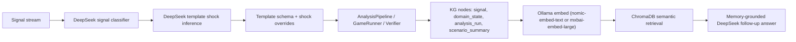

# Real LLM E2E Evaluation

This document records a live end-to-end evaluation of Freeman using a real DeepSeek chat model loaded from the local `DS.txt` key file and a local Ollama embedding backend. The run used:

- live LLM calls for signal classification
- live LLM calls for domain-state shock inference over fixed Freeman templates
- live LLM calls for simulation interpretation
- semantic memory retrieval from the KG through ChromaDB with Ollama embeddings
- memory-grounded follow-up answers that did not receive the full KG

## Objective

The evaluation target was:

$$
\text{signal stream} \rightarrow \text{world picture} \rightarrow \text{simulation forecast} \rightarrow \text{memory write} \rightarrow \text{memory-only follow-up prior}
$$

For each domain, the agent had to:

1. ingest a small signal stream
2. infer a structured world state around the phenomenon
3. run Freeman simulation and extract a dominant outcome
4. persist the case into long-term memory
5. answer an analogous follow-up question using retrieved memory context only

## Execution Flow



## Memory Constraint

No follow-up answer received the full KG. The prompt path was:

$$
\text{question} \xrightarrow{\text{embed}} \text{top-}K \text{ semantic nodes} \xrightarrow{\text{1-hop}} \text{context subset}
$$

The embedding backend for the recorded run was local Ollama with `nomic-embed-text`. The same adapter also supports `mxbai-embed-large`.

## Run Command

```bash
python scripts/run_real_llm_e2e.py \
  --output-dir runs/real_llm_e2e_ollama_20260328 \
  --max-steps 12 \
  --seed 42 \
  --top-k 6
```

Artifacts produced locally:

- `runs/real_llm_e2e_ollama_20260328/kg_state.json`
- `runs/real_llm_e2e_ollama_20260328/chroma_db/`
- `runs/real_llm_e2e_ollama_20260328/report.md`
- per-scenario JSON artifacts

## Scenario Results

### 1. Economy: trade shock and stagflation risk

- Dominant outcome: `inflation_persistence`
- Simulation confidence: `0.4402`
- Follow-up retrieval size: `6 / 6` KG nodes
- Main LLM shock overrides:
  - `trade_cost_pressure = +12`
  - `inflation_pressure = +10`
  - `policy_rate = +6`
  - `recession_risk = +9`
  - `business_demand = -8`

Interpretation:

- the model converged to persistent inflation as the dominant macro regime
- recession risk remained secondary, though business demand collapsed materially
- the follow-up memory answer correctly reused the stored case and returned a prior favoring inflation persistence over outright recession

### 2. Social relationships: stress, jealousy, and repair

- Dominant outcome: `repair_path`
- Simulation confidence: `0.6427`
- Follow-up retrieval size: `9 / 12` KG nodes
- Main LLM shock overrides:
  - `work_stress = +10`
  - `jealousy_pressure = +10`
  - `breakup_risk = +10`
  - `trust_level = -12`
  - `communication_quality = -8`
  - `repair_capacity = -5`

Interpretation:

- the model produced a strong repair-path posterior (`95%`) despite acute short-run strain
- jealousy and work stress decayed strongly through the simulated path, but mainly through exhaustion rather than healthy recovery
- trust, communication, and repair capacity remained low, so the relationship was classified as stabilizing but fragile
- the follow-up answer reused memory and immediately returned a repair-over-breakup prior rather than recomputing from the full KG

### 3. Film release: buzz, mixed reviews, and box-office path

- Dominant outcome: `breakout_hit`
- Simulation confidence: `0.7664`
- Follow-up retrieval size: `6 / 18` KG nodes
- Main LLM shock overrides:
  - `buzz = +10`
  - `marketing_intensity = +8`
  - `opening_weekend = +7`
  - `critic_sentiment = -5`
  - `box_office_legs = -8`
  - `word_of_mouth = -3`

Interpretation:

- the stored case predicted that strong pre-release buzz and marketing could overpower mixed reviews
- the simulation favored a breakout trajectory rather than a front-loaded opening
- the follow-up memory answer preserved that qualitative lesson and returned a prior emphasizing strong opening plus resilient legs

## Repeated Memory Probe

After all three domains were stored, the runner repeated the social-relationship question on the mixed-domain KG:

- total KG size: `18` nodes, `15` edges
- retrieved context for the repeated social probe: `6 / 18` nodes

Result:

- the answer still returned the correct domain-level prior: repair favored over breakup
- it did so from a strict subset of memory rather than the full KG
- the retrieved subset remained relationship-centered under the Ollama embedding backend, with no need to expose the mixed-domain KG to the LLM

## Empirical Takeaways

The live run supports the following claims:

1. Freeman can convert a real LLM-interpreted signal stream into structured domain state shocks over a stable world template.
2. The deterministic simulator then produces domain-specific forecasts rather than generic prose.
3. The resulting case is persisted into a semantic KG and reused on analogous follow-up questions.
4. The memory path can answer from a bounded retrieved subset of nodes instead of exposing the entire KG.

## Limitations

- This evaluation depends on a local Ollama daemon and an installed embedding model, so portability now depends on that local service being healthy.
- Only `nomic-embed-text` was used for the recorded numbers; `mxbai-embed-large` is supported but was not benchmarked in this report.
- The economy scenario had visibly lower confidence (`0.4402`) than the social and film cases, which is consistent with a noisier or less separable macro regime.
